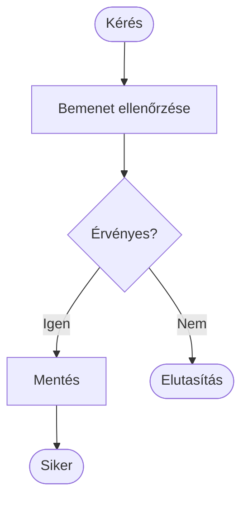

# Diagramkészítés Mermaid-del: forrás, jelölés és ellenőrzés

Mermaid-ben a diagram forrása szöveg. A diagram nem egy kézzel elhelyezett alakzatgyűjtemény: csomópontokat, kapcsolatokat és szabályokat írunk le, a megjelenítő ezekből készít ábrát. Ez jól verziókezelhető, de a forrás és az eredmény együtt ellenőrizendő.

## Folyamatábra forrása

Markdownban a Mermaid-forrás `mermaid` nyelvjelölésű kódblokkba kerül. Az alábbi forrást szövegként mutatjuk, hogy a jelölések is olvashatók legyenek:

```text
flowchart TD
  Start(["Kérés"]) --> Check["Bemenet ellenőrzése"]
  Check --> Valid{"Érvényes?"}
  Valid -->|"Igen"| Save["Mentés"]
  Valid -->|"Nem"| Reject(["Elutasítás"])
  Save --> Done(["Siker"])
```

Ugyanez renderelve:



A `Start`, `Check` és `Valid` azonosítókra a további kapcsolatokban hivatkozhatunk. A szögletes zárójel lépést, a kapcsos zárójel döntést, a lekerekített jelölés kezdő- vagy végpontot mutat az itt választott konvencióban. A `-->` irányított kapcsolat, a `|"Igen"|` élcímke. A jelöléseket mindig a diagram céljával összhangban használd.

## Strukturális csoportosítás

A `subgraph` összetartozó elemeket keretez. Jelölhet logikai modulhatárt, szolgáltatás belső terét vagy telepítési környezetet. A három nem ugyanaz: a keret címében mondd meg a jelentését. Az ábra jelmagyarázata például rögzítheti, hogy minden külső nyíl hálózati hívás, a belső nyíl pedig helyi függőség.

A stabil azonosítók és a beszédes feliratok különválasztása megkönnyíti a módosítást. Ékezetes és írásjeles feliratokat idézőjelben használj. A nyelvtanban foglalt szavak, például a lezáró `end`, ne jelenjenek meg véletlenül csomópontazonosítóként.

## Szekvenciadiagram forrása

```text
sequenceDiagram
  participant C as Kliens
  participant S as Szolgáltatás
  C->>S: Kérés, requestId
  alt Siker
    S-->>C: Eredmény, requestId
  else Elutasítás
    S-->>C: Hibakód, requestId
  end
```

A résztvevők sorrendje hat az olvashatóságra. A nyílfajtákat következetesen használd, és a szövegben írd le, mely üzenet közvetlen válasz vagy későbbi értesítés. `par` esetén az ágak valóban függetlenül futhassanak; puszta rajzi párhuzamosság ne takarjon adatfüggést.

## Állapotdiagram forrása

```text
stateDiagram-v2
  [*] --> Varakozik
  Varakozik --> Fut: worker felvette
  Fut --> Kesz: siker
  Fut --> Sikertelen: végleges hiba
  Kesz --> [*]
```

A `[*]` kezdő- vagy végpontot jelöl a környezet szerint. Az átmeneti címke az eseményt vagy feltételt mondja meg, nem pusztán a következő állapot nevét ismétli. A diagramhoz tartozzon a tárolt állapot és a tiltott átmenet magyarázata is.

## Szemantikai ellenőrzés

A parser sikere csak nyelvtani helyességet bizonyít. Ezután végig kell követni egy sikeres és egy hibás útvonalat. Ellenőrizd, hogy minden döntési ágnak van következménye, minden hálózati határ látható, és az állapotdiagramon szereplő átmeneteket a szekvencia is megmagyarázza.

Túl sűrű ábrát bonts több nézetre. Egy fejezetnél hasznos lehet külön strukturális kép és külön hívási folyamat. A technológiai logók és színek nem pótolják a felelősségek nevét. A szín ne legyen az egyetlen információhordozó.

> [!tip] Módosításkor ellenőrizd a renderelt ábrát is
> A forrás diffje megmutatja, milyen kapcsolat változott. A renderelt nézetből derül ki, hogy az elrendezés és a címkék még olvashatók-e.

## Önálló ábrázolási feladat

Készíts három nézetet ugyanarról az exportfolyamatról: komponensábrát az API és worker kapcsolatáról, szekvenciát az indításról és eredményről, állapotdiagramot a feladat életciklusáról. Ezután adj hozzá worker-kiesést, és mindhárom nézeten vezesd át a következményét.
