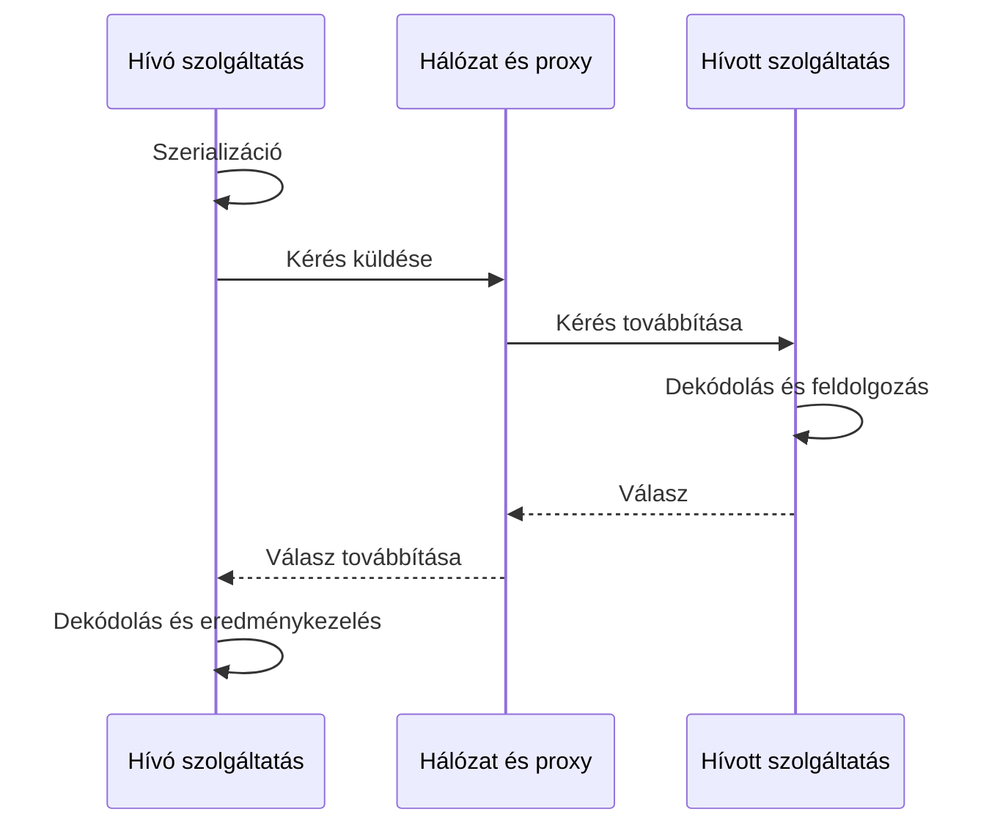

# A távoli hívás nem helyi függvényhívás

Egy helyi függvényhívásban a hívó és a hívott ugyanazon folyamat vezérlési és memóriakörnyezetében dolgozik. Távoli híváskor a kérés és a válasz üzenetként utazik. A fogadó másik folyamatban, másik gépen vagy másik hálózati zónában futhat. A hálózati határ új költségeket és új bizonytalanságot hoz létre.

## Az üzenet útja

A hívó összeállítja a kérést, szerializálja az adatokat, kapcsolatot talál vagy nyit, majd elküldi az üzenetet. A fogadó dekódolja, ellenőrzi és végrehajtja a műveletet. A válasz ugyanezen lépések egy részén visszafelé halad. Az üzleti feldolgozás csak egy része a teljes időnek.

A helyi objektumreferencia nem küldhető át változatlanul. Az üzenetben csak a megállapodott reprezentáció szerepel. Az időpontot, pénzösszeget, opcionális mezőt és hibát is egyértelműen kell kódolni. A szerializált adat jelentését a szerződés adja, nem a kliens nyelvének objektummodellje.

## Négy fontos kimenet

A hívó láthat sikeres eredményt, üzleti elutasítást, technikai hibát vagy ismeretlen eredményt. A technikai hiba és az üzleti elutasítás eltérő műveletet indokolhat. A „nincs elegendő készlet” választ nem javítja meg ugyanazon kérés automatikus ismétlése.

Ismeretlen eredmény alakulhat ki, ha a szerver végrehajtott egy módosítást, de a válasz elveszett. A timeout csak azt mutatja, hogy a hívó időkerete lejárt. Nem bizonyítja a végrehajtás hiányát. Módosító művelet ismétléséhez ezért logikai műveletazonosító vagy lekérdezhető állapot szükséges.

## Részleges meghibásodás

Elosztott rendszerben az egyik rész működhet, miközben a másik nem érhető el. Lehet hibás a hálózat, a DNS, egy proxy vagy csak az egyik szolgáltatáspéldány. A lassú válasz és a kiesés a hívó számára sokáig ugyanúgy nézhet ki.

Nem feltétlenül létezik olyan megfigyelés, amelyből a hívó azonnal eldönti, mi történt a távoli oldalon. A tervnek kezelnie kell ezt a bizonytalanságot. Ez a legfontosabb különbség a helyi metódushíváshoz képest: a távoli művelet egyszerűnek látszó szintaxisa nem tünteti el a hálózatot.

> [!warning] A generált kliens sem teszi helyivé a hívást
> Egy gRPC-stub vagy SDK kényelmes függvényhívásnak mutathatja az API-t. A timeout, a szerződésverzió és a részleges hiba továbbra is a rendszer működésének része.

## Diagnosztikai adatok

Egy szolgáltatáshívásnál hasznos a logikai műveletazonosító, a trace-azonosító, a cél szolgáltatás, az időkeret és a kimenet. A műveletazonosító ismétléskezelésre szolgál; a trace-azonosító a hívási lánc megfigyelésére. A kettő nem ugyanaz, és egy újrapróbálás több hálózati próbálkozást hozhat létre ugyanazon üzleti művelethez.

## Ellenőrző kérdések

1. Miért lehet sikeres a távoli módosítás timeout mellett?
2. Milyen adatokat kell megőrizni, hogy az eredmény később tisztázható legyen?
3. Milyen problémát okoz, ha egy API a belső objektumok teljes szerkezetét publikálja?
