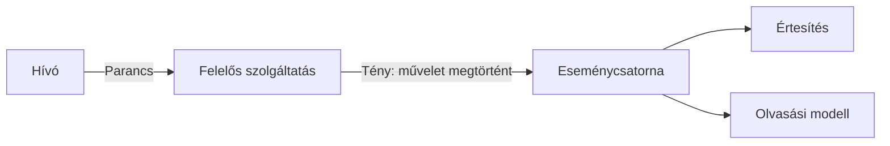

# Kérés–válasz, üzenet, esemény és stream

A kommunikációs modell a résztvevők együttműködését írja le. A transport azt mondja meg, hogyan jut el az adat; az alkalmazási szerződés azt, mit jelent az üzenet. Ugyanazon HTTP-kapcsolaton működhet REST API, RPC és eseményfolyam is. A megnevezéseket ezért külön szinten használjuk.

## Kérés–válasz

A hívó egy konkrét művelet eredményét kéri. A válasz lehet közvetlen eredmény vagy egy később befejeződő feladat azonosítója. Szinkron használatban a hívó vár, mielőtt továbblép. Ez egyszerű követést ad, de a hívott elérhetősége és késleltetése a hívó útvonalának részévé válik.

A várakozás nem feltétlenül blokkol operációsrendszer-szálat. Aszinkron I/O mellett is fennmarad a logikai függés: az üzleti művelet csak a válasz után folytatható. A nyelvi `async` tehát nem azonos az eseményvezérelt szolgáltatáskapcsolattal.

## Parancs és esemény

A **parancs** szándékot fejez ki: „foglalj le két helyet”. Címzettje felel a végrehajtásért, és elutasíthatja. Az **esemény** megtörtént tényt közöl: „két helyet lefoglaltak”. A fogyasztó másik üzleti folyamatot indíthat belőle, de az eseményt nem úgy kezeli, mint egy neki címzett végrehajtási utasítást.

A megkülönböztetés a szerződésre és a hibakezelésre is hat. Egy parancsnál ismernünk kell a művelet eredményét vagy az eredmény lekérdezésének helyét. Egy eseménynél azt kell tisztázni, mely fogyasztók milyen saját állapotot módosítanak.

## Aszinkron üzenetküldés

A küldő és a fogadó végrehajtása időben elválasztható. A broker átveheti az üzenetet akkor is, amikor a fogyasztó átmenetileg nem fut. Ez csökkentheti a közvetlen rendelkezésre állási függést, de új állapotokat hoz: várakozó, folyamatban levő, feldolgozott és hibás üzenetek.

Az üzenet átvétele nem egyenlő az üzleti feldolgozással. A producer broker-nyugtája és a consumer feldolgozási nyugtája külön esemény. A felhasználó számára is láthatóvá kell tenni, ha az eredmény még függő.

## Streaming

A stream több adatot vagy üzenetet továbbít egy logikai folyamatban. Lehet szerverről kliensre, kliensről szerverre vagy kétirányú. Egy állapotfigyelő streamben az egyes elemek események lehetnek; egy fájlletöltés streamje viszont bájtsorozat. A streaming nem automatikusan eseményvezérelt üzleti architektúra.

Hosszú streamnél kezelni kell a megszakítást, a lassú fogadót, a pufferelést és a folytatási pontot. Ha a fogyasztó gyorsabban kap adatot, mint ahogy feldolgozza, a kapcsolat puszta életben tartása nem védi meg a memóriát.

> [!important] Három külön kérdés
> Mi az interakció jelentése? Milyen transport viszi? Milyen időbeli függés van a résztvevők között? Ezekre külön válaszolj, például: parancs, HTTP, később lekérdezhető eredmény.

## Választási feladat

Válassz modellt egy ár lekérdezéséhez, egy számla elkészítéséhez és egy élő műszeradat továbbításához. Mindegyiknél nevezd meg az eredményt, a várakozást és a megszakadás utáni folytatást. Indokold meg, mely esetben fontos a tartós üzenet és melyikben az aktuális állapot.
