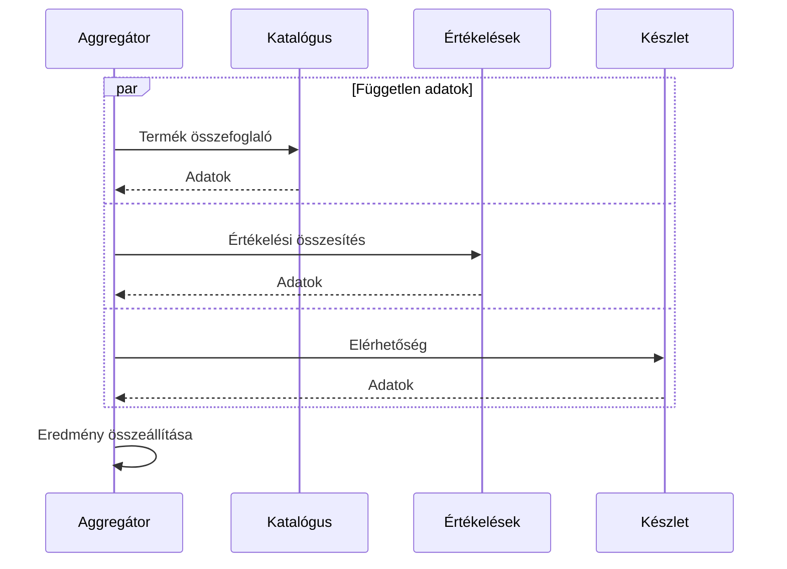

# Késleltetés, fan-out és kommunikációs csatolás

A szolgáltatásközi kommunikáció teljesítményét nem az egyetlen végpont átlagos válaszideje írja le. Az egész kérési útvonal számít: a hívások száma, sorrendje, párhuzamossága és az átadott adatmennyiség. A kis szolgáltatásokból összeálló rendszer akár több időt tölthet kommunikációval, mint üzleti számítással.

## Soros és párhuzamos hívások

Ha egy kérés négy, egyenként 40 ms-os távoli hívást sorban hajt végre, csak ezekre körülbelül 160 ms telik el. Ehhez adódik a belépési pont és a saját feldolgozás ideje. Független hívások párhuzamos indításakor az összidő közelebb kerül a leglassabb hívás idejéhez, de több egyidejű erőforrásigény keletkezik.

A párhuzamosítás nem old fel adatfüggőséget. Ha a második hívás paramétere az első eredményéből származik, a kettő nem indítható egyszerre. A tervből ezért derüljön ki, mely adat mikor áll rendelkezésre.

## Fan-out és tail latency

Fan-out során egy belépő kérés több belső hívást indít. Ha minden eredményt meg kell várni, a leglassabb függőség szabja meg a befejezést. Minél több hívás történik, annál több lehetőség van arra, hogy valamelyik lassú legyen.

Az átlag elrejtheti ezt a jelenséget. A p95 és p99 késleltetés a lassabb kérési tartományt segít vizsgálni. A percentilisek nem adhatók egyszerűen össze minden körülmény között; a teljes útvonal mérésére is szükség van. Egy distributed trace megmutatja, mely hívások futottak sorban, párhuzamosan vagy várakoztak sorban.

Egyszerű szemléltető modellben, ha három független függőség mindegyike 99%-os elérhetőségű, és mindhárom kell a sikerhez, az együttes elérhetőség `0,99³ ≈ 97,03%`. A valós függések gyakran korrelálnak, ezért ez nem SLA-számítás, hanem annak illusztrációja, hogy a kötelező függőségek halmozása csökkentheti a teljes művelet sikerét.

## Chatty API és batching

Chatty a kapcsolat, ha egy üzleti művelet sok apró oda-vissza hívást igényel. Egy lista húsz eleme után egyenként lekért név, ár és készlet hatvan további hívást okozhat. Összefoglaló végpont, batching vagy célzott read model csökkentheti a költséget.

Az óriási válasz viszont túl sok adatot továbbíthat és szoros szerződést hozhat létre. Nem az összes hívás összeolvasztása a cél, hanem az adott fogyasztási igényhez igazított határ. A payload méretét, a feldolgozási időt és a cache lehetőségét együtt értékeljük.

## Csökkenthető függőség

Nem minden adat egyformán kritikus. Ha az értékelési összesítés hiányzik, a termékoldal még megjelenhet. Ha a fizetés eredménye nem ismert, a vásárlást nem szabad sikeresnek állítani. A degradált működés az üzleti jelentés alapján dönthető el, nem általános „hiba esetén üres lista” szabállyal.

> [!tip] Hívási gráfot rajzolj, ne csak szolgáltatáslistát
> Egy konkrét kérés gráfján jelöld a kötelező és opcionális hívásokat, a párhuzamos ágakat és az időkereteket. Így láthatóvá válik a késleltetés és a kiesés terjedése.

## Ellenőrző kérdések

1. Miért nem bizonyít gyors rendszert három külön gyors végpont?
2. Mikor csökkenthető a fan-out egy read modellel?
3. Mely adatok hiánya mellett működhet tovább egy keresési oldal, és milyen jelzést kell adnia?
