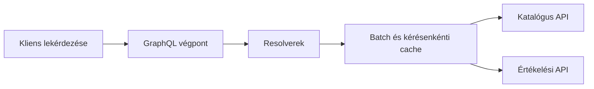

# GraphQL: séma, resolver és adatösszeállítás

A GraphQL típusos sémával írja le a kliens számára elérhető adatokat és műveleteket. A kliens lekérdezésben választja ki a szükséges mezőket. A szerver resolverekkel állítja elő ezeket, akár több adatforrás vagy szolgáltatás használatával.

## Séma és lekérdezés

A séma nem az adatbázis automatikus tükre. A fogyasztónak szánt fogalmakat írja le. Egy terméktípus tartalmazhat katalógusadatot, értékelést és elérhetőséget, miközben ezek három külön adatgazdától származnak.

```graphql
type Product {
  id: ID!
  name: String!
  price: Money!
  rating: Float
}

type Money {
  amountMinor: Int!
  currency: String!
}

type Query {
  product(id: ID!): Product
}
```

```graphql
query ProductCard($id: ID!) {
  product(id: $id) {
    id
    name
    price { amountMinor currency }
  }
}
```

A kliens nem kér értékelést, így a szervernek nem szükséges azt előállítania, ha a megvalósítás ténylegesen követi a mezőigényt. A kért mezők szabályozása csökkentheti a túl nagy reprezentációkat, de nem garantálja önmagában az olcsó lekérdezést.

## Query, mutation és subscription

A query olvasási műveletet ír le, a mutation állapotváltoztatást. A mutation mező neve és visszatérési típusa üzleti szerződés: például a létrehozott foglalás mellett visszaadható a lejárat és a kezelhető elutasítás.

A subscription időben több eredményt adhat. A GraphQL-modell és az üzenetek szállítása külön kérdés: a subscription önmagában nem határozza meg, hogy WebSocketet vagy más transportot használunk. A konkrét protokollt, hitelesítést és újracsatlakozást a használt megoldás szerződése rögzíti.

## Resolverek és N+1

Egy lista resolver húsz terméket ad vissza. Ha minden termék `rating` mezőjének resolvere külön távoli hívást indít, az eredmény egy kezdeti és húsz további hívás lehet. Ez az N+1 probléma egyik megjelenése. Batchinggel több azonosítót egy kérésben dolgozunk fel; kérésenkénti cache-sel az ismételt adatlekérést is csökkenthetjük.



A batch nem lehet felhasználók között ellenőrizetlenül megosztott jogosultsági cache. Az adatlekérési optimalizáció nem kerülheti meg a hozzáférési szabályokat.

## Költség, hibák és cache

A lekérdezés mélységét, összetettségét, elemszámát és végrehajtási idejét korlátozni kell. Egy típus szerint érvényes query sok szolgáltatáshívást vagy nagy adathalmazt indíthat. A lapozás a sémában is fontos, nem csupán REST-listáknál.

GraphQL-válasz tartalmazhat adatot és hibákat egyszerre. A nullability befolyásolja, egy mező hibája hogyan terjed a válaszban. A kliensnek a részleges eredményt is értelmeznie kell. Az egységes végpont miatt a HTTP státusza önmagában nem mindig mondja el a teljes lekérdezés eredményét.

A cache-elés megvalósítható, de az erőforrás-URI-kra épülő HTTP-cache használata kevésbé közvetlen. Persisted query, stabil azonosítók és kliensoldali normalizált cache segíthet; ezek nem teszik szükségtelenné a frissességi és jogosultsági szabályokat.

> [!important] Egy klienskérés mögött sok hívás lehet
> A GraphQL csökkentheti a kliens által indított kérések számát, miközben a szerveren továbbra is jelentős fan-out történik. A teljes végrehajtási gráfot kell mérni.

## Federation és választás

Federation során több részséma közös gráfban jelenhet meg. Ez szervezeti és sématulajdonosi együttműködést igényel; egy közös mező jelentését nem oldja meg a séma összefűzése. GraphQL különösen hasznos lehet eltérő adatigényű klienseknél és összetett olvasási felületeknél. Egyszerű belső parancsinterfészhez REST vagy RPC is megfelelő lehet.

További fogalmak: [GraphQL queries](https://graphql.org/learn/queries/), [schema](https://graphql.org/learn/schema/), [performance](https://graphql.org/learn/performance/).
