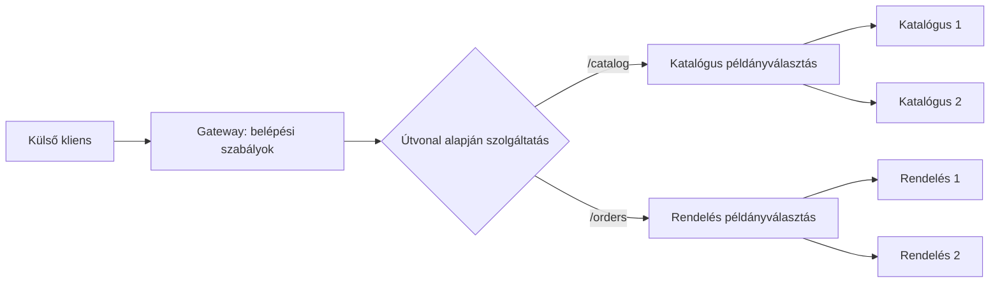

# Service router, reverse proxy, load balancer és gateway

Több szolgáltatásnál a kliensnek valahogyan el kell jutnia a megfelelő szolgáltatás megfelelő példányához. A routing azt dönti el, melyik cél kezelje a kérést. A terheléselosztás a cél szolgáltatás elérhető példányai között választ. A gateway ezen túl közös belépési és API-kezelési feladatokat is végezhet.

## A szerepek elkülönítése

A **reverse proxy** a szerverek előtt áll, és a beérkező kéréseket továbbítja. Elrejtheti a belső címeket, lezárhatja a TLS-kapcsolatot és kezelhet több upstream célt. A **load balancer** forgalmat oszt el példányok között. A **service router** elnevezést használhatjuk arra a szerepre, amely a kérés alapján logikai szolgáltatást választ. A kifejezés nem minden platformon jelent külön, szabványos komponenst.

Az **API gateway** az API-k belépési pontja. Routing mellett például hitelesítést, terheléskorlátozást, API-verzióválasztást és megfigyelési feladatokat végezhet. Egy termék több ilyen szerepet egyszerre is elláthat. Az architektúrában a funkciót nevezzük meg, ne feltételezzük, hogy minden fogalomhoz külön szervert kell indítani.

## Routing szempontjai

A cél kiválasztható host alapján, például `catalog.example.test`, útvonal alapján, például `/catalog`, vagy egy explicit verziójelzés alapján. A routernek a szabályokat egyértelmű sorrendben kell alkalmaznia. A túl általános wildcard egy konkrét útvonalat is elnyelhet.

Útvonalátírásnál tisztázzuk, mit lát a belső szolgáltatás. Ha a gateway levágja a `/catalog` prefixet, a belső szerver más útvonalat fogad, mint a publikus API. A redirect és a `Location` header viszont a kliens számára értelmezhető címet kell tartalmazzon.

A gateway által továbbított headerek bizalmi kérdések. A külső kliens által megadott „user” vagy „role” header nem válhat automatikusan hiteles felhasználói kontextussá. A belépési pontnak el kell különítenie a megbízhatóan előállított és a kliens által küldött adatokat.

## Egy közös belépési pont előnye és ára

A kliensnek kevesebb szolgáltatáscímet és hitelesítési kapcsolatot kell ismernie. A belső felbontás változhat a publikus API stabilitása mellett. Közös szabályok érvényesíthetők és a forgalom egységesen mérhető.

A gateway ugyanakkor extra ugrás, közös függőség és konfigurációs kockázat. Saját kapacitást, magas rendelkezésre állást és hibakezelést igényel. Ha minden üzleti folyamat az aggregátorba költözik, egy új monolitikus koordinátor alakulhat ki a szolgáltatások előtt.

> [!important] A gateway nem veszi át az adatgazda felelősségét
> A belépési pont ellenőrizheti a kérést és a hitelesítést, de az üzleti invariánst és az erőforráshoz tartozó jogosultságot a felelős szolgáltatásnak is érvényesítenie kell.

## Tervezési feladat

Tervezz routingot katalógus-, rendelés- és értesítési API-hoz. Add meg a publikus útvonalat, a belső célnevet, az átírást és a hibaválaszt ismeretlen útvonal esetén. Jelöld, melyik feladat routing, melyik példányválasztás, és melyik API-szintű szabály.
