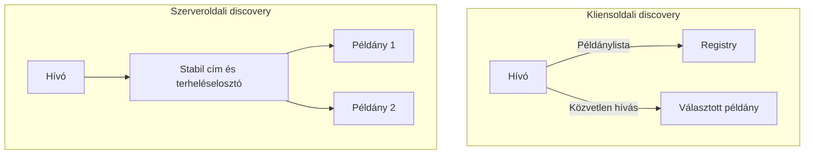

# Service discovery és terheléselosztás

Egy szolgáltatás logikai neve stabil lehet, miközben a példányai indulnak, leállnak és más címre kerülnek. A service discovery azt a problémát oldja meg, hogyan található meg az aktuálisan használható cél. A kliens ne kézzel beírt, örökké érvényesnek feltételezett IP-címekre építsen.

## Kliensoldali és szerveroldali discovery

Kliensoldali discovery esetén a hívó kap információt az elérhető példányokról, és maga választ közülük. Ehhez registry- vagy DNS-információ, kliensoldali cache és terheléselosztási szabály kell. Az előny kevesebb köztes ugrás lehet, a költség a kliensekben megjelenő összetettség.

Szerveroldali discovery esetén a kliens stabil címet hív, egy köztes komponens választ példányt. A kliensek egyszerűbbek, de a köztes réteg rendelkezésre állása és friss állapota fontos. Gyakori platformmegoldás a stabil szolgáltatásnév és a mögötte változó végpontkészlet.

## A lista nem tökéletesen friss

A registry, a DNS-cache és a health check állapota késhet. Egy példány kieshet közvetlenül azután, hogy a kliens egészségesnek látta. A discovery ezért nem helyettesíti a hívásonkénti timeoutot és hibakezelést.

A túl hosszú cache-idő lassíthatja a kiesett címek kivezetését. A túl rövid cache-idő terhelheti a discoveryréteget. A beállításokat a példányéletciklus és a platform működése alapján kell választani. A kapcsolat újrahasználata miatt a kliens akár a DNS-frissítés után is régi példányhoz kapcsolódhat.

## Elosztási algoritmusok

Round robin sorban választ a példányok között. Súlyozott változatban eltérő kapacitás vagy fokozatos bevezetés tükrözhető. Least connections vagy hasonló terhelésérzékeny szabály a kevésbé foglalt példányt keresi. A pontos mérce számít: egy nyitott WebSocket és egy rövid HTTP-kérés nem azonos erőforrásigény.

Hashalapú elosztás egy kulcshoz következetesebb célt rendelhet. Ez hasznos cache-lokalitáshoz vagy particionált állapothoz, de példányváltozáskor újraelosztás történhet. Sticky session egy kliens további kéréseit ugyanahhoz a példányhoz tereli; ez egyszerűsíthet lokális állapotot, de ronthatja az egyenletes elosztást és nem oldja meg a kiesést.

## Health, readiness és kiesés

Egy folyamat lehet életben úgy, hogy még nem fogadhat forgalmat. A readiness ezt a fogadóképességet jelzi. A liveness a folyamat működőképességének más kérdésére válaszolhat. Ha minden külső függőség átmeneti hibáját újraindítási oknak tekintjük, instabil újraindítási hullám alakulhat ki.

Kivezetéskor a példány először ne kapjon új kérést, majd fejezze be a folyamatban levőket egy korlátozott időkeretben. Hosszú kapcsolatoknál külön bontási és újracsatlakozási rend szükséges. A discoveryfrissítés és a kapcsolatleállítás sorrendje hat a felhasználókra.

> [!warning] A sikeres health check nem garantálja a következő kérés sikerét
> A hívó és a cél közötti útvonal hibázhat, és a példány állapota változhat. A health check a routing bemenete, nem üzleti végrehajtási garancia.

## Ellenőrző kérdések

1. Miért nem elég új DNS-címet publikálni, ha hosszú kapcsolatok vannak?
2. Milyen elosztási probléma lehet sticky session mellett?
3. Mi legyen a forgalomkivezetés sorrendje egy hosszú exportot futtató példánynál?

Egy konkrét platform megoldása: [Kubernetes Service](https://kubernetes.io/docs/concepts/services-networking/service/).
