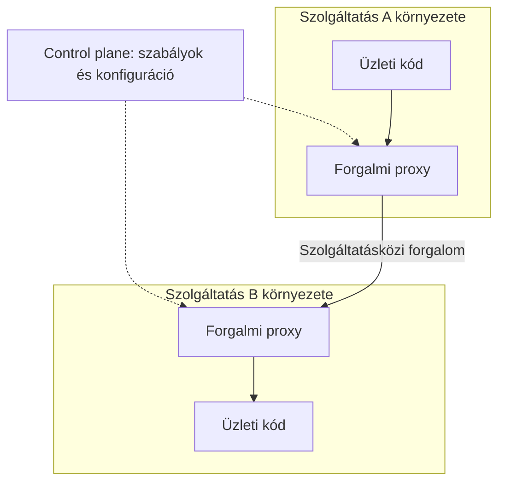

# Service mesh és a köztes réteg korlátai

Sok szolgáltatásnál ismétlődő infrastruktúrafeladat a címfeloldás, a titkosított kapcsolat, a routing, a metrikák és bizonyos hibatűrési szabályok kezelése. A service mesh ezek egy részét a szolgáltatások közötti forgalmi rétegbe helyezi. Nem üzleti architektúrastílus, hanem szolgáltatásközi infrastruktúra.

## Data plane és control plane

A data plane a tényleges forgalmat kezeli: proxyk vagy más adatútbeli komponensek továbbítják a kéréseket. A control plane konfigurációt és szabályokat ad a data plane számára. Az implementáció lehet sidecaralapú vagy más felépítésű; a szerepek megkülönböztetése fontosabb, mint egyetlen termék topológiája.

A mesh segíthet közös kapcsolatbiztonságban és forgalommérésben. A művelet üzleti jelentését azonban nem ismeri automatikusan. Nem tudja eldönteni, hogy egy timeout után megismételt fizetési kérés biztonságos-e.

## Gateway és mesh kapcsolata

A gateway tipikusan a rendszer határán áll, a mesh a belső szolgáltatásforgalomhoz kapcsolódik. A szerepek átfedhetnek, de eltérő célra szolgálnak. Egy kisméretű rendszerben a gateway és a platform szolgáltatásnevei elegendők lehetnek; nem kötelező mesh-t bevezetni a mikroszervizek mellé.

Minden köztes réteg új konfigurációt és diagnosztikai felületet hoz. A kérés hibája eredhet az üzleti szolgáltatásból, a proxyból, a routingból vagy a tanúsítványból. A fejlesztőnek tudnia kell, melyik komponens válaszolt és hol fogyott el az időkeret.

## Retry és timeout több rétegben

Ha a kliens háromszor próbálkozik, a gateway minden próbálkozást háromszor továbbít, a mesh pedig megint háromszor, egy logikai műveletből akár 27 távoli próbálkozás is lehet. Ez szemléltető maximum: a pontos viselkedés a konfigurációtól függ. A lényeg, hogy a rétegek önálló retryja összeszorzódhat.

Egy helyen kell megtervezni, ki jogosult ismételni, milyen feltételekkel és mennyi időből. A hívási lánc deadline-ját tovább kell vinni, a retrykeretet pedig korlátozni kell. Az infrastruktúraszintű default nem írhatja felül az alkalmazási idempotenciafeltételt.

## Routing mint kockázat

Hibás útvonal egy egész szolgáltatást elérhetetlenné tehet. Rossz verzióválasztás inkompatibilis szervert küldhet a kliensnek. Egy véletlenül nyilvánossá tett belső endpoint biztonsági határt bont meg. A routingkonfiguráció ezért a működő szerződés része, nem pusztán üzemeltetési apróság.

> [!warning] Az infrastruktúra nem javítja meg a rossz felbontást
> A mesh titkosíthat és mérhet egy chatty, körkörös hívási láncot. Ettől a lánc csatolása és üzleti hibái nem szűnnek meg.

## Mikor indokolt?

A közös forgalmi szabályok száma, a szolgáltatások és csapatok mérete, valamint a működtetési képesség együtt indokolhat mesh-t. A bevezetés előtt meg kell nevezni, mely ismétlődő problémát oldja meg, és hogyan diagnosztizálható a plusz réteg. Kis rendszerben a több infrastruktúra könnyen nagyobb költség, mint a nyereség.

## Ellenőrző kérdések

1. Mely feladatot végezhet proxy, és melyiket kell az üzleti szolgáltatásnak eldöntenie?
2. Hol állítanál retryt egy háromrétegű hívási útvonalon?
3. Hogyan különítenéd el a szolgáltatás hibáját a routing hibájától?

Konkrét proxyarchitektúra: [What is Envoy](https://www.envoyproxy.io/docs/envoy/latest/intro/what_is_envoy).
