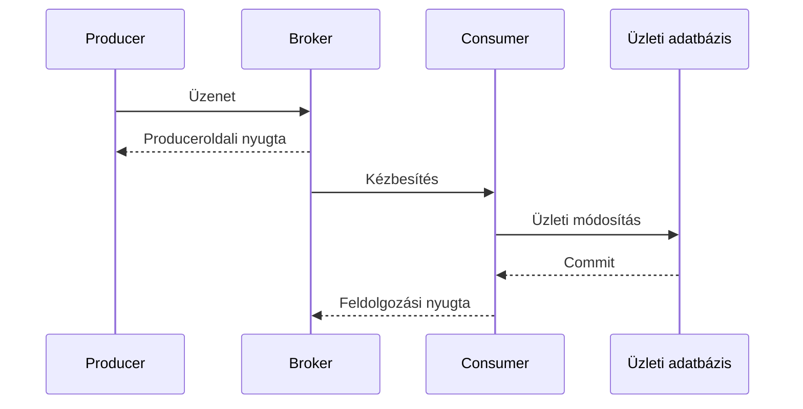

# Nyugtázás, kézbesítési garanciák és duplikáció

Az üzenetküldés megbízhatóságát a teljes útvonalon kell értelmezni: producer, broker, consumer és üzleti adattároló. A „megbízható broker” nem jelenti automatikusan, hogy egy üzleti hatás pontosan egyszer következik be.

## Két külön nyugta

A publisher confirm vagy hasonló produceroldali nyugta azt jelzi, hogy a broker a saját szerződése szerint átvette az üzenetet. A consumer acknowledgment a fogyasztó feldolgozásához kapcsolódik. A nyugta tartóssági és replikációs jelentése a termék és konfiguráció függvénye.

Ha a consumer a commit után, de a nyugta előtt áll le, a broker újraküldheti az üzenetet. A hatás ekkor már megtörtént, mégis újra érkezik ugyanaz a munka. Ha a consumer a commit előtt nyugtáz, kiesésekor a munka elveszhet. A nyugtázási sorrend ezért a tartóssági terv része.

## At-most-once és at-least-once

At-most-once modellben nem vállalunk újrakézbesítést olyan módon, amely duplikációhoz vezetne, de elveszhet az üzenet. Ez megfelelő lehet gyorsan elavuló telemetriánál, ahol a következő állapot felülírja az előző jelentőségét.

At-least-once modellben újrakézbesítés történhet a siker eléréséig a megállapodott feltételek mellett. A fogyasztónak duplikációra kell számítania. Tartós üzleti parancsoknál ez gyakori választás, ha idempotens feldolgozás társul hozzá.

Az „exactly once” állítás határát mindig meg kell nevezni. Egy broker vagy streamfeldolgozó adott tranzakciós körben biztosíthat ilyen tulajdonságot, de egy külső e-mail, banki API vagy más adatbázis hatása nem válik ettől automatikusan pontosan egyszerivé. A végponttól végpontig értelmezett üzleti hatás külön tervet igényel.

## Idempotens fogyasztó

A consumer tartósan rögzítheti a feldolgozott eseményazonosítót az üzleti módosítással egy tranzakcióban. Újrakézbesítéskor az egyedi azonosító alapján felismeri, hogy a hatás már megtörtént. Az ellenőrzés és a mentés ne két egymástól független lépés legyen, mert két worker egyszerre mindkettőt „újnak” láthatja.

A deduplikáció időtartama kapcsolódik a visszajátszás és az újraküldés időablakához. Ha a feldolgozott azonosítókat túl hamar töröljük, egy késői ismétlés új műveletnek látszhat. Az azonosítóhoz az eredeti payloadot vagy annak lenyomatát is társíthatjuk, hogy azonos kulccsal eltérő tartalom ne fusson le csendben.

> [!warning] A nyugta nem mindenkinek ugyanazt jelenti
> Az „átvettük”, „tartósan eltároltuk” és „üzletileg végrehajtottuk” külön állítás. A protokollban és a felhasználói állapotban is különítsd el őket.

## Ellenőrző kérdések

1. Miért érkezhet ismételt üzenet sikeres adatbázis-commit után?
2. Hol legyen a deduplikációs rekord tranzakciós határa?
3. Miért nem bizonyít egy broker exactly-once funkciója pontosan egyszer elküldött e-mailt?

Konkrét nyugtázási modell: [RabbitMQ confirms and acknowledgements](https://www.rabbitmq.com/docs/confirms).
