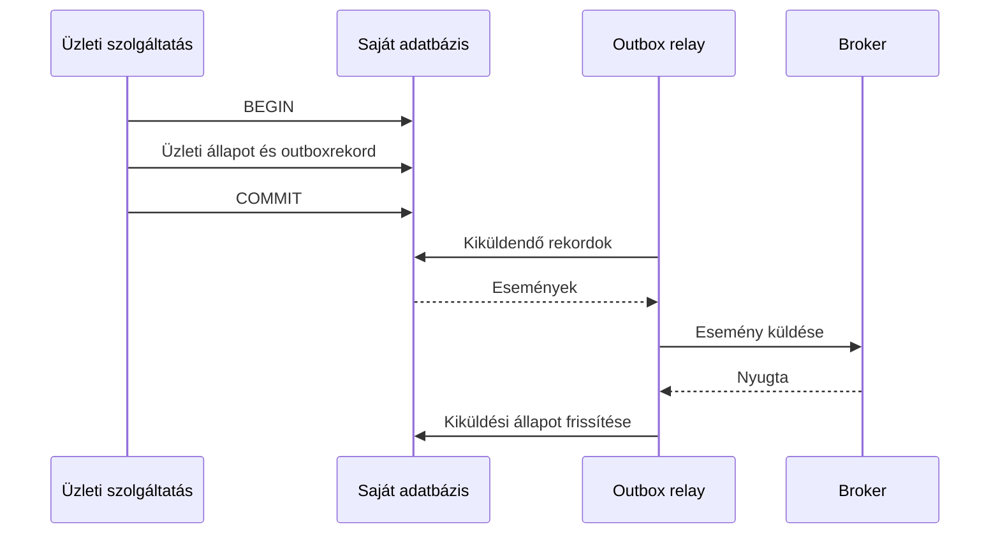

# Transactional outbox, inbox és atomi határok

Gyakori probléma, hogy egy szolgáltatás adatot ment és eseményt küld. Ha a két lépés külön rendszerben történik, a kettő között kieshet a folyamat. A transactional outbox a saját adatbázison belül kapcsolja össze az üzleti módosítást és a kiküldendő üzenet tényét.

## A kettős írás hibája

Ha először mentjük a rendelést, majd küldjük az eseményt, a mentés után bekövetkező kiesés miatt az esemény hiányozhat. Ha először küldjük az eseményt, majd mentünk, a consumer olyan rendelésről értesülhet, amely nem jött létre. Egy try–catch blokk nem teszi közös tranzakcióvá a két rendszert.

## Outbox

Az üzleti rekord és az outboxrekord egyetlen helyi tranzakcióban kerül mentésre. Egy relay később kiolvassa a kiküldendő üzenetet és továbbítja a broker felé. A relay lehet lekérdezésalapú vagy változásnaplóhoz kapcsolódó megoldás; a fő garancia a helyi mentés atomi kapcsolata.

A relay a nyugta után, de az állapotfrissítés előtt kieshet. Emiatt ugyanaz az esemény ismét küldhető. Az outbox nem tünteti el a duplikációt; idempotens fogyasztóval együtt használható.

## Több relay és sorrend

Több relaynek össze kell hangolnia a rekordok felvételét, különben ugyanazt a munkát feleslegesen párhuzamosan végezhetik. Lehet lease, zárolás vagy partícióalapú kiosztás. A megoldásnak a worker kiesése után újra felvehetővé kell tennie a munkát.

A sorrendi igényt külön kezeljük. Egy entitás 7-es és 8-as verziójú eseményét két relay fordított sorrendben is elküldheti, ha a kiválasztás nem őrzi a kívánt rendet. Az outbox tábla megléte önmagában nem jelent globális vagy entitásonkénti sorrendgaranciát.

## Inbox a fogadónál

Az inbox a fogadott üzenet tényét vagy feldolgozott azonosítóját tárolja. A consumer az üzleti módosítással egy tranzakcióban rögzítheti, hogy az üzenetet alkalmazta. Egyedi kulcs védi a párhuzamos duplikációt is. A broker nyugtája ezután történik.

Külső API-hívásnál az inbox és a helyi tranzakció nem tudja önmagában atomi módon bevonni a távoli hatást. Ilyenkor a külső API idempotenciakulcsa, állapotlekérdezése vagy egyeztetése is szükséges. Az atomi határt minden lépésnél meg kell nevezni.

> [!important] Az outbox egy konkrét rést zár be
> A saját üzleti adat és a kiküldendő üzenet együtt menthető. A broker, a consumer és a külső szolgáltató teljes folyamatára nem ad automatikus közös tranzakciót.

## Működési következmények

A ki nem küldött rekordok száma és kora megfigyelendő. A táblának szüksége lehet takarításra, de a megőrzés ne tegye lehetetlenné a hibakeresést vagy visszajátszást. A hosszú ideig várakozó esemény üzleti késést jelent, amelyet a rendszernek láthatóvá kell tennie.

## Ellenőrző kérdések

1. Mely hibafolyamatot javítja az outbox, és melyiket nem?
2. Hol keletkezhet duplikáció a relay működésében?
3. Miért nem elég inboxot használni pontosan egyszeri banki terheléshez?

Mintaleírás: [Transactional outbox](https://microservices.io/patterns/data/transactional-outbox.html).
