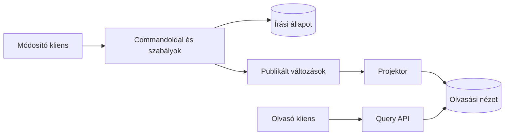

# Read model, CQRS, cache és visszajátszás

Több szolgáltatás adatainak együttes olvasására nem csak kérésidőbeli API composition használható. Egy külön olvasási nézet előre összegyűjtheti a szükséges adatokat. Az írási adatgazdák továbbra is önállóak, az olvasási modell pedig a fogyasztó igényére optimalizált másolatot tart fenn.

## Materializált nézet

Egy rendeléslista megjelenítéséhez rendelési összeg, fizetési állapot és szállítási becslés kellhet. A read model eseményekből frissítheti ezt a kombinált nézetet. Az olvasó egyetlen adatforrást kérdez, kevesebb szinkron függőséggel.

A nézet késhet. A felületnek el kell tudnia különíteni a „feldolgozás alatt” állapotot a végleges hibától. Megjeleníthető a forrásverzió, a frissítés időpontja vagy egy explicit függő jelzés, ha ezek a felhasználói döntést segítik.

## CQRS

CQRS esetén a command- és queryoldal modellje elkülönül. A módosítás az üzleti invariánsokhoz, az olvasás a megjelenítési és lekérdezési igényhez igazodik. Ez egy monoliton belül is megvalósítható; nem követeli meg a mikroszervizeket.

CQRS nem azonos event sourcinggal. Event sourcingnál a tartós üzleti eseménysor a fő állapotforrás, amelyből az aktuális állapot előállítható. Egy hagyományos állapottároló mellett is lehet eseményekből frissített read model és CQRS-szemléletű szétválasztás.

A projektor kódja alkalmazza az eseményeket a nézetre. Idempotensnek kell lennie, és kezelnie kell az ismétlést, a késést és a szerződésváltozást. Az olvasási nézet hibája nem változtathatja meg csendben az írási adatgazda igazságát.

## Újraépítés és visszajátszás

Ha a nézet eldobható és a forrásadat vagy eseménymegőrzés elegendő, újraépíthető. A tervnek meg kell mondania, miből indul az építés, hogyan kezeli közben az új változásokat, és mikor kapcsolható át a kliens az új nézetre.

A visszajátszás nem mindig végezhet minden eredeti mellékhatást. Egy régi `InvoiceIssued` esemény újrafeldolgozása read model frissítésére alkalmas lehet, de nem szabad automatikusan újra e-mailt küldenie. A projektor és az üzleti reakciók célját különítsük el.

## Cache és invalidáció

A cache a lekérés költségét csökkenti, de a frissítés szabályát meg kell határozni. TTL mellett idővel lejár az adat; eseményalapú invalidáció gyorsabban követheti a módosítást, de maga az esemény is késhet. A két megoldás kombinálható.

Az invalidációs esemény után egy lassú, korábban indított lekérés régi adatot írhat vissza a cache-be. Verzióellenőrzés vagy tudatos betöltési szabály szükséges lehet. A „töröljük a kulcsot minden módosítás után” megoldás nem minden versenyhelyzetre elég.

> [!warning] A másolat frissessége a szerződés része
> A kliensnek tudnia kell, mikor tekintheti a nézetet döntési alapnak. A read model előnye nem jogosít fel olyan konzisztenciaígéretre, amelyet nem biztosít.

## Tervezési feladat

Rajzolj read modelt egy ügyfél rendelésösszesítőjéhez. Add meg a forrásokat, az eseményazonosítót, a verziókezelést és az újraépítés menetét. Különítsd el azokat az adatokat, amelyekből tájékoztatást adunk, és azokat a műveleteket, amelyekhez az eredeti adatgazda döntése kell.
