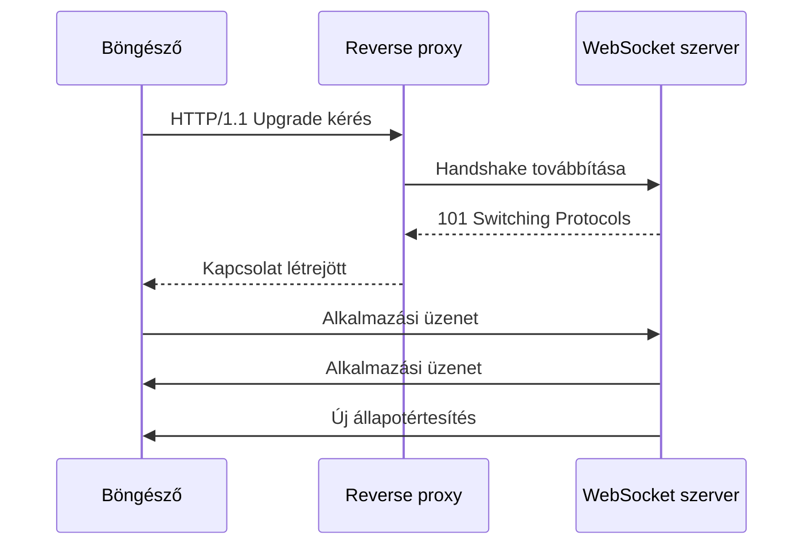

# WebSocket: kapcsolatfelépítés és kétirányú üzenetek

A WebSocket tartós, kétirányú üzenetkommunikációt ad kliens és szerver között. Kapcsolatfelépítés után mindkét fél küldhet adatot anélkül, hogy minden szerverüzenethez új klienskérés kellene. Ez hasznos chat, együttműködés, vezérlés és gyakori élő frissítés esetén.

## Kapcsolatfelépítés

A klasszikus, HTTP/1.1-alapú felépítés Upgrade-kéréssel indul. A kliens jelzi a WebSocket-protokollra váltás szándékát, a szerver elfogadó handshake-válasszal felel. A `ws` és `wss` sémák közül az utóbbi titkosított kapcsolatot jelent.

Ez az ábra a HTTP/1.1-felépítést szemlélteti. HTTP/2-höz és újabb környezetekhez eltérő felépítési mechanizmusok kapcsolódhatnak; a proxy és a szerver támogatását ellenőrizni kell. A hagyományos `101` mintát nem vetítjük automatikusan minden HTTP-verzióra.

## Frame és message

A protokoll keretekkel viszi az adatot; egy alkalmazási üzenet több frame-re is bontható. Szöveges és bináris üzenetek küldhetők. A böngészős API üzenetes felületet ad, így nem kell úgy keretezni a beérkező bájtfolyamot, mint saját TCP-protokollnál.

A kliensoldali frame-ek maszkolása a protokoll része, de nem titkosítás. A bizalmasságot a TLS adja `wss` kapcsolatnál. A szervernek maximális üzenetméretet, feldolgozási korlátot és elfogadott formátumot is meg kell adnia.

## Kapcsolat és alkalmazási jelentés

A WebSocket nem definiálja, mi a „belépés”, „feliratkozás” vagy „foglalás”. Ezeket saját subprotocol vagy alkalmazási üzenetséma írja le. A handshake során egyeztetett subprotocol megnevezhet egy üzenetformátumot és szabályrendszert.

Egy nyitott kapcsolat nem bizonyítja, hogy a kliens jogosult minden csatornára, és nem jelenti, hogy a legutóbbi művelet sikerült. A transport és az alkalmazási állapot külön marad. A szervernek kifejezett választ kell adnia a műveletekre, ha a kliensnek eredményt kell ismernie.

## Ping, pong és close

A protokoll kontrollkeretei segíthetik az életképesség ellenőrzését és a rendezett bontást. Böngészőben a natív JavaScript WebSocket API nem ad közvetlen pingframe-küldő metódust; szükség esetén alkalmazási heartbeat használható. Ennek üzeneteit és timeoutját a saját szerződésben rögzítjük.

A normál bontás és a hirtelen hálózati megszakadás eltérő eset. A close eseményből elérhető információ segít, de nem ad bizonyítékot az utolsó üzleti üzenet feldolgozásáról. A hibakereséshez a kapcsolat és a logikai műveletek azonosítói is kellenek.

> [!important] Tartós kapcsolat, nem tartós üzenetnapló
> A WebSocket önmagában nem tárolja a kiesés alatt keletkező eseményeket. Visszajátszás vagy friss állapotlekérés nélkül a kliens lemaradhat.

## Előny és költség

Gyakori kétirányú adatnál csökkenthető az új kérések költsége és a kliensoldali lekérdezési késés. Cserébe kapcsolatállapot, heartbeat, újracsatlakozás, lassú kliensek és speciális proxyszabályok jelennek meg. Ritka, csak szerverről érkező értesítéshez egyszerűbb alternatíva is megfelelő lehet.

## Ellenőrző kérdések

1. Mit biztosít a WebSocket, és mit kell hozzá az alkalmazásnak definiálnia?
2. Miért nem titkosítás a maszkolás?
3. Miért nem bizonyít sikeres műveletet a kapcsolat nyitott állapota?

Protokoll és böngészős felület: [RFC 6455](https://www.rfc-editor.org/rfc/rfc6455.html), [WebSocket API](https://developer.mozilla.org/en-US/docs/Web/API/WebSockets_API).
