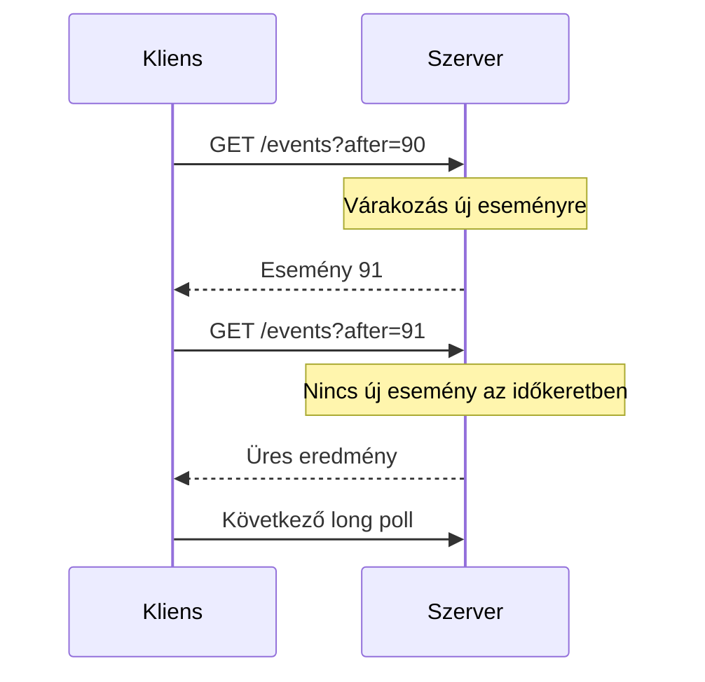

# Polling és long polling

Élőnek érzékelt felülethez nem mindig szükséges tartós kétirányú kapcsolat. Ha az állapot ritkán változik és néhány másodperc késés elfogadható, az ismételt HTTP-lekérdezés egyszerű megoldás lehet. A döntéshez a frissességet, a kliensek számát és a kérések költségét együtt vizsgáljuk.

## Polling

Polling során a kliens rendszeres időközönként lekéri az aktuális állapotot. Például egy exportfeladat státuszát öt másodpercenként ellenőrzi. Előnye a szokásos HTTP-infrastruktúra, az egyszerű újraindulás és a tartós kapcsolatállapot hiánya.

A lekérdezési periódus közvetlenül befolyásolja a késést. Ha a változás időpontja egyenletesen oszlik el a periódusban, átlagosan nagyjából fél periódusnyi várakozás keletkezik, plusz a kérés ideje. Öt másodperces pollingnál ez szemléltető modellben 2,5 másodperc.

Tízezer kliens öt másodpercenként körülbelül kétezer kérést indít másodpercenként, akkor is, ha az állapot nem változik. Feltételes kérés és cache csökkentheti a payloadot, de a kéréskezelés költsége megmarad. A kliensek indításának jittere elkerülheti az egy időpillanatban jelentkező tüskét.

## Adaptív polling

Várakozó feladatnál a gyakoriság változhat: kezdetben rövid periódus, később hosszabb, végleges állapotnál leállítás. A szerver javasolhat következő ellenőrzési időt. A kliens ne indítson új kérést, ha az előző még fut, különben lassú hálózatnál egyre több párhuzamos lekérés halmozódik fel.

A „nincs változás” és a „nem sikerült lekérni” külön állapot. A felület jelezheti az adat utolsó frissítését, és hálózati hiba után ritkíthatja a próbálkozást. Végleges jogosultsági hibánál ne folytassa korlátlanul a pollingot.

## Long polling

Long pollingnál a szerver nyitva tartja a kérést, amíg új adat érkezik vagy lejár egy időkeret. Válasz után a kliens új kérést nyit. Ez csökkentheti az üres válaszokat és az esemény észlelési késését.

A válasz és az új kérés közti időben esemény keletkezhet. Kurzor és szerveroldali megőrzés szükséges, ha ezt nem szabad elveszíteni. A proxytimeoutnak és a szerver várakozási idejének összhangban kell lennie. Az új kapcsolatok és headerek költsége továbbra is ismétlődik.

## Mikor melyik?

Polling jó lehet ritka állapotváltozás, egyszerű feladatszerver és nem szigorú frissességi igény mellett. Long polling akkor hasznos, ha kisebb késés kell, de a tartós stream más okból nem megfelelő. Gyakori üzeneteknél SSE vagy WebSocket hatékonyabb interakciót adhat.

> [!tip] A frissességi igényből indulj ki
> Ha a felhasználónak percenkénti állapot is elegendő, ne tervezz automatikusan millisekundumos élő kapcsolatot. Ha azonnali kétirányú vezérlés kell, a ritka polling valószínűleg nem elég.

## Számítási feladat

Számold ki 30 000 kliens kérésütemét 2, 10 és 30 másodperces pollingnál. Add meg a közelítő átlagos észlelési késést. Ezután tervezd meg a long polling kurzorát és a hálózati hiba utáni újrakérést.
