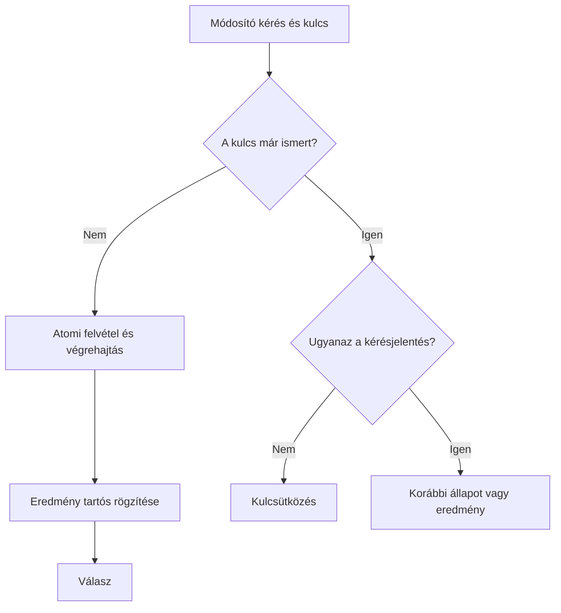

# Timeout, deadline, retry és idempotencia

Hibatűréskor nem minden hiba elkerülése a cél. Azt tervezzük meg, mennyi ideig várunk, mikor ismétlünk, és hogyan őrizzük meg az üzleti állapot helyességét bizonytalan eredmény mellett. A szolgáltatásközi hívásnak legyen korlátozott erőforrás- és időkerete.

## Timeout és teljes deadline

A timeout egy várakozás határa, például kapcsolódás vagy válaszolvasás. A deadline a teljes művelet befejezési határideje. Egy 800 ms-os kliensidőkeretből nem adhat minden belső hívás újabb 800 ms-ot, mert a lánc így túllépheti a vállalt időt.

Soros műveleteknél a megmaradt keretből gazdálkodunk. Ebbe a kapcsolódás, a feldolgozás és az esetleges retry is belefér. Ha a kliens már elhagyta a kérést, a szerver törekedhet a felesleges munka megszakítására, de a tartósan végrehajtott hatást nem vonja vissza pusztán a kapcsolat megszűnése.

## Mely hibát ismételjük?

Átmeneti hálózati hiba vagy túlterhelés később javulhat. Hibás bemenet, hiányzó jogosultság és üzleti elutasítás általában változtatást igényel. Az automatikus retry csak a megállapodott hibaosztályra, időkereten és próbálkozási korláton belül történjen.

Exponential backoffnál nő a várakozás; jitter véletlen eltéréssel csökkenti az egyidejű újrapróbálási hullámot. Egy lehetséges szemléltető szabály: véletlen várakozás a `0` és `min(maxDelay, baseDelay × 2^attempt)` közötti tartományban. A paramétereket nem általános receptből, hanem a függőség és az igény alapján választjuk.

## Idempotenciakulcs

Módosító kérésnél a kliens ugyanahhoz a logikai művelethez azonos kulcsot használhat. A szerver tartósan tárolja a kulcsot, a kérés jelentését és az eredményt. Ismétléskor nem végzi el újra a hatást, hanem a dokumentált korábbi állapotot adja.

A kulcs scope-ja számít: lehet felhasználóhoz és művelettípushoz kötött. Azonos kulccsal eltérő payloadot el kell utasítani vagy más explicit szabály szerint kezelni. A párhuzamos első kéréseket atomi egyedi kulcs vagy tranzakciós állapot védi, nem pusztán egy előzetes `SELECT`.

Az „éppen fut” állapotot is meg kell tervezni. Egy második kérés várhat, függő státuszt kaphat vagy állapotlekérdezésre irányítható. A kulcs lejárata után már nem biztosított ugyanaz az ismétlésvédelem, ezért a megőrzési idő a szerződés része.

## Retry storm és egyetlen felelős réteg

Kliens, gateway, proxy és szolgáltatás egymástól független retryja megsokszorozza a terhelést. Válasszuk ki, mely réteg tudja a hiba jelentését és az ismétlés biztonságát. A többi réteg ne indítson rejtett, korlátlan próbálkozást.

> [!warning] Timeout után nem automatikusan új művelet következik
> A korábbi kérés már végrehajtódhatott. A retry akkor biztonságos, ha a művelet szerződése és az azonosítókezelés megőrzi az egyszeri üzleti hatást.

## Ellenőrző kérdések

1. Hogyan osztanál fel 800 ms-ot három soros hívás és egy lehetséges retry között?
2. Mi történjen azonos kulccsal eltérő bemenetnél?
3. Miért számít a kulcs megőrzési ideje egy napokkal későbbi ismétlésnél?

Működési tapasztalatok: [Timeouts, retries and backoff with jitter](https://aws.amazon.com/builders-library/timeouts-retries-and-backoff-with-jitter/).
