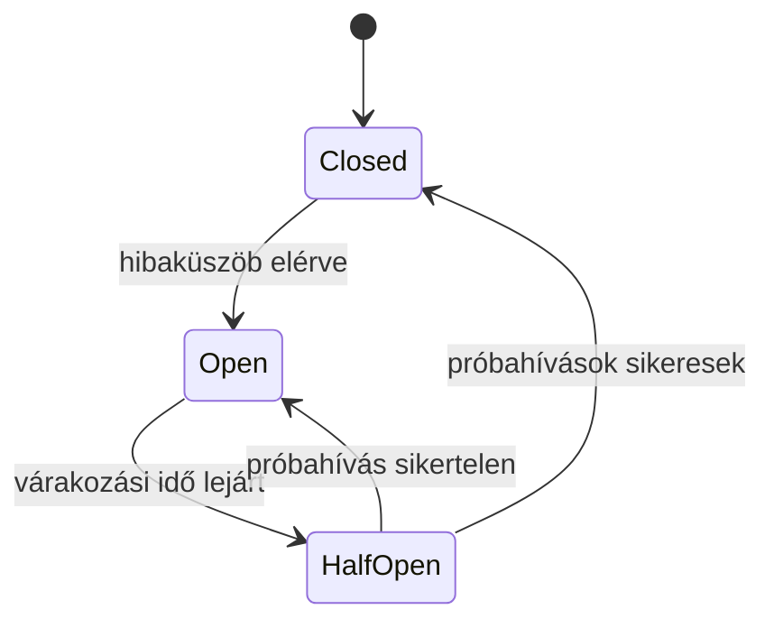

# Circuit breaker, bulkhead és túlterhelésvédelem

Egy kiesett vagy lassú függőség nemcsak az adott hívást rontja el. A rá váró kérések lefoglalhatnak kapcsolatokat, memóriát és workerhelyeket, majd a hiba továbbterjedhet más funkciókra. A hibatűrés célja a hibaterjedés korlátozása és a helyreállítás támogatása.

## Circuit breaker

A circuit breaker megfigyeli a függőséghez menő hívások eredményét, és tartós hibánál átmenetileg megszakítja az új próbálkozásokat. Closed állapotban a hívások mennek. Open állapotban a breaker gyorsan elutasít. Half-open állapotban kevés próba teszteli, helyreállt-e a függőség.

A hibaküszöb időablakhoz és minimális mintaszámhoz kapcsolódhat. Egy üzleti elutasítás, például „nincs készlet”, nem feltétlenül függőségi meghibásodás. Ha ezt technikai hibának számítjuk, a breaker egészséges szolgáltatást is letilthat.

A breaker nem végzi el a műveletet később. Gyors elutasítást vagy megtervezett fallbacket ad. A fontos parancs későbbi végrehajtásához tartós munkasor vagy más explicit folytatási modell szükséges.

## Bulkhead

Bulkhead esetén elkülönítjük az erőforráskereteket. Például a külső riportlekérés nem használhatja el a fizetési műveletek összes kapcsolathelyét. A külön pool, párhuzamossági limit vagy futtatási egység csökkenti a hibák átterjedését.

Az elkülönítés ára az erőforrás-felhasználás és a konfiguráció. Túl szűk keret normál terhelésnél is elutasíthat, túl tág keret nem ad védelmet. A limiteket a terhelési és késleltetési profil alapján választjuk, majd méréssel ellenőrizzük.

## Rate limit és concurrency limit

A rate limit időegységenként korlátozza az elfogadott kéréseket. A concurrency limit az egyszerre folyamatban levő munkát. Egy lassuló rendszerben ugyanaz a másodpercenkénti kérésütem több egyidejű munkát eredményez, ezért a két korlát eltérő problémát kezel.

Felhasználó, tenant, végpont vagy külső függőség szerint külön limit indokolt lehet. A választás ne tegye lehetővé, hogy egyetlen kliens az összes kapacitást lefoglalja. Túlterheléskor világos elutasítás, retryjelzés és felső várakozási korlát szükséges.

## Degradált működés

Fallback lehet cache-elt adat, részleges válasz vagy egy opcionális funkció kihagyása. Az eredmény jelentését meg kell őrizni. A „fizetési szolgáltatás hibás, ezért sikeres fizetést feltételezünk” elfogadhatatlan fallback. A „értékelések átmenetileg nem elérhetők” viszont lehet helyes részleges működés.

Az elavult cache megjelenítésekor a frissességi igény számít. A tegnapi ár, az aktuális készlet és egy nem kritikus statisztika külön szabályt igényel. Az általános fallback minden végpontra rossz architekturális rövidítés.

> [!important] Hibatűrés = korlátozott, ismert viselkedés
> A rendszer akkor is jól tervezett lehet, ha bizonyos műveletet hibánál elutasít. A megtévesztő sikeres válasz rosszabb, mint a követhető függő vagy sikertelen állapot.

## Hibainjektálási feladat

Tervezz vizsgálatot, amelyben egy függőség két másodpercre lassul, hibás válaszokat ad, majd teljesen elérhetetlenné válik. Add meg a várt timeoutot, breakerállapotot, párhuzamossági korlátot és kliensválaszt. Mérd, hogy az opcionális funkció hibája érinti-e a kritikus műveletet.
