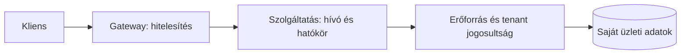

# Szolgáltatásazonosság, TLS/mTLS és jogosultság

Szolgáltatások között is ellenőrizni kell, ki hív, mire jogosult, és milyen erőforrást érint. A belső hálózat nem automatikusan megbízható. Hibás konfiguráció, kompromittált komponens vagy véletlen publikus útvonal miatt nem megengedett hívó is elérheti a szolgáltatást.

## Kapcsolatbiztonság és identitás

TLS titkosított kapcsolatot és a megállapodott tanúsítványellenőrzést ad. mTLS esetén mindkét fél tanúsítvánnyal igazolhatja magát. Ez szolgáltatás- vagy workloadazonosságot adhat, de önmagában nem mondja meg, milyen üzleti műveletet végezhet az azonosított hívó.

Tanúsítványkezeléshez kibocsátás, érvényesség, rotáció és bizalmi gyökér tartozik. A lejárt vagy ismeretlen tanúsítványt nem szabad az ellenőrzés kikapcsolásával „megjavítani”. A működési terv tartalmazza a frissítés és kiesés kezelését.

## Szolgáltatástoken és felhasználói kontextus

Egy hívás lehet tisztán szolgáltatásművelet, vagy egy felhasználó nevében végzett művelet. A kettőt meg kell különböztetni. A szolgáltatás saját azonosítása mellett szükség lehet a felhasználói jogosultságra és tenantkontextusra is.

Token továbbításakor ellenőrizzük a célt és a hatókört. Egy publikus frontend számára kibocsátott tokent nem küldünk automatikusan minden belső szolgáltatásnak, ha azok nem a megengedett audience. Delegálás vagy célhoz kötött szolgáltatástoken használható az alkalmazott identitásrendszer szerint.

JWT használatakor ellenőrizni kell az aláírást, a megengedett algoritmust, a kibocsátót, a címzettet és az időbeli feltételeket. A payload dekódolása nem hitelesítés. A kulcsforrás és a token típusa megbízható konfigurációból származzon, ne a támadó által megadott tetszőleges címről.

## Gateway és erőforrás-jogosultság

A gateway hitelesíthet és előzetes hozzáférési szabályt alkalmazhat. A szolgáltatás viszont az adatgazda: ő tudja eldönteni, hogy a hívó módosíthatja-e az adott rendelést. A „be van jelentkezve” nem egyenlő azzal, hogy bármelyik azonosítót használhatja.

A kliens által küldött tenantazonosítót össze kell vetni a hiteles kontextussal. A cache, a háttérmunka és az eseményfogyasztás se veszítse el ezt a határt. Egy jogosultságilag hibás read model vagy cache érzékeny adatot adhat másik felhasználónak.

## Legkisebb szükséges jogosultság

Szolgáltatás csak a szükséges API-kat és adatokat érje el. A készletfoglaló szolgáltatásnak nem kell minden ügyféladatbázist írnia. Az API-scope és az adatbázisjogosultság együtt csökkenti a kompromittált komponens hatását.

A naplókba ne kerüljenek tokenek, jelszavak vagy érzékeny payloadok. Diagnosztikához többnyire azonosító, műveletnév, kimenet és biztonságosan kiválasztott kontextus elég. A trace-azonosító megfigyelési adat, nem jogosultsági bizonyíték.

> [!warning] A belső elérhetőség nem hozzáférési engedély
> A hálózati korlátozás, a hitelesítés és az üzleti jogosultság egymást kiegészítő határok. Egyik sem helyettesíti automatikusan a másikat.

## Ellenőrző kérdések

1. Mit bizonyít az mTLS, és mit nem dönt el?
2. Miért kell a szolgáltatásnak a konkrét rendelés tulajdonosát ellenőriznie gateway mögött is?
3. Milyen hibát okozhat a tenantkontextus nélküli megosztott cache?

Tokenellenőrzési irányelvek: [RFC 8725 — JWT Best Current Practices](https://www.rfc-editor.org/rfc/rfc8725.html).
