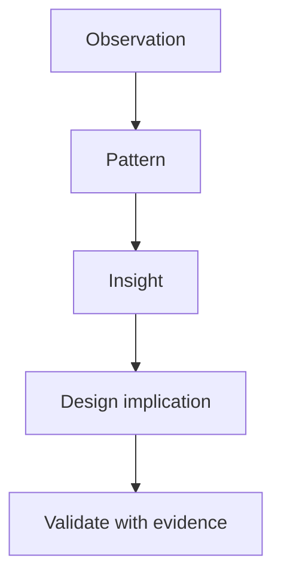

---
tags:
  - research-synthesis
  - insights
  - personas
---
# 02.03. Insights, patterns, and personas

## Objectives

By the end of the lesson, students will be able to identify patterns in raw research notes, turn quotes and observations into design insights, and create a target user description that supports decisions rather than an invented biography.

## Notes are not yet findings

> [!note] Key idea
> After an interview, it is easy to remember the most striking statement. This can be misleading. Analysis organizes signals from multiple sources: which goals people mention, which circumstances recur, what language they use, and where the same workarounds appear. You can organize these on sticky notes, in a table, or on a digital board, but always preserve the connection to the original evidence.

Label goals, obstacles, decision criteria, quotes, and exceptions separately. If three people say “I didn't know whom to contact,” that does not yet mean you need a chat window. First ask: what information was missing? Whom could they have approached? Why was that option not visible or trustworthy?

## What makes an insight an insight?

An insight is an interpretation that explains a behavioral pattern and leads to a design implication. It is more than an observation: “Two people opened several tabs.” It is more than a wish: “They want a simpler interface.” A stronger insight is: “Participants feel they can compare options only when price, time, and restrictions are visible together; hiding this information behind detail views therefore creates uncertainty in their decisions.”

A useful template is: **observation → interpretation → design implication**. This keeps insights from becoming mere opinions and lets the team trace them back to the data. If you observed something in only one participant, record it too, but label it as an exception or a signal requiring further investigation.

## Personas as decision tools

A persona is not “Nora, 21, likes coffee.” Demographics alone rarely tell us how to design. A useful persona describes the situation, goal, knowledge, constraints, and risks relevant to the task. For example: “A student handling an administrative process for the first time, with little time, unfamiliar with the official process names, and worried about missing a deadline.” This immediately raises questions about labels, timing, and feedback.

One primary target user is usually enough for a project. If you identify several roles, explain who is primary for each task and what happens if their needs conflict. Do not create a persona for every quote; a persona condenses important patterns.

## Priorities and counterexamples

Not every insight is equally important. When prioritizing, consider user impact, frequency, consequences of errors, and uncertainty about the solution. Counterexamples are valuable too: if someone completes the task easily, identify the prior knowledge, tool, or situation that helped. The interface may not have worked well; the person may simply have known the system already.

## Process at a glance

The diagram summarizes the relationships discussed above; it is a learning model, not a complete implementation.

## Worked example

A group investigating a local donation site finds in three interviews that participants repeatedly use an external search engine to check the organization before donating. The insight is not “we need a Google link.” One possible interpretation is that users lack sufficient, easily understandable evidence of the organization's credibility and the likely impact of the money. The design implication could be transparent information about the project owner, verifiable reports, or a specific funding target and explanation of how funds will be used.

## Common misconceptions

| Statement | Clarification |
| --- | --- |
| “A persona replaces research.” | A persona summarizes research after it is conducted; without research, it is merely an assumed character. |
| “Every request becomes a feature.” | The goal and obstacle behind a request matter more than the participant's proposed solution. |
| “The most frequently mentioned issue is always the most important.” | A less frequent error with serious consequences, such as a wrong payment decision, may deserve high priority. |

## Review questions

1. What is the difference between an observation and an insight?
2. What evidence supports your strongest insight?
3. What design decision does your target user description support?
4. Which counterexample should you investigate further?

## Glossary

**Insight:** an evidence-based understanding that leads to a design implication.  
**Pattern:** a behavior, goal, or obstacle recurring across observations.  
**Persona:** a target user description derived from research patterns to support decisions.  
**Synthesis:** organizing and interpreting raw research data.
