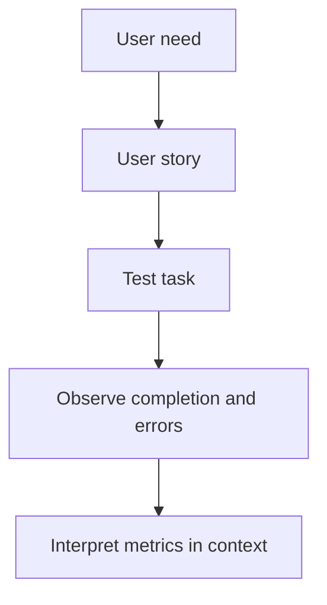

---
tags:
  - user-stories
  - task-design
  - ux-metrics
---
# 04.03. User stories, tasks, and metrics

## Objectives

Students will distinguish user stories, test tasks, and success measures. They will be able to write task instructions that provide a realistic situation without revealing the route, and choose a metric connected to the user's goal.

## User stories: intent, not specification

> [!note] Key idea
> A user story briefly states who wants to achieve which value: “As a [role], I want [goal], so that [value or consequence].” For example: “As a student handling this administrative process for the first time, I want to check whether I have uploaded every required document so that my application is not rejected as incomplete.” A user story does not list buttons, pages, or database fields. Those are later solution decisions.

A good story is not too broad. “As a student, I want to handle my administration” does not help set priorities. For a semester project, the story should let you identify a starting point, a successful end state, and the information needed for the decision.

## Task instructions for testing

A test task is not the same as a user story. It gives participants a specific situation without telling them where to click. A poor instruction is: “Find the cancellation button.” A better one is: “Imagine that you cannot attend tomorrow's booking. Find out what you can do and explain what would happen.” The latter investigates the user's goal rather than recognition of an interface element.

Avoid excessive background information and hidden correct answers. If completing the task requires testers to think exactly like the designer, you are not testing the interface. Define success in advance so you do not adjust the assessment afterward to match the desired result.

## What should we measure?

Metrics should fit the question. In early usability tests, useful indicators often include successful completion, requests for help, misunderstandings, critical errors, and observable uncertainty. Timing makes sense only if tasks and participants are comparable and speed actually matters. In a healthcare decision, choosing too quickly may itself be risky.

A qualitative indicator is whether participants can correctly explain the consequences in their own words at the end of the process. For example, do they know whether the booking is final, when to arrive, and how to change it? This measures understanding rather than clicks.

## Process at a glance

The diagram summarizes the relationships discussed above; it is a learning model, not a complete implementation.

## Worked example

User story: “As an event organizer, I want to choose a suitable activity for my group so that it is accessible to every participant.” Test task: “You are looking for a free English-language activity for a group of eight on Friday evening. Find an option whose suitability you can confidently judge.” Success criterion: participants find a suitable event, can identify the time, place, cost, and registration condition, and do not misunderstand critical information.

## Common misconceptions

| Statement | Clarification |
| --- | --- |
| “A user story is a shortened development task list.” | It records intent and value, not implementation. |
| “A metric is always a number.” | A clear, predefined observation or correct understanding can also provide a valuable measure. |
| “The test task must name the feature.” | This can hide whether users would find or recognize it themselves. |

## Review questions

1. Is your user story based on a goal or a screen?
2. Does your test task reveal the name of the solution?
3. What would count as a critical error in your project, and how would you observe it?
4. What indicator would show that users truly understand the consequences?

## Glossary

**User story:** a brief statement of a user's role, goal, and expected value.  
**Test task:** a neutral instruction embedded in a specific situation for trying a solution.  
**Success criterion:** a predefined indication of successful task completion.  
**Critical error:** an error that prevents or seriously misdirects the main task.
