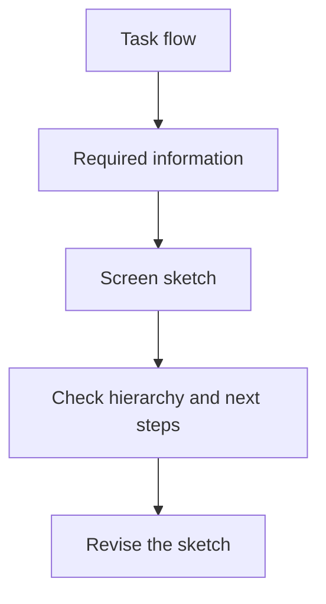

---
tags:
  - wireframing
  - low-fidelity
  - screen-sketches
---
# 06.01. Low-fi thinking and screen sketches

## Objectives

Students will understand why low-fi wireframes are used to investigate structural questions. They will be able to create screen sketches from a user flow, identify the main task, information, and state on a screen, and distinguish structural decisions from later visual decoration.

## Why start with low fidelity?

> [!note] Key idea
> A wireframe is not an unfinished visual design. It is a quick, low-detail model for discussing content, sequence, interaction, and task flow at little cost. If the first version already uses colors, images, fonts, and polished illustrations, feedback can easily drift toward aesthetic preferences: “that's a nice blue,” when the important question is whether participants notice the cancellation condition at all.

Low-fi can mean paper, a whiteboard, a simple Figma file, or any tool that allows quick changes. Match fidelity to the question. If you are examining screen order, a few boxes and labels may suffice. If you are testing whether people understand an error message, realistic wording may already be more important.

## From flow to screen

Do not begin with a blank canvas. Take your user flow and ask, for every important state: what must users know here, what must they decide, what can they do, and how will they see the consequences? An appointment selection screen, for example, needs more than a calendar. Location, duration, price, capacity, and how to change an earlier choice may all matter.

Sketch empty, loading, or error states alongside the normal path. You need not fully develop every state, but indicate what happens at critical points in the flow. The sketch should help the team and testers discuss the same system behavior.

## What should a wireframe indicate?

Make the screen title, main information, primary action, secondary options, and state clear. For complex elements, add a short annotation explaining the assumption: for example, “only available appointments can be selected,” “the error message appears after submission,” or “previous data is retained when going back.” This prevents everyone from inferring different behavior from the screen's appearance.

## Process at a glance

The diagram summarizes the relationships discussed above; it is a learning model, not a complete implementation.

## Worked example

In an event discovery service, the main goal is choosing an evening activity. The first sketch immediately shows a detailed map and many filters before the results list. Testing reveals that participants first want to see what is happening today, what it costs, and where to go. In the next low-fi version, the list comes first, the map becomes a secondary view, and every card shows the key information. The change follows the decision sequence rather than visual taste.

## Common misconceptions

| Statement | Clarification |
| --- | --- |
| “Wireframes should be ugly.” | The aim is to prevent details from obscuring structural questions, not to make something ugly. |
| “Every screen must be drawn first.” | Start by creating and trying the main task's critical states. |
| “Low-fi cannot be tested.” | Low-fi is often the best tool for navigation, content, and hierarchy questions. |

## Review questions

1. Which user flow state still lacks a screen sketch?
2. What is the primary task in each sketch?
3. What assumption should you record in an annotation?
4. Which detail would currently distract from the structural question?

## Glossary

**Wireframe:** a low-detail screen sketch showing interface structure and hierarchy.  
**Low-fi:** a prototype level with low visual and technical detail.  
**Annotation:** a brief explanation of behavior or an assumption attached to a sketch.  
**Primary action:** the most important user action supporting a screen's main task.
