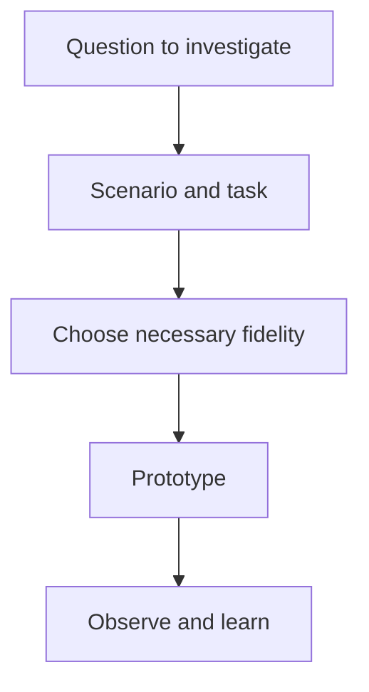

---
tags:
  - prototyping
  - prototype-fidelity
  - scenarios
---
# 07.02. Prototype fidelity and scenarios

## Objectives

Students will be able to match prototype detail to the question being investigated and write scenarios and tasks that make a design testable without revealing the solution in advance.

## A prototype answers a question

> [!note] Key idea
> A prototype is not a miniature copy of the finished product. It is a testable model of a hypothesis. Appropriate fidelity depends on what we want to learn. A low-detail clickable sketch may suffice for structure and navigation. Investigating copy, trust, brand voice, or complex data interpretation requires more realistic content. Do not build what the research question does not justify.

Document the prototype's limitations. If search, payment, or notifications are not real, you need not give participants a technical explanation, but you must know what the findings can and cannot apply to.

## Scenarios and tasks

A scenario supplies context: who you are, what happened, the goal, and relevant constraints. A task does not instruct participants how to solve it. “Find an available court for four people on Friday evening” is better than “Open the filter and select Friday.” The first tests whether the system is understandable; the second only tests finding a control.

Define the starting point and success criterion in advance. Success might be a choice, a correctly interpreted condition, or a completed process. If participants choose a different but reasonable route, do not treat it as an error merely because it differs from the intended path.

## Process at a glance

The diagram summarizes the relationships discussed above; it is a learning model, not a complete implementation.

## Worked example

In an event discovery prototype, the designer wants to test whether filters are understandable. A real database is unnecessary: a few carefully chosen events and states where filtering visibly changes the list are enough. The task is: “You are looking for a free English-language activity tonight that does not require advance registration.” Observe participants' words, which information they expect on cards, and whether they can judge if a result fits.

## Common misconceptions

| Statement | Clarification |
| --- | --- |
| “High fidelity is always better.” | Only when the research question requires it; otherwise, it is costly and can misleadingly appear final. |
| “A prototype problem is the tester's fault.” | Testing reveals where the model or task is insufficiently clear. |

## Review questions

1. Which questions can your low-fi prototype answer, and which need more realistic content?
2. Do your task instructions reveal the solution's name?
3. What is a known limitation of your prototype?

## Glossary

**Prototype fidelity:** the model's visual, content, and interaction detail.  
**Scenario:** a framework describing the situation and goal of a user task.  
**Starting point:** the interface state from which participants begin the task.  
**Success condition:** a predefined indication of successful task completion.
