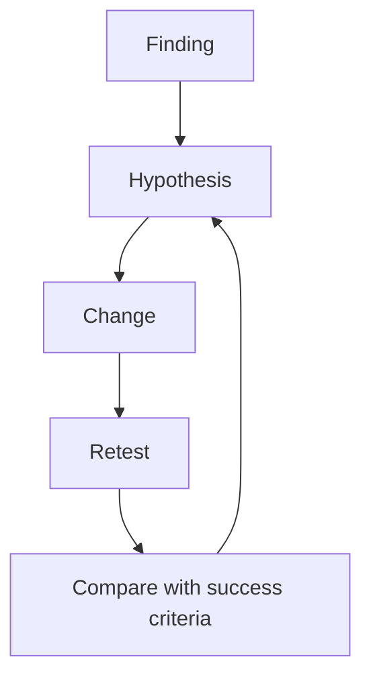

---
tags:
  - iteration
  - validation
  - tradeoffs
---
# 09.02. Improvement cycles and tradeoffs

## Objectives

Students will understand that iteration does not mean implementing every tester suggestion. They will compare alternatives, make tradeoffs visible, and check changes with further evidence.

## The iteration cycle

> [!note] Key idea
> A deliberate iteration has four steps: an observation or finding, a hypothesis about the cause, a change, and verification. Omitting the second step risks treating only a surface symptom. Omitting the fourth leaves only the designer's impression of the change.

Do not treat participant suggestions as finished specifications. If someone says “we need a bigger button,” ask what uncertainty or difficulty that would resolve. The issue may be size, label, location, or not knowing when the button can be used. You can create several alternatives and examine them within the task.

## Tradeoffs

Every decision can have side effects. More explanation may clarify a condition while crowding the mobile view. Earlier confirmation may reduce errors while slowing frequent users. A tradeoff is not a failure; it becomes dangerous when hidden or disconnected from the task's consequences.

Record the values involved: understandability, speed, accessibility, security, feasibility, and cost. “It didn't fit” is not a complete explanation. A better one is: “On mobile, the short summary remains visible and detailed conditions can be opened because testing showed the basic information was needed for the decision; we will check discoverability of the details in the next round.”

## Returning to research

If iteration reveals that we misunderstood the user's goal or situation, drawing another button is insufficient. Return to the research question. Users may ignore a filter because they choose based on different information, rather than because it is poorly placed. The iterative process is not linear; testing may take us back to problem framing.

## Process at a glance

The diagram summarizes the relationships discussed above; it is a learning model, not a complete implementation.

## Worked example

In an event discovery service, participants do not use the “Ease of access” filter. The first suggestion is to move it forward. Interviews reveal, however, that they do not understand the term and instead ask concrete questions: are there stairs, is the restroom accessible, and can the venue be reached by public transport? A better iteration revisits the label and information model rather than merely rearranging the screen.

## Review questions

1. For which finding could you create two different solution hypotheses?
2. Which values involve tradeoffs in your project?
3. Which change should be retested rather than simply accepted?

## Glossary

**Iteration cycle:** a repeating sequence of observation, hypothesis, change, and verification.  
**Tradeoff:** a deliberate choice between two or more values.  
**Alternative:** a different solution hypothesis for the same problem.  
**Validation:** checking whether a change produced the expected effect.
