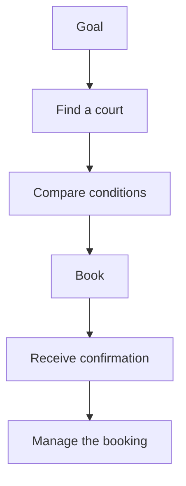

# UX, UI, and service experience

## Objectives

By the end of this lesson, students will be able to distinguish the visual quality of an interface from the overall user experience. They will be able to identify several touchpoints of a digital service and describe a problem in terms of a user task and its consequences, rather than simply as a screen defect.

## What does UX actually mean?

> [!note] Key idea
> **UX**, or user experience, is not the mood of an application or the design of an individual screen. The experience begins when someone recognizes their goal and ends when they know whether they have achieved it and experience its consequences. When a student registers for an exam, UX includes finding the deadline, understanding the requirements, filling in the form, receiving confirmation, and later being able to check what they registered for.

**UI**, or user interface, is the layer through which users see and control this process: headings, buttons, fields, navigation, icons, colors, spacing, and feedback. UI matters because it makes the system understandable. However, an attractive UI does not establish good UX. Even a visually polished booking page provides a poor experience if availability is unclear or users do not receive clear confirmation after payment.

This is why “make it more modern” is not a design goal in itself. The question is: **which person, in which situation, cannot currently complete which task with enough confidence, speed, or fairness?** The interface provides tools for addressing that problem.

## Design a process, not just a screen

Imagine a sports court booking service. The home screen may have a large, striking search field, but the actual experience involves several steps:

1. Users decide when they want to play and with whom.
2. They try to find a suitable court nearby.
3. They compare times, prices, equipment, and cancellation conditions.
4. They book, pay, or receive confirmation.
5. Later, they find the address, change the booking, or cancel.

If we design only the screen for the third step, we can easily lose sight of what comes before and after it. For example, an “Available” label is insufficient if the time zone, booking duration, or free cancellation deadline is unclear. Good UX does not necessarily mean showing everything at once; it means making the necessary information available and understandable when a decision is made.

## Touchpoints and service experience

Even with digital products, parts of the user journey often take place outside the interface. A touchpoint might be an email, push notification, customer support response, automatically generated invoice, physical location, or another organization's system. If the booking interface says the booking succeeded but the email never arrives, the service still feels uncertain to the user.

This does not mean a student project must design every channel in full detail. It means identifying the critical points. A task is complete when users also know what happened, what will happen next, and where they can get help.

## UX, UI, and product design

**Product design** generally combines understanding the problem, shaping the solution, and aligning it with product goals. Organizations do not all use role names in the same way, but the central point remains: a design decision is more than a matter of taste. It weighs evidence about research, operational constraints, business goals, technology, and users.

In a login process, for example, the organization wants to reduce misuse, the development team wants secure authentication, and users want to sign in quickly. A good design cannot simply choose one goal over the others. It must examine the risks of failure, which steps are justified, and how to communicate the necessary security measures clearly.

## Process at a glance

The diagram summarizes the relationships discussed above; it is a learning model, not a complete implementation.

## Worked example: appointment booking

An initial problem for a healthcare booking service might be: “Users do not know which specialist service to choose.” A poor first response would be “let's draw a larger calendar.” First, clarify the source of uncertainty. Perhaps service names use specialist jargon. Perhaps there is no explanation of referral requirements. Perhaps users discover only at the end of booking that the appointment is unsuitable for them.

Each possibility suggests a different solution hypothesis: plain-language descriptions and examples, a question that supports the decision, or earlier presentation of the conditions. The design goal is to reduce the cause of uncertainty, rather than redraw the calendar.

## Common misconceptions

| Statement | Clarification |
| --- | --- |
| “UX is research; UI is drawing.” | Research is an important UX activity, but prototypes, copy, error states, and testing also shape the experience. UI designers must understand the user task too. |
| “If users eventually achieve their goal, the process is good.” | Not necessarily. They may have encountered so much uncertainty, so many detours, or such a high risk of error that they will avoid it next time. |
| “Users always know what they need.” | They know their circumstances and difficulties well, but designing an appropriate solution requires research and iteration. |

## Review questions

1. What is the difference between UX and UI in a specific digital service?
2. Name three touchpoints other than the main application screen.
3. Why is “the interface is outdated” an insufficient problem statement?
4. What information do users need to feel certain that a task is complete?

## Glossary

**Touchpoint:** any moment or channel in a service where users encounter information, an interface, or an organization.  
**Task flow:** the sequence of steps, decisions, and states required to achieve a goal.  
**Product design:** the design practice of aligning a user problem, a solution, and product constraints.  
**Service experience:** the experience of the entire customer journey, extending beyond the digital interface.
