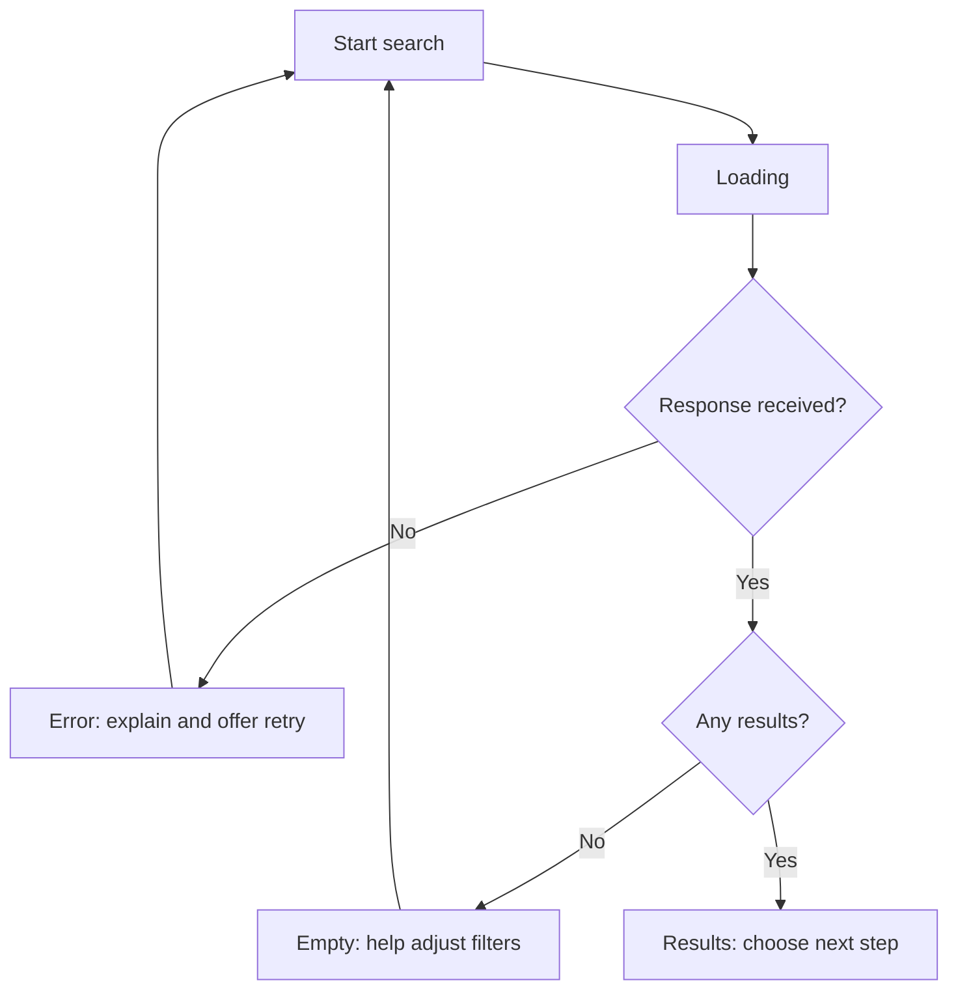

# Errors, feedback, and states

## Objectives

Students will be able to design the states of a main task: normal, loading, empty, error, success, and disabled. They will understand that an error message is content supporting the user's next decision, rather than a technical log.

## More than the “normal” screen exists

> [!note] Key idea
> Many designs show only the ideal moment when all data is available and users act correctly. Real use includes slow networks, unavailable appointments, invalid data, empty search results, expired access, or interrupted payments. These are not exceptional situations; the system's quality often becomes apparent here.

For every main screen, consider at least normal, loading, empty, error, and success states. If something cannot be used, explain the disabled state: why it is unavailable and what is needed to enable it. A gray button alone is not necessarily understandable, particularly if users cannot see which condition is missing.

## Loading and waiting

Waiting creates uncertainty when users do not know whether anything happened, how long it might take, or whether they may try again. Immediate visual feedback may suffice for short waits; longer processes should explain what the system is doing and preserve entered data where possible. Avoid misleading progress indicators: do not show a bar stuck at 90% if it has no real connection to the process status.

## Empty states

An empty list is not the same as an error. A new account may have no bookings yet, or filtering may produce no results. A good empty state names the situation, briefly explains why, and offers a next step. “You haven't saved any events yet. Browse today's activities.” This is much more useful than blank white space or a system message saying “No data.”

## Error messages as help

A good error message answers three questions: what happened, what are the consequences, and what can users do now? “We couldn't save your changes. Your changes have not been lost; try again or download them as a draft.” The message need not expose internal error codes, but if support needs a code, it can be displayed separately in a copyable form.

In forms, connect errors to their fields and preferably summarize them after submission too. Instead of simply writing “required field,” name the missing information and expected format. Error states should remain perceivable without color.

## Success and the next step

A success state closes the current task but often opens the next one. After booking, users need to know the date, location, how to make changes, and how they will be notified. “Success!” alone does not provide enough reassurance. If processing is delayed, do not promise a final outcome: say that the request was received and when a response is expected.

## Process at a glance

The diagram summarizes the relationships discussed above; it is a learning model, not a complete implementation.

## Worked example: a search with no results

In an event search, someone selects “tonight,” “free,” and “English-language” filters. “No results” is technically true but unhelpful. A good state can show which condition is most restrictive, suggest the following day or a nearby location, and allow filters to be reset in one click. The system does not force another choice; it helps users understand the current result.

## Common misconceptions

| Statement | Clarification |
| --- | --- |
| “Error pages are rare, so they need no design.” | Clear communication is especially important for rare errors with serious consequences. |
| “A spinner provides enough loading feedback.” | Only if the wait is short and users know what will change afterward. |
| “A success state is decoration.” | It can be essential to closing the task and understanding the next step. |

## Review questions

1. Which states are missing from your current prototype?
2. Does an error message explain what happened, what was preserved, and what to do?
3. How would you help users with a no-results search without hiding reality?
4. What must users know immediately after a successful action?

## Glossary

**Loading state:** an interface state indicating an operation in progress.  
**Empty state:** a state with no content to display, either because none exists yet or because of filtering.  
**Error state:** communication of a situation that prevents or casts doubt on successful task continuation.  
**Success state:** a state showing an action's outcome and possible next steps.
