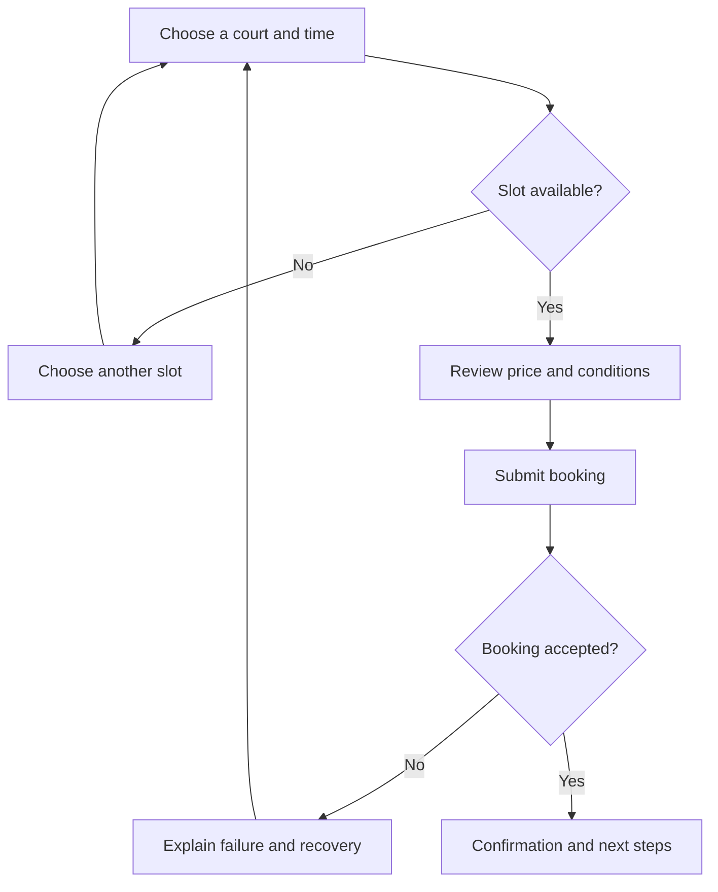

# User flows and exceptional states

## Objectives

Students will be able to break a user goal into steps, decision points, and system states. They will understand that a flow is more than a sequence of screens and that the main path is incomplete without designing exceptional states.

## What does a user flow represent?

> [!note] Key idea
> A user flow shows the route from the starting situation to achieving a goal. Indicate user actions, system responses, decision points, required data, and successful or unsuccessful outcomes. You do not need every small UI element; focus on steps that matter for decisions and consequences.

Begin with the user goal rather than the opening screen, for example “book a suitable appointment.” Then describe what information users must find, which conditions they must select, what the system checks, and how they know they succeeded. If several routes lead to the goal, identify the main one and explain why.

## Decision points and information needs

At every decision point, ask what information supports a good choice, where it comes from, and what happens if it is unavailable. “Choose an appointment” lacks detail if it does not indicate availability, location, price, duration, or cancellation conditions. A flow helps reveal when information needed earlier has been placed on a later screen.

Pay special attention to backtracking and editing. Users do not always move linearly: they compare, change their minds, look up information, or interrupt the process. A good flow preserves what reasonably should be preserved and clearly communicates what changes.

## Exceptional states

An exceptional state is not necessarily rare. If an appointment becomes unavailable, the connection drops, or data is invalid, the main task's actual circumstances change. Mark at least the high-impact branches: no results, ineligibility, invalid data, an unavailable resource, an interrupted action, and successful completion.

Not every exception needs an entirely separate sequence of screens. Some need field-level feedback; others need an alternative route or access to help. What matters is that users understand what happened, what was preserved, and what they can do now.

## Process at a glance

The diagram summarizes the relationships discussed above; it is a learning model, not a complete implementation.

## Worked example: booking a court

Main flow: search for a location → select a time → check conditions → enter details → submit booking → confirmation. Critical branches: the selected time becomes unavailable; the user does not accept the cancellation condition; payment fails; booking processing is delayed. Design the explanation and next step for each. Prototype testing can then examine trust and recoverability alongside the ideal path.

## Review questions

1. What are the starting and success states of your main task?
2. Which decision point still lacks important information?
3. What happens if users change their minds before the last step?
4. Which exception would have the greatest consequences?

## Glossary

**User flow:** a representation of the steps, decisions, and states leading to task completion.  
**Decision point:** a step where the user or system chooses between routes.  
**Main path:** the most common or primary successful route through a task.  
**Exceptional state:** an error, missing condition, or alternative situation that changes continuation of the normal task path.
