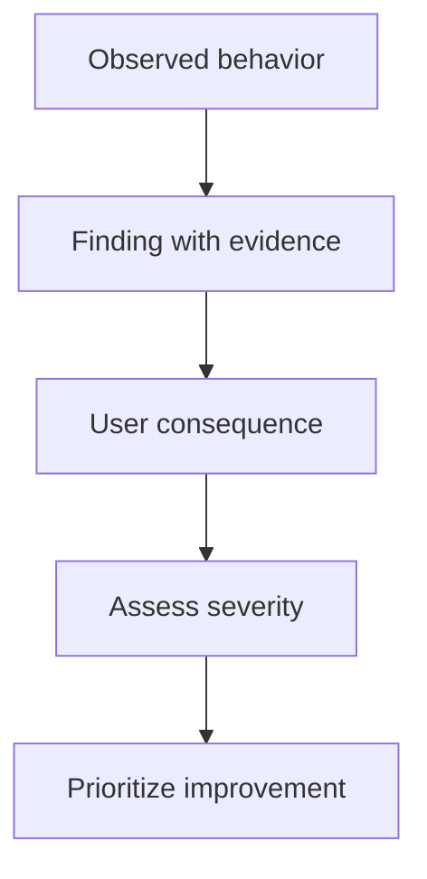

# Findings, severity, and prioritization

## Objectives

Students will be able to write evidence-based findings from test notes, estimate problem severity, and prioritize improvements by user impact, frequency, risk, and effort rather than personal taste.

## The structure of a finding

> [!note] Key idea
> A finding is not a label such as “bad UX” or “unintuitive menu.” Describe the observation, affected task, consequence, and possible cause. For example: “Before payment, three participants thought the booking was already final because the screen was titled ‘Booking successful.’ As a result, they did not check the amount and cancellation condition. Possible cause: the intermediate summary uses success-state language.” This can be discussed and improved.

Connect similar phenomena without forcing different causes together. Two participants may get stuck in the same place with different expectations; the difference may itself be an important finding.

## Severity

At least three factors shape severity: the impact on the main task, how frequently the problem occurs in relevant use, and whether users can recover. A critical error may prevent booking or lead to a wrong decision. A medium-severity error slows users, creates uncertainty, or requires outside help. A low-severity issue may be aesthetic or easy to work around, but still deserves documentation.

Do not confuse conspicuous problems with severe ones. A striking animation can be annoying, but a small, ambiguous cancellation condition may have greater consequences.

## Priority and improvement

Write an improvement hypothesis for each finding rather than immediately committing to a final solution. “Make it clear that booking becomes final only after the next step” is better than “put a green button here.” Then weigh expected user impact, implementation effort, uncertainty, and effects on other areas. A quick fix is not always the most important; a high-impact but uncertain decision may need retesting.

## Process at a glance

The diagram summarizes the relationships discussed above; it is a learning model, not a complete implementation.

## Worked example

Finding: participants do not understand whether the selected appointment uses local time or the service's central time zone. Impact: they may arrive at the wrong time, so it is high. Frequency: it arose with every tester. Improvement hypothesis: display the location's time zone beside the appointment and repeat it in the confirmation. After the change, a new test task can check whether participants state the appointment time correctly.

## Review questions

1. Does your finding contain an observation or an opinion?
2. What is the highest-impact error in your project?
3. Which proposed improvement needs a new test?
4. How would you express the problem without proposing a solution?

## Glossary

**Finding:** an evidenced usability problem concerning a task and its consequences.  
**Severity:** an estimate of a problem's user impact, frequency, and recoverability.  
**Priority:** a justified order for improvements.  
**Improvement hypothesis:** a testable assumption about the effect of a change.
