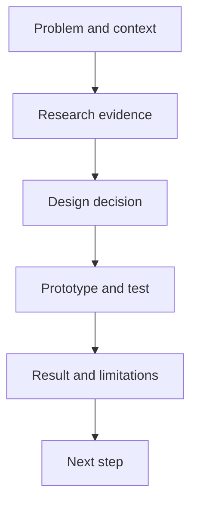

# Design story and evidence

## Objectives

Students will be able to present a project as a verifiable design story rather than a list of screens. They will distinguish claims, evidence, decisions, and results and understand why statements should reflect the strength of the evidence.

## The structure of a design story

> [!note] Key idea
> A strong project presentation answers a simple question: **why this solution in the situation studied?** The story begins with the user and problem, rather than the first screen in the Figma file. Research evidence, design decisions, testing, and results follow. The ending explains what you learned, what changed, and what remains open, rather than merely saying “it's finished.”

Make claims specific. Instead of “Users struggled to find cancellation,” show the task, how many studied participants encountered the issue, and what behavior revealed it. Evidence can be a quote, observation, user flow, before-and-after screen, or test finding. One strong, relevant piece of evidence is worth more than many decorative screenshots.

## Evidence, decision, result

Avoid logical gaps. If a research quote leads directly to a new feature, explain the interpretation. For example: observation—participants switch between views to compare times and prices; insight—decision information is not displayed together; decision—both details appear upfront on result cards; result—in the next test, participants choose with less backtracking. This chain makes the presentation professionally understandable.

Do not claim more than the evidence supports. With a small test, discuss “the participants studied,” rather than “all users.” If a change has not been tested, call it a hypothesis rather than a result.

## What is worth showing?

Choose artifacts that explain decisions: a brief research summary, persona or situation description, user flow, low-fi sketch, prototype excerpt, test note, or iteration. You do not need to project the entire workflow. A screen is useful when it shows which problem it addresses and what indicates that the response works or remains uncertain.

## Process at a glance

The diagram summarizes the relationships discussed above; it is a learning model, not a complete implementation.

## Worked example

“During research, participants could not compare basic event information, so they opened external tabs. We displayed time, price, location, and registration conditions together on the cards. In the second test, every participant could judge whether a result was suitable; however, interpretation of group size remained unresolved.” This is a brief design story: situation, evidence, decision, result, and limitation.

## Review questions

1. What is your project's main claim in one sentence?
2. What evidence supports your most important decision?
3. Where is there a logical gap in your current presentation?
4. Which screen can you omit because it does not explain a decision?

## Glossary

**Design story:** a coherent presentation of the problem, evidence, decision, and result.  
**Evidence:** data from research, testing, or a verified source that supports a claim.  
**Artifact:** a tangible document or output of the design process.  
**Claim:** a statement that needs supporting evidence.
