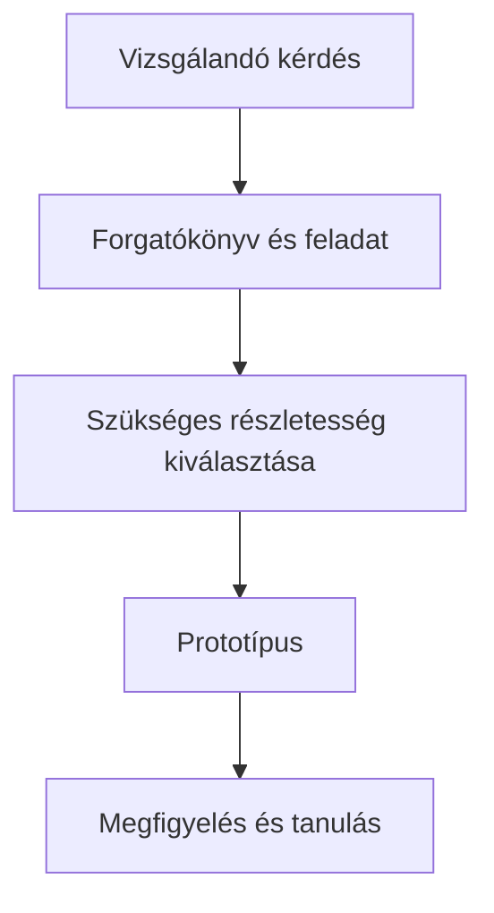

---
tags:
  - prototyping
  - prototype-fidelity
  - scenarios
---
# 07.02. Prototípushűség és forgatókönyv

## Célok

A hallgató képes lesz a prototípus részletességét a vizsgált kérdéshez igazítani, és olyan forgatókönyvet, illetve feladatot írni, amely kipróbálhatóvá teszi a tervet anélkül, hogy előre elmondaná a megoldást.

## A prototípus kérdésre válaszol

> [!note] Kulcsgondolat
> A prototípus nem a kész termék miniatűr másolata. Egy hipotézis kipróbálható modellje. A megfelelő hűség attól függ, mit akarunk megtudni. Struktúra és navigáció vizsgálatához alacsony részletességű, kattintható vázlat is elég lehet. Szöveg, bizalom, márkahang vagy összetett adatértelmezés vizsgálatához valósághűbb tartalom kell. Ne építs olyat, amit a kutatási kérdés nem indokol.

A prototípus korlátait dokumentáld. Ha nincs valós keresés, fizetés vagy értesítés, ezt a tesztelőnek nem kell technikai részletként előadni, de neked tudnod kell, mire vonatkozhat és mire nem az eredmény.

## Forgatókönyv és feladat

A forgatókönyv helyzetet ad: ki vagy, mi történt, mi a cél és milyen korlát számít. A feladat nem utasítja a résztvevőt a megoldásra. „Keress foglalható pályát péntek estére négy embernek” jobb, mint „Nyisd meg a szűrőt és válaszd ki a pénteket”. Az első a rendszer érthetőségét, a második csak a vezérlő megtalálását méri.

Előre rögzítsd a kezdőpontot és a siker kritériumát. Lehet a siker egy választás, egy helyesen értelmezett feltétel vagy egy végigvitt folyamat. Ha a tesztelő más, de ésszerű utat választ, azt ne kezeld hibának csak azért, mert nem a tervezett útvonalat követte.

## A folyamat áttekintése

Az ábra a fenti összefüggéseket foglalja össze; tanulási modell, nem teljes megvalósítás.

## Végigvezetett példa

Egy eseménykereső prototípusban a tervező azt akarja vizsgálni, hogy a szűrők érthetők-e. Nem szükséges valódi adatbázis: elég néhány gondosan kiválasztott esemény és olyan állapot, ahol a szűrés láthatóan módosítja a listát. A tesztfeladat: „A mai estére keresel ingyenes, angol nyelvű programot, amelyre nem kell előre regisztrálni.” A megfigyelés tárgya az, milyen szavakat használ a résztvevő, mely adatokat vár el a kártyán, és el tudja-e dönteni, hogy a találat megfelel-e.

## Gyakori tévhitek

| Állítás | Pontosítás |
| --- | --- |
| „A magas hűség mindig jobb.” | Csak akkor, ha a vizsgálati kérdéshez szükséges; különben drága és félrevezetően véglegesnek tűnik. |
| „A prototípus hibája a tesztelő hibája.” | A teszt éppen azt mutatja meg, hol nem elég világos a modell vagy a feladat. |

## Ellenőrző kérdések

1. Mely kérdéshez elég a low-fi prototípusod, és mihez kellene valósabb tartalom?
2. A feladatutasításod elárulja-e a megoldás nevét?
3. Mi a prototípusod ismert korlátja?

## Fogalomtár

**Prototípushűség:** a modell vizuális, tartalmi és interakciós részletessége.  
**Forgatókönyv:** a felhasználói feladat helyzetét és célját leíró keret.  
**Kezdőpont:** az a felületi állapot, ahonnan a résztvevő a feladatot indítja.  
**Sikerfeltétel:** előre rögzített jel a feladat eredményes teljesítésére.
