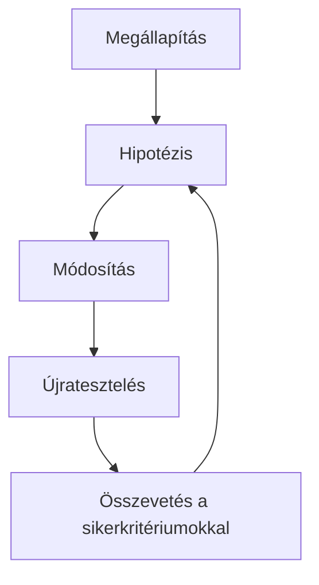

---
tags:
  - iteration
  - validation
  - tradeoffs
---
# 09.02. Javítási ciklus és kompromisszumok

## Célok

A hallgató megérti, hogy az iteráció nem a tesztelők minden javaslatának beépítése. Képes alternatívákat összehasonlítani, a kompromisszumokat láthatóvá tenni, és a változtatásokat újabb bizonyítékkel ellenőrizni.

## Az iteráció ciklusa

> [!note] Kulcsgondolat
> Egy tudatos iteráció négy lépésből áll: megfigyelés vagy lelet, okra vonatkozó hipotézis, változtatás, majd ellenőrzés. Ha a második lépés kimarad, könnyen csak felületi tünetet javítunk. Ha a negyedik marad el, a módosításról csak a tervező benyomása marad.

Ne tekintsd a résztvevő javaslatát kész specifikációnak. Ha valaki azt mondja, „kellene egy nagyobb gomb”, kérdezd meg, milyen bizonytalanságot vagy nehézséget oldana meg. Talán a gomb mérete gond, talán a címkéje, a helye vagy az, hogy nem tudja, mikor használható. Több alternatívát is készíthetsz, majd a feladatban vizsgálhatod őket.

## Kompromisszumok

Minden döntésnek lehet mellékhatása. A több magyarázat érthetőbbé teheti a feltételt, de zsúfolhatja a mobilnézetet. A korábbi megerősítés csökkentheti a hibát, de lassíthatja a gyakori felhasználót. A kompromisszum nem kudarc; akkor veszélyes, ha rejtve marad vagy nem kapcsolódik a feladat következményéhez.

Rögzítsd, milyen értékek között választasz: érthetőség, sebesség, hozzáférhetőség, biztonság, implementálhatóság, költség. A „nem fért el” nem teljes indoklás. Inkább: „Mobilon a rövid összefoglaló marad látható, a részletes feltétel megnyitható, mert a tesztben az alapinformációra volt szükség a döntéshez; a részletek megtalálhatóságát a következő körben ellenőrizzük.”

## Vissza a kutatáshoz

Ha az iteráció közben kiderül, hogy rosszul értettük a felhasználói célt vagy helyzetet, nem elég új gombot rajzolni. Vissza kell térni a kutatási kérdéshez. Lehet, hogy a felhasználó nem azért nem használ egy szűrőt, mert rossz helyen van, hanem mert más információ alapján választ. Az iteratív folyamat nem lineáris; a teszt visszavihet a probléma megfogalmazásához is.

## A folyamat áttekintése

Az ábra a fenti összefüggéseket foglalja össze; tanulási modell, nem teljes megvalósítás.

## Végigvezetett példa

Egy eseménykeresőben a résztvevők nem használják a „Megközelíthetőség” szűrőt. Első javaslat: tegyük előre a szűrőt. Interjúból azonban kiderül, hogy a kifejezést nem értik, és inkább konkrét kérdéseket tesznek fel: van-e lépcső, akadálymentes-e a mosdó, elérhető-e tömegközlekedéssel. A jobb iteráció nem pusztán átrendezés: a címke és az információs modell felülvizsgálata.

## Ellenőrző kérdések

1. Melyik lelethez készíthetnél két eltérő megoldási hipotézist?
2. Milyen értékek között van kompromisszum a projektedben?
3. Mely változtatást kellene újra tesztelni, nem csak elfogadni?

## Fogalomtár

**Iterációs ciklus:** megfigyelés, hipotézis, változtatás és ellenőrzés ismétlődő sora.  
**Kompromisszum:** két vagy több érték közötti tudatos választás.  
**Alternatíva:** ugyanarra a problémára adott eltérő megoldási hipotézis.  
**Validáció:** annak ellenőrzése, hogy a változtatás a várt hatást okozta-e.
