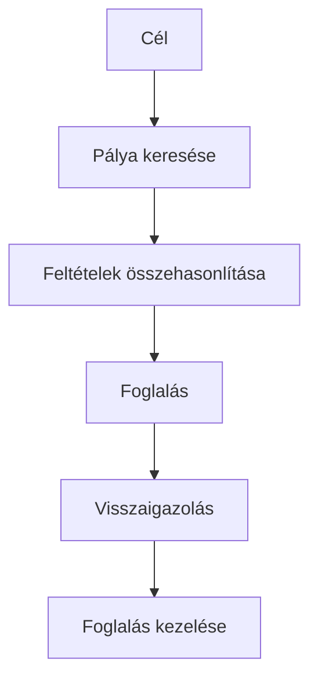

# UX, UI és szolgáltatásélmény

## Célok

Az anyag végére a hallgató képes lesz megkülönböztetni a felület vizuális minőségét a teljes felhasználói élménytől. Meg tud nevezni egy digitális szolgáltatás több érintkezési pontját, és egy problémát nem képernyőhibaként, hanem felhasználói feladat és következmény összefüggéseként ír le.

## Mit jelent valójában az UX?

> [!note] Kulcsgondolat
> Az **UX**, vagyis user experience nem egy alkalmazás „hangulata”, és nem egy külön képernyő terve. Az élmény akkor kezdődik, amikor valaki felismeri a saját célját, és akkor ér véget, amikor tudja, hogy elérte-e azt, illetve viseli a következményét. Ha egy hallgató vizsgára jelentkezik, az UX része a határidő megtalálása, a feltételek megértése, az űrlap kitöltése, a visszaigazolás, majd az is, hogy később vissza tudja-e keresni, mire jelentkezett.

Az **UI**, vagyis user interface az a réteg, amelyen keresztül a felhasználó ezt a folyamatot látja és kezeli: a címsorok, gombok, mezők, navigáció, ikonok, színek, térközök és visszajelzések. A UI fontos, mert rajta keresztül válik érthetővé a rendszer. De egy szép UI nem bizonyít jó UX-et. Egy vizuálisan igényes foglalási oldal is rossz élményt ad, ha nem derül ki, van-e még szabad hely, vagy a felhasználó a fizetés után nem kap egyértelmű visszaigazolást.

Ezért a „tegyük modernebbé” önmagában nem tervezési cél. A kérdés inkább az: **melyik ember milyen helyzetben milyen feladatot nem tud most elég biztosan, gyorsan vagy méltányosan elvégezni?** A felület ehhez ad megoldási eszközöket.

## Egy folyamatot tervezzünk, ne egy képernyőt

Képzeljünk el egy sportpálya-foglaló szolgáltatást. A kezdőképernyőn lehet egy nagy, látványos keresőmező, de a tényleges élmény több lépésből áll:

1. A felhasználó eldönti, mikor és kivel szeretne játszani.
2. Megpróbálja megtalálni a hozzá közeli, megfelelő pályát.
3. Összehasonlítja az időpontot, árat, felszerelést és lemondási feltételeket.
4. Foglal, fizet vagy visszaigazolást kap.
5. Később megtalálja a címet, módosít vagy lemond.

Ha csak a harmadik lépés képernyőjét tervezzük meg, könnyen elvesznek az előzmények és a következmények. Például az „Elérhető” címke nem elég, ha nem világos, melyik időzónában szerepel az időpont, mennyi ideig tart a foglalás, vagy meddig lehet ingyen lemondani. A jó UX nem feltétlenül azt jelenti, hogy minden egyszerre látható; inkább azt, hogy a döntés pillanatában a szükséges információ elérhető és érthető.

## Érintkezési pontok és szolgáltatásélmény

Digitális terméknél is gyakori, hogy a felhasználó útjának egy része a felületen kívül történik. Az érintkezési pont lehet e-mail, push értesítés, ügyfélszolgálati válasz, automatikusan generált számla, fizikai helyszín vagy egy másik szervezet rendszere. Ha a foglaló felület azt ígéri, hogy a foglalás sikeres, de az e-mail nem érkezik meg, a felhasználó számára a szolgáltatás továbbra is bizonytalan.

Ez nem azt jelenti, hogy egy hallgatói projektben minden csatornát teljes részletességgel kell megtervezni. Azt jelenti, hogy azonosítani kell a kritikus pontokat. Egy feladat akkor tekinthető lezártnak, ha a felhasználó azt is tudja, mi történt, mi fog ezután történni, és hol tud segítséget kérni.

## UX, UI és product design

A **product design** kifejezés általában a problémamegértést, a megoldás kialakítását és a termékcélokkal való összehangolását fogja össze. Nem minden szervezet használja ugyanígy a szerepneveket, de a lényeg állandó: a design döntés nem csak ízlés. Kutatásra, működési korlátra, üzleti célra, technológiára és a felhasználóra vonatkozó bizonyítékot mérlegel.

Egy bejelentkezési folyamatban például a szervezet szeretné csökkenteni a visszaélést, a fejlesztés biztonságos azonosítást akar, a felhasználó pedig gyorsan szeretne belépni. A jó terv nem választhatja ki egyszerűen az egyik célt a többi helyett. Meg kell vizsgálnia, milyen kockázatot jelent a hiba, milyen lépés indokolt, és hogyan lehet a szükséges biztonságot érthetően kommunikálni.

## A folyamat áttekintése

Az ábra a fenti összefüggéseket foglalja össze; tanulási modell, nem teljes megvalósítás.

## Végigvezetett példa: időpontfoglalás

Egy egészségügyi időpontfoglaló kiinduló problémája lehet: „A felhasználók nem tudják, mely szakrendeléshez kell fordulni.” Rossz első reakció lenne az, hogy „rajzoljunk nagyobb naptárat”. Előbb tisztázni kell, mi a bizonytalanság forrása. Talán a szolgáltatások neve szakzsargon. Talán nincs leírás a beutaló szükségességéről. Talán a felhasználó csak a foglalás végén tudja meg, hogy az időpont nem megfelelő számára.

Ezekhez más-más megoldási hipotézis tartozik: közérthető leírás és példák, döntést segítő kérdés, vagy a feltételek korábbi megjelenítése. A design célja nem a naptár újrarajzolása, hanem a bizonytalanság okának csökkentése.

## Gyakori tévhitek

| Állítás | Pontosítás |
| --- | --- |
| „A UX a kutatás, a UI a rajzolás.” | A kutatás fontos UX-tevékenység, de a prototípus, a szöveg, a hibaállapot és a tesztelés is az élményt alakítja. A UI-tervezőnek is értenie kell a felhasználói feladatot. |
| „Ha a felhasználó végül eléri a célt, a folyamat jó.” | Nem feltétlenül. Lehet, hogy túl sok bizonytalansággal, kerülővel vagy olyan hibakockázattal jutott el oda, amely legközelebb elriasztja. |
| „A felhasználó mindig tudja, mire van szüksége.” | A saját helyzetét és nehézségét jól ismeri, de a megfelelő megoldási forma megtervezése a kutatás és az iteráció feladata. |

## Ellenőrző kérdések

1. Mi a különbség UX és UI között egy konkrét digitális szolgáltatásban?
2. Nevezz meg három érintkezési pontot, amely nem maga a fő alkalmazásképernyő.
3. Miért nem elég egy problémát úgy megfogalmazni, hogy „a felület elavult”?
4. Milyen információ kell egy felhasználónak ahhoz, hogy egy feladat végét biztosnak érezze?

## Fogalomtár

**Érintkezési pont:** a szolgáltatás bármely pillanata vagy csatornája, ahol a felhasználó információval, felülettel vagy szervezettel találkozik.  
**Feladatfolyam:** a cél eléréséhez szükséges lépések, döntések és állapotok sora.  
**Product design:** a felhasználói probléma, a megoldás és a termékkorlátok összehangolására irányuló tervezési gyakorlat.  
**Szolgáltatásélmény:** a digitális felületen túlmutató, teljes ügyfélút élménye.
