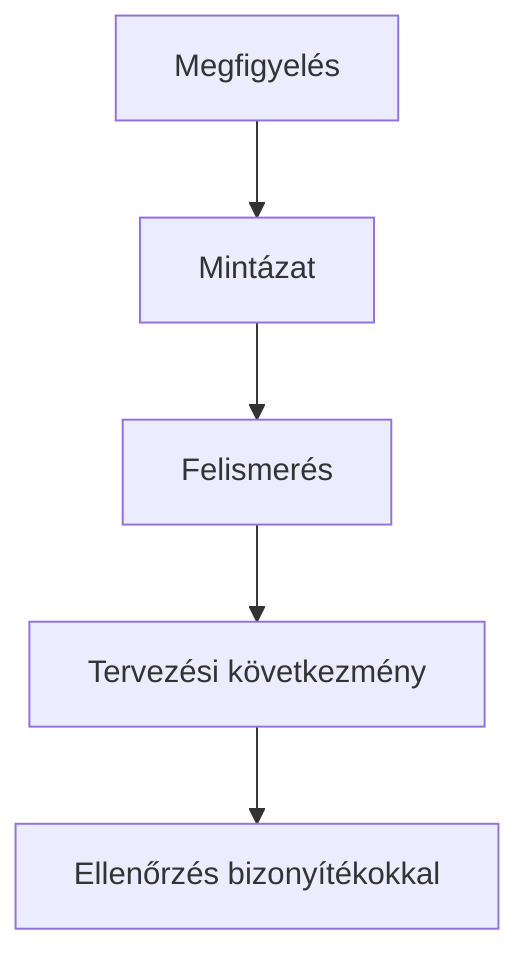

# Insightok, mintázatok és persona

## Célok

Az anyag végére a hallgató képes lesz nyers kutatási jegyzetekből mintázatot keresni, az idézetet és megfigyelést tervezési insighttá alakítani, valamint olyan célfelhasználó-leírást készíteni, amely a döntésekhez használható, nem pedig kitalált életrajz.

## A jegyzet még nem eredmény

> [!note] Kulcsgondolat
> Egy interjú után könnyű a legerősebb mondatra emlékezni. Ez azonban torzíthat. Az elemzés célja, hogy több forrásból származó jelet rendezzünk: milyen célt említenek, milyen körülmény ismétlődik, milyen nyelvet használnak, hol fordul elő ugyanaz a kerülőút. A rendezés történhet cetlikkel, táblázatban vagy digitális falon, de mindig őrizd meg a kapcsolatot az eredeti bizonyítékkal.

Érdemes külön címkézni a célokat, akadályokat, döntési szempontokat, idézeteket és kivételeket. Ha három ember azt mondja, hogy „nem tudtam, kinek írjak”, ez még nem jelenti, hogy chatablak kell. Először azt kérdezd: milyen információ hiányzott? Kihez fordulhattak volna? Miért nem volt ez látható vagy bizalomkeltő?

## Mitől insight egy insight?

Az insight olyan értelmezés, amely megmagyaráz egy viselkedési mintát és tervezési következményhez vezet. Nem puszta megfigyelés: „Ketten több fület nyitottak.” Nem puszta kívánság: „Szeretnének egyszerűbb felületet.” Erősebb insight: „A résztvevők a lehetőségeket csak akkor érzik összehasonlíthatónak, ha az ár, idő és korlátozás egyszerre látható; ezért a részletek mögé rejtett adatok döntési bizonytalanságot okoznak.”

Hasznos sablon: **megfigyelés → értelmezés → tervezési következmény**. Így az insight nem válik véleménnyé, és a csapat vissza tudja követni, milyen adatból indult ki. Ha csak egy résztvevőnél láttál valamit, azt is írd le, de jelöld kivételként vagy további vizsgálatra váró jelzésként.

## Persona mint döntési eszköz

A persona nem „Nóra, 21 éves, szereti a kávét”. A demográfia önmagában ritkán mondja meg, hogyan tervezzünk. Hasznos persona a feladat szempontjából írja le a helyzetet, célt, tudást, korlátot és kockázatot. Például: „Első alkalommal ügyintéző hallgató, akinek kevés ideje van, nem ismeri a folyamat hivatalos neveit, és attól tart, hogy határidőt mulaszt.” Ez rögtön felvet címkézési, időzítési és visszajelzési kérdéseket.

Egy projektben általában egy elsődleges célfelhasználó elég. Ha több szerepet nevezel meg, írd le, melyik feladatban ki az elsődleges, és mi történik konfliktus esetén. Ne csinálj personát minden idézetből; a persona a fontos mintázatokat sűríti.

## Prioritás és ellenpélda

Nem minden insight egyformán fontos. Prioritáskor vizsgáld a felhasználói hatást, a gyakoriságot, a hiba következményét és a megoldás bizonytalanságát. Az ellenpélda is értékes: ha valaki gond nélkül elvégzi a feladatot, keresd meg, milyen előzetes tudás, eszköz vagy helyzet segítette. Lehet, hogy nem a felület működött jól, hanem ő már ismerte a rendszert.

## A folyamat áttekintése

Az ábra a fenti összefüggéseket foglalja össze; tanulási modell, nem teljes megvalósítás.

## Végigvezetett példa

Egy helyi adományozási oldalt vizsgáló csoport három interjúban azt találja, hogy a résztvevők a támogatás előtt többször külső keresővel ellenőrzik a szervezetet. Az insight nem az, hogy „kell Google-link”. Lehetséges értelmezés: a felhasználóknak nincs elég, könnyen értelmezhető bizonyítékuk a szervezet hitelességéről és a pénz várható hatásáról. A tervezési következmény lehet transzparens projektgazda-információ, ellenőrizhető beszámoló vagy konkrét célösszeg és felhasználás.

## Gyakori tévhitek

| Állítás | Pontosítás |
| --- | --- |
| „A persona helyettesíti a kutatást.” | A persona a kutatás utáni összegzés; kutatás nélkül csak feltételezett karakter. |
| „Minden kérésből funkció lesz.” | A kérés mögötti cél és akadály fontosabb, mint a résztvevő által javasolt megoldás. |
| „A legtöbb említés mindig a legfontosabb.” | Egy ritkább, de súlyos következményű hiba – például rossz fizetési döntés – kiemelt lehet. |

## Ellenőrző kérdések

1. Mi a különbség megfigyelés és insight között?
2. Mely bizonyíték támasztja alá a legerősebb insightodat?
3. Milyen tervezési döntést segít a célfelhasználó-leírásod?
4. Melyik ellenpéldát kellene tovább vizsgálnod?

## Fogalomtár

**Insight:** bizonyítékokra épülő felismerés, amely tervezési következményhez vezet.  
**Mintázat:** több megfigyelésben ismétlődő viselkedés, cél vagy akadály.  
**Persona:** kutatási mintázatokból levezetett, döntést segítő célfelhasználó-leírás.  
**Szintézis:** a nyers kutatási adatok rendezése és értelmezése.
