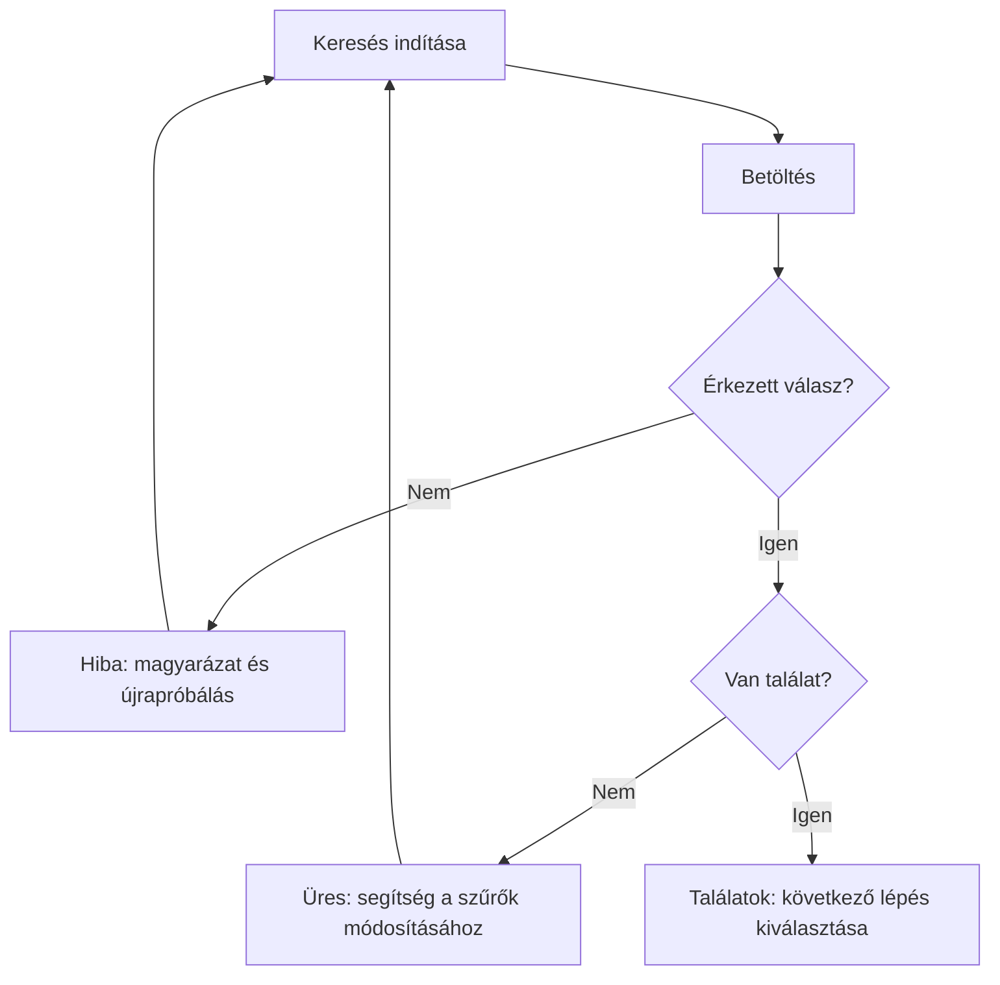

# Hibák, visszajelzés és állapotok

## Célok

A hallgató képes lesz egy fő feladat állapotait – normál, betöltő, üres, hiba-, siker- és tiltott állapot – megtervezni. Megérti, hogy a hibaüzenet nem technikai napló, hanem a felhasználó következő döntését segítő tartalom.

## Nem csak a „normál” képernyő létezik

> [!note] Kulcsgondolat
> Sok terv csak azt az ideális pillanatot mutatja, amikor minden adat elérhető és a felhasználó helyesen cselekszik. A valós használatban azonban lehet lassú hálózat, elfogyott időpont, hibás adat, üres keresési eredmény, lejárt jogosultság vagy megszakított fizetés. Ezek nem különleges helyzetek; a rendszer minősége gyakran itt válik láthatóvá.

Minden fő képernyőhöz gondold végig legalább a normál, betöltő, üres, hiba- és sikerállapotot. Ha valami nem használható, a tiltott állapot mellé adj magyarázatot: miért nem elérhető, és mi kell ahhoz, hogy azzá váljon. A pusztán szürke gomb nem feltétlenül érthető, különösen akkor, ha a felhasználó nem látja, milyen feltétel hiányzik.

## Betöltés és várakozás

A várakozás akkor bizonytalanító, ha a felhasználó nem tudja, történt-e valami, mennyi időre számíthat, vagy szabad-e újra próbálkoznia. Rövid várakozásnál elég lehet az azonnali vizuális visszajelzés; hosszabb folyamatnál a rendszernek meg kell mondania, min dolgozik, és lehetőség szerint megtartani a már bevitt adatot. Kerüld a megtévesztő előrehaladást: ne mutass 90%-on megálló sávot, ha nincs valós kapcsolat a folyamat állapotával.

## Üres állapot

Az üres lista nem egyenlő a hibával. Lehet, hogy új fiókban még nincs foglalás, vagy a szűrés nem ad találatot. A jó üres állapot megnevezi a helyzetet, röviden elmondja az okot, és ad egy következő lépést. „Még nincs mentett eseményed. Böngéssz a mai programok között.” Sokkal hasznosabb, mint az üres fehér terület vagy a „Nincs adat” rendszerüzenet.

## Hibaüzenet mint segítség

Egy jó hibaüzenet válaszol három kérdésre: mi történt, mi a következmény, és mit tehet most a felhasználó. „Nem sikerült menteni. A módosításaid nem vesztek el; próbáld újra, vagy töltsd le piszkozatként.” A szövegnek nem kell feltárnia belső hibakódot, de ha az ügyfélszolgálatnak szüksége van rá, külön, másolható formában megjeleníthető.

Űrlapnál a hiba legyen a mezőhöz kötve, lehetőleg a beküldés után összefoglalva is. Ne csak azt írd, hogy „kötelező mező”, hanem nevezd meg a hiányzó adatot és a várt formátumot. A hiba állapota maradjon észlelhető szín nélkül is.

## Siker és következő lépés

A sikerállapot lezárja a jelenlegi feladatot, de gyakran megnyitja a következőt. Foglalás után például a felhasználónak tudnia kell a dátumot, helyszínt, módosítás lehetőségét és az értesítés módját. A „Sikeres!” önmagában nem ad elég bizalmat. Ha a folyamat késleltetett feldolgozású, ne ígérj végleges eredményt: mondd ki, hogy a kérés beérkezett, és mikor várható válasz.

## A folyamat áttekintése

Az ábra a fenti összefüggéseket foglalja össze; tanulási modell, nem teljes megvalósítás.

## Végigvezetett példa: keresés nulla találattal

Egy eseménykeresőben valaki beállítja a „ma este”, „ingyenes” és „angol nyelvű” szűrőket. A „Nincs találat” technikailag igaz, de nem segít. A jó állapot megmutathatja, melyik feltétel szűkít leginkább, felajánlhatja a következő napot vagy a közeli helyszínt, és egy kattintással visszaállíthatóvá teheti a szűrőket. A rendszer nem erőltet másik választást, csak segít megérteni a jelenlegi eredményt.

## Gyakori tévhitek

| Állítás | Pontosítás |
| --- | --- |
| „A hibaoldal ritka, ezért nem kell tervezni.” | A ritka, de nagy következményű hibákban különösen fontos a világos kommunikáció. |
| „A spinner elegendő betöltési visszajelzés.” | Csak akkor, ha a várakozás rövid és a felhasználó tudja, mi változik majd. |
| „A sikerállapot dekoráció.” | A feladat lezárásának és a következő lépés megértésének kulcsa lehet. |

## Ellenőrző kérdések

1. Milyen állapotok hiányoznak a jelenlegi prototípusodból?
2. Egy hibaüzeneted megmondja-e, mi történt, mi maradt meg és mi a teendő?
3. Hogyan segítenéd a nulla találatos keresést anélkül, hogy elrejtenéd a valóságot?
4. Mit kell tudnia a felhasználónak közvetlenül a sikeres művelet után?

## Fogalomtár

**Betöltő állapot:** a folyamatban lévő műveletet jelző felületi állapot.  
**Üres állapot:** olyan állapot, amikor még nincs vagy a szűrés miatt nincs megjeleníthető tartalom.  
**Hibaállapot:** a feladat sikeres folytatását akadályozó vagy bizonytalanná tevő helyzet kommunikációja.  
**Sikerállapot:** a művelet eredményét és lehetséges következő lépéseit megmutató állapot.
