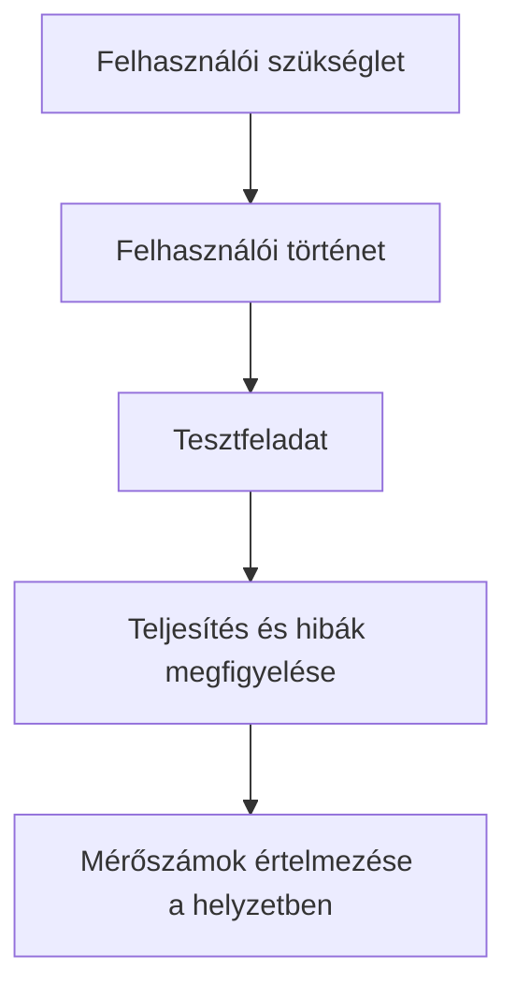

# User story, feladat és mérőszám

## Célok

A hallgató meg tudja különböztetni a user story-t, a tesztfeladatot és a sikermérőt. Képes olyan feladatutasítást írni, amely valós helyzetet ad, de nem árulja el az útvonalat, és olyan mérőszámot választ, amely a felhasználó céljához kapcsolódik.

## User story: szándék, nem specifikáció

> [!note] Kulcsgondolat
> A user story röviden rögzíti, ki milyen értéket szeretne elérni: „[szerep]ként szeretnék [célt], hogy [érték vagy következmény].” Például: „Első alkalommal ügyintéző hallgatóként szeretném ellenőrizni, hogy minden szükséges dokumentumot feltöltöttem-e, hogy ne utasítsák el a kérelmemet hiányosság miatt.” A user story nem sorolja fel a gombokat, oldalakat és adatbázismezőket. Azok későbbi megoldási döntések.

Egy jó story nem túl tág. A „hallgatóként szeretném intézni az ügyeimet” nem segít prioritást választani. Egy féléves projekthez a storyból ki kell tudni jelölni egy kezdőpontot, egy sikeres végállapotot és azokat az információkat, amelyek a döntéshez szükségesek.

## Feladatutasítás teszteléshez

A tesztfeladat nem azonos a user story-val. Konkrét helyzetet ad a résztvevőnek, de nem mondja meg, hová kattintson. Rossz utasítás: „Keresd meg a lemondás gombot.” Jobb: „Képzeld el, hogy egy holnapi foglalást nem tudsz megtartani. Nézd meg, mit tehetsz, és mondd el, mi történne.” Az utóbbi a felhasználó célját vizsgálja, nem egy felületi elem felismerését.

Kerüld a túl sok háttérinformációt és a rejtett helyes választ. Ha a feladat csak úgy teljesíthető, hogy a tesztelő pontosan ugyanúgy gondolkodik, mint a tervező, akkor nem a felületet vizsgálod. A sikerfeltételt előre rögzítsd, hogy utólag ne a kívánt eredményhez igazítsd az értékelést.

## Mit mérjünk?

A mérőszám a kérdéshez tartozzon. Korai használhatósági tesztben gyakran hasznos a feladat sikeres befejezése, a segítségkérés, a félreértés, a kritikus hiba és a megfigyelhető bizonytalanság. Időmérés csak akkor értelmes, ha a feladatok és a résztvevők összehasonlíthatók, és a gyorsaság valóban érték. Egy egészségügyi döntésnél a túl gyors választás akár kockázat is lehet.

Minőségi jelzés lehet az is, hogy a résztvevő a folyamat végén saját szavaival helyesen el tudja mondani a következményt. Például tudja-e, hogy a foglalás végleges, mikor jelenjen meg, és hogyan módosíthat? Ez a megértést méri, nem a kattintások számát.

## A folyamat áttekintése

Az ábra a fenti összefüggéseket foglalja össze; tanulási modell, nem teljes megvalósítás.

## Végigvezetett példa

User story: „Eseményszervezőként szeretném kiválasztani a csoportomnak megfelelő programot, hogy minden résztvevő számára elérhető legyen.” Tesztfeladat: „Nyolcfős csoporttal péntek este keresel ingyenes, angol nyelvű programot. Találj egy lehetőséget, amelyről biztosan el tudod dönteni, megfelel-e.” Sikerkritérium: a résztvevő talál egy megfelelő eseményt, meg tudja nevezni az időt, helyet, költséget és jelentkezési feltételt, és nem értelmez félre kritikus információt.

## Gyakori tévhitek

| Állítás | Pontosítás |
| --- | --- |
| „A user story a fejlesztési feladatlista rövid változata.” | Nem; a szándékot és értéket rögzíti, nem az implementációt. |
| „A mérőszám mindig szám.” | Egyértelmű, előre meghatározott megfigyelés vagy helyes megértés is lehet értékes mérőjel. |
| „A tesztfeladatnak meg kell neveznie a funkciót.” | Ez elrejtheti, hogy a felhasználó egyáltalán megtalálná-e vagy felismerné-e a funkciót. |

## Ellenőrző kérdések

1. A user story-d célra vagy képernyőre épül?
2. A tesztfeladatod elárulja-e a megoldás nevét?
3. Mi lenne a projektedben kritikus hiba, és miből látnád?
4. Melyik mérőjel mutatná meg, hogy a felhasználó valóban érti a következményt?

## Fogalomtár

**User story:** rövid megfogalmazás a felhasználó szerepéről, céljáról és várt értékéről.  
**Tesztfeladat:** konkrét helyzetbe ágyazott, semleges utasítás a megoldás kipróbálásához.  
**Sikerkritérium:** előre meghatározott jel, amely a feladat eredményes végrehajtását mutatja.  
**Kritikus hiba:** olyan hiba, amely megakadályozza vagy súlyosan félreviszi a fő feladatot.
