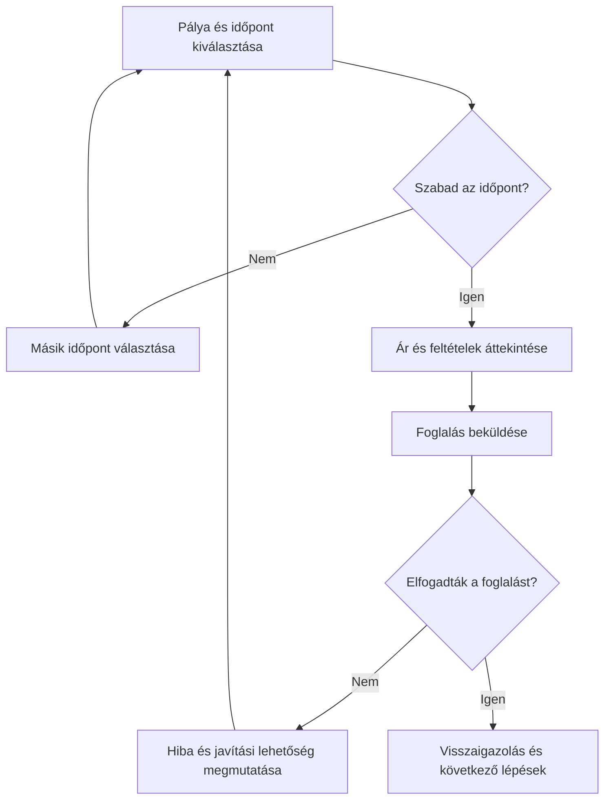

# User flow és kivételes állapotok

## Célok

A hallgató képes lesz egy felhasználói célt lépésekre, döntési pontokra és rendszerállapotokra bontani. Megérti, hogy a flow nem képernyők sorrendje, és hogy a kivételes állapotok tervezése nélkül a fő út sem tekinthető késznek.

## Mit ábrázol a user flow?

> [!note] Kulcsgondolat
> A user flow a felhasználó útját mutatja a kiinduló helyzettől a cél eléréséig. Jelölje a felhasználó műveletét, a rendszer válaszát, a döntési pontot, a szükséges adatot és a sikeres vagy sikertelen kimenetet. Nem kell minden apró UI-elemet beleírni; a döntéshez és következményhez fontos lépések a lényegesek.

Kezdd a felhasználói céllal, ne a nyitóképernyővel. Például: „megfelelő időpont foglalása”. Ezután írd le, milyen információt kell megtalálnia, milyen feltételt kell kiválasztania, mit ellenőriz a rendszer, és miből tudja, hogy sikerült. Ha több út is vezet a célhoz, azonosítsd, melyik a fő út, és miért.

## Döntési pontok és információigény

Minden döntési pontnál kérdezd meg: milyen információ kell a jó választáshoz, honnan érkezik, és mi történik, ha nincs meg? A „válassz időpontot” lépés nem elég részletes, ha nem jelzi a szabad helyet, helyszínt, árat, időtartamot vagy lemondási feltételt. A flow segít meglátni, ha egy későbbi képernyőre került olyan adat, amelyre korábban szükség lenne.

Különösen figyelj a visszalépésre és módosításra. A felhasználó nem mindig lineárisan halad: összehasonlít, meggondolja magát, adatot keres, vagy félbehagyja a folyamatot. A jó flow nem bünteti ezt, hanem megőrzi, amit ésszerű megőrizni, és világosan jelzi, mi változik.

## Kivételes állapotok

A kivételes állapot nem ugyanaz, mint a ritka eset. Ha elfogy egy időpont, megszakad a kapcsolat vagy az adat hibás, akkor a fő feladat valódi helyzete változik meg. A flow-ban jelöld legalább a nagy hatású ágakat: nincs találat, nem jogosult, érvénytelen adat, már nem elérhető erőforrás, megszakított művelet és sikeres lezárás.

Nem minden kivételhez kell teljesen külön képernyősor. Némelyik mezőszintű visszajelzés, másik alternatív út vagy segítségkérési lehetőség. A fontos az, hogy a felhasználó értse, mi történt, mi maradt meg, és mit tehet most.

## A folyamat áttekintése

Az ábra a fenti összefüggéseket foglalja össze; tanulási modell, nem teljes megvalósítás.

## Végigvezetett példa: pályafoglalás

A fő flow: helyszín keresése → időpont kiválasztása → feltételek ellenőrzése → adatok megadása → foglalás elküldése → visszaigazolás. A kritikus ágak: a kiválasztott időpont közben elfogyott; a felhasználó nem fogadja el a lemondási feltételt; a fizetés nem sikerül; a foglalás feldolgozása késik. Mindegyikhez tervezd meg a tájékoztatást és a következő lépést. Így a prototípus tesztjén nem csak az ideális út, hanem a bizalom és helyreállíthatóság is vizsgálható.

## Ellenőrző kérdések

1. Mi a fő feladatod kezdő- és sikerállapota?
2. Mely döntési ponthoz hiányzik még fontos információ?
3. Mi történik, ha a felhasználó az utolsó lépés előtt meggondolja magát?
4. Mely kivételnek lenne a legnagyobb következménye?

## Fogalomtár

**User flow:** a feladat eléréséhez vezető lépések, döntések és állapotok ábrázolása.  
**Döntési pont:** olyan lépés, ahol a felhasználó vagy a rendszer több út közül választ.  
**Fő út:** a leggyakoribb vagy elsődleges sikeres feladatút.  
**Kivételes állapot:** a normál feladatút folytatását megváltoztató hiba, hiány vagy alternatív helyzet.
