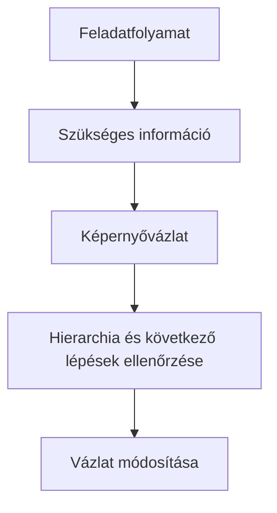

# Low-fi gondolkodás és képernyővázlat

## Célok

A hallgató megérti, miért a szerkezeti kérdések vizsgálatára való a low-fi wireframe. Képes a user flow-ból képernyővázlatot készíteni, a képernyőn jelölni a fő feladatot, az információt és az állapotot, valamint megkülönböztetni a szerkezeti döntést a későbbi vizuális díszítéstől.

## Miért kezdünk alacsony részletességgel?

> [!note] Kulcsgondolat
> A wireframe nem félkész látványterv. Egy gyors, alacsony részletességű modell, amelyen olcsón lehet vitatni a tartalmat, a sorrendet, az interakciót és a feladatfolyamot. Ha már az első változatban színekkel, képekkel, betűtípusokkal és tökéletes illusztrációval dolgozunk, a visszajelzés könnyen esztétikai ízlésre terelődik: „szép ez a kék”, miközben a fontos kérdés az lenne, hogy a résztvevő egyáltalán észreveszi-e a lemondási feltételt.

Low-fi lehet papír, tábla, egyszerű Figma-fájl vagy bármely eszköz, amely gyorsan módosítható. A részletességet a kérdéshez igazítsd. Ha azt vizsgálod, mi legyen a képernyők sorrendje, elég lehet néhány doboz és címke. Ha azt teszteled, hogy az emberek megértik-e egy hibaüzenet nyelvét, akkor a valósághű szöveg már fontosabb lehet.

## A flow-ból képernyő

Ne üres vászonnal kezdj. Vedd elő a user flow-t, és minden fontos állapothoz kérdezd meg: mit kell a felhasználónak itt tudnia, mit kell eldöntenie, mit tehet, és miből látja a következményt? Egy időpontválasztó képernyőnek például nem csak naptárt kell mutatnia. A döntéshez fontos lehet a helyszín, az időtartam, az ár, a férőhely és a korábbi választás megváltoztatásának módja is.

Rajzold ki a normál út mellett az üres, betöltő vagy hibaállapotot is. Nem kell minden állapotot teljesen kidolgozni, de a flow kritikus pontjain jelezd, mi történne. A vázlat célja, hogy a csapat és a tesztelő ugyanarról a rendszerviselkedésről beszéljen.

## Mit jelölj egy wireframe-en?

Hasznos, ha egy vázlaton egyértelmű a képernyő címe, a fő információ, az elsődleges művelet, a másodlagos lehetőségek és az állapot. Komplex elemnél rövid annotációban írd le a feltételezést: például „csak a szabad időpontok választhatók”, „a hibaüzenet beküldés után jelenik meg”, vagy „a korábbi adat megmarad visszalépéskor”. Ez megakadályozza, hogy a képernyő kinézetéből mindenki mást olvasson ki.

## A folyamat áttekintése

Az ábra a fenti összefüggéseket foglalja össze; tanulási modell, nem teljes megvalósítás.

## Végigvezetett példa

Egy eseménykeresőben a fő cél az esti program kiválasztása. Az első vázlat a találati lista előtt rögtön részletes térképet és sok szűrőt mutat. Teszteléskor kiderül, hogy a résztvevők először csak azt akarják látni, mi van ma, mennyibe kerül és hova kell menni. A következő low-fi változatban a lista kerül előre, a térkép másodlagos nézet lesz, a kulcsadatok pedig minden kártyán megjelennek. A változtatás nem vizuális ízlésből, hanem a döntési sorrendből következik.

## Gyakori tévhitek

| Állítás | Pontosítás |
| --- | --- |
| „A wireframe legyen csúnya.” | Nem a csúnyaság a cél, hanem hogy a részletek ne takarják el a szerkezeti kérdést. |
| „Előbb minden képernyőt meg kell rajzolni.” | Először a fő feladat kritikus állapotait készítsd el és próbáld ki. |
| „A low-fi nem tesztelhető.” | Sok navigációs, tartalmi és hierarchiai kérdéshez épp a low-fi a legjobb eszköz. |

## Ellenőrző kérdések

1. Melyik user flow-állapotból hiányzik még a képernyővázlatod?
2. Mi az elsődleges feladat minden vázlatodon?
3. Milyen feltételezést kell annotációban rögzítened?
4. Mely részlet terelné el most a figyelmet a szerkezeti kérdésről?

## Fogalomtár

**Wireframe:** a felület szerkezetét és hierarchiáját mutató, alacsony részletességű képernyővázlat.  
**Low-fi:** alacsony vizuális és technikai részletességű prototípusszint.  
**Annotáció:** a vázlathoz kapcsolt rövid magyarázat egy viselkedésről vagy feltételezésről.  
**Elsődleges művelet:** a képernyő fő feladatát támogató, legfontosabb felhasználói művelet.
