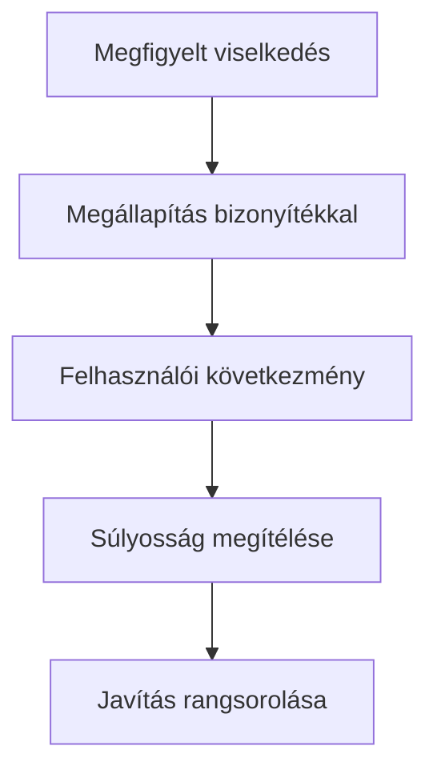

# Leletek, súlyosság és priorizálás

## Célok

A hallgató a tesztjegyzetekből bizonyítékokra épülő leletet tud írni, meg tudja becsülni egy probléma súlyosságát, és a javításokat nem személyes ízlés, hanem felhasználói hatás, gyakoriság, kockázat és ráfordítás alapján rendezi sorba.

## A lelet szerkezete

> [!note] Kulcsgondolat
> A lelet nem címke, például „rossz UX” vagy „nem intuitív menü”. Írd le a megfigyelést, az érintett feladatot, a következményt és a feltételezett okot. Példa: „Három résztvevő a fizetés előtt azt hitte, a foglalás már végleges, mert a képernyő címe ‘Sikeres foglalás’ volt. Emiatt nem ellenőrizték az összeget és a lemondási feltételt. Feltételezett ok: a köztes összefoglaló sikerállapot nyelvét használja.” Ez már megvitatható és javítható.

Kapcsold össze az azonos jelenségeket, de ne olvaszd össze erőszakkal a különböző okokat. Két résztvevő ugyanott akadhat el más elvárással; az eltérés is fontos kutatási eredmény lehet.

## Súlyosság

A súlyosságot legalább három tényező alakítja: mekkora a hatás a fő feladatra, milyen gyakran fordul elő a releváns használatban, és helyre tudja-e állítani a felhasználó a helyzetet. A kritikus hiba megakadályozhatja a foglalást vagy hibás döntéshez vezethet. A közepes hiba lassít, bizonytalanságot okoz vagy külső segítséget igényel. Az alacsony súlyosságú probléma lehet esztétikai vagy könnyen megkerülhető, de ettől még érdemes dokumentálni.

Ne téveszd össze a látványos és a súlyos problémát. Egy feltűnő animáció zavaró lehet, de egy apró, félreérthető lemondási feltétel nagyobb következménnyel járhat.

## Prioritás és javítás

Minden lelethez írj javítási hipotézist, ne azonnal végleges megoldást. „Tegyük egyértelművé, hogy a foglalás csak a következő lépés után végleges” jobb, mint „tegyünk ide zöld gombot”. Ezután mérlegeld a várható felhasználói hatást, a megvalósítási ráfordítást, a bizonytalanságot és a más területekre gyakorolt következményt. A gyors javítás nem mindig a legfontosabb; a nagy hatású, de bizonytalan döntést lehet, hogy újra tesztelni kell.

## A folyamat áttekintése

Az ábra a fenti összefüggéseket foglalja össze; tanulási modell, nem teljes megvalósítás.

## Végigvezetett példa

Lelet: a résztvevők nem értik, hogy a kiválasztott időpont helyi vagy központi idő szerint jelenik meg. Hatás: rossz időben érkezhetnek, ezért magas. Gyakoriság: minden tesztelőnél felmerült. Javítási hipotézis: az időpont mellé jelenjen meg a helyszínhez kötött időzóna és a visszaigazolásban is ismétlődjön. A javítás után új tesztfeladatban ellenőrizhető, hogy a résztvevő helyesen mondja-e meg az időpontot.

## Ellenőrző kérdések

1. A leleted megfigyelést vagy véleményt tartalmaz?
2. Mi a legnagyobb hatású hiba a projektedben?
3. Melyik javítási javaslatod igényel új tesztet?
4. Hogyan fogalmaznád a problémát megoldási javaslat nélkül?

## Fogalomtár

**Lelet:** bizonyítékokkal alátámasztott, feladatra és következményre vonatkozó használhatósági probléma.  
**Súlyosság:** a probléma felhasználói hatásának, gyakoriságának és helyreállíthatóságának becslése.  
**Prioritás:** a javítások indokolt sorrendje.  
**Javítási hipotézis:** ellenőrizhető feltevés arról, hogy egy változtatás milyen hatást okoz.
