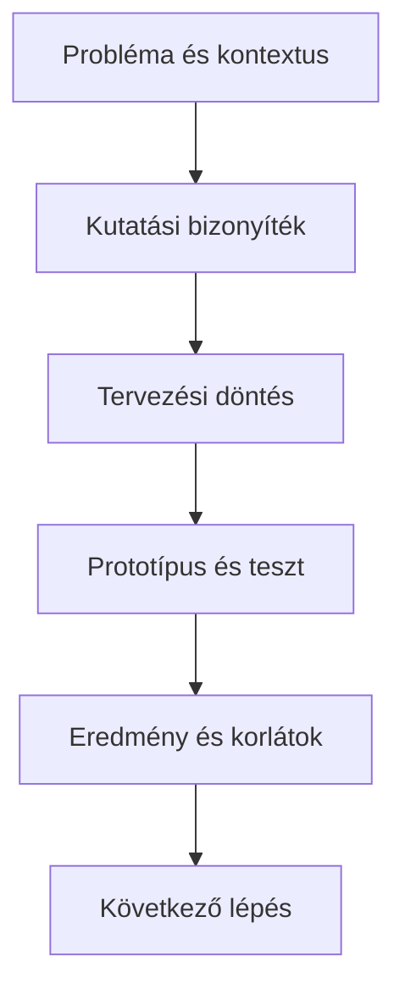

# Design story és bizonyíték

## Célok

A hallgató képes lesz a projektet nem képernyők felsorolásaként, hanem ellenőrizhető tervezési történetként bemutatni. Meg tudja különböztetni az állítást, a bizonyítékot, a döntést és az eredményt, és tudja, miért fontos a bizonyíték erejével arányosan fogalmazni.

## A design story szerkezete

> [!note] Kulcsgondolat
> Egy erős projektbemutató egy egyszerű kérdésre válaszol: **miért ez a megoldás a vizsgált helyzetben?** A történet kezdete a felhasználó és a probléma, nem a Figma-fájl első képernyője. Ezután a kutatási bizonyíték, a tervezési döntés, a kipróbálás és az eredmény következik. A végén nem az a tanulság, hogy „elkészült”, hanem az, hogy mit tanultál, mi változott, és mi maradt nyitva.

Az állítás legyen konkrét. „A felhasználók nehezen találták meg a lemondást” helyett mutasd meg, milyen feladatban, hány vizsgált résztvevőnél, milyen viselkedésben jelent meg ez. A bizonyíték lehet idézet, megfigyelés, user flow, előtte–utána képernyő vagy tesztlelet. Egyetlen erős, releváns bizonyíték többet ér, mint sok dekoratív képernyőkép.

## Bizonyíték, döntés, eredmény

Ne hagyj logikai ugrást. Ha egy kutatási idézetből közvetlenül új funkció következik, magyarázd el az értelmezést. Például: megfigyelés – a résztvevők több nézet között váltanak, hogy összehasonlítsák az időpontot és árat; insight – a döntési adatok nem jelennek meg együtt; döntés – a találati kártyán mindkét adat előre látható; eredmény – a következő tesztben a résztvevők kevesebb visszalépéssel választottak. Ez a lánc teszi szakmailag követhetővé a bemutatót.

Ne állíts többet, mint amit a bizonyíték enged. Kis tesztből beszélj „a vizsgált résztvevőkről”, ne „minden felhasználóról”. Ha egy változás még nem tesztelt, nevezd hipotézisnek, ne eredménynek.

## Mit érdemes megmutatni?

Válassz olyan artefaktumot, amely döntést magyaráz: rövid kutatási összegzés, persona vagy helyzetleírás, user flow, low-fi vázlat, prototípus-részlet, tesztjegyzet, iteráció. Nem kell a teljes munkafolyamatot kivetíteni. Egy képernyő akkor hasznos, ha megmutatja, melyik problémára válaszol és miből látszik, hogy a válasz működik vagy még bizonytalan.

## A folyamat áttekintése

Az ábra a fenti összefüggéseket foglalja össze; tanulási modell, nem teljes megvalósítás.

## Végigvezetett példa

„A kutatásban a résztvevők nem tudták összevetni az események alapadatait, ezért külső füleket nyitottak. A kártyákon az időt, árat, helyet és jelentkezési feltételt együtt jelenítettük meg. A második tesztben minden résztvevő el tudta dönteni, megfelel-e egy találat; a csoportméret értelmezése azonban nyitott maradt.” Ez rövid design story: helyzet, bizonyíték, döntés, eredmény és korlát.

## Ellenőrző kérdések

1. Mi a projekted egy mondatos fő állítása?
2. Mely bizonyíték támasztja alá a legfontosabb döntésedet?
3. Hol van logikai ugrás a jelenlegi bemutatódban?
4. Melyik képernyőt hagyhatod ki, mert nem magyaráz döntést?

## Fogalomtár

**Design story:** a probléma, bizonyíték, döntés és eredmény összefüggő bemutatása.  
**Bizonyíték:** kutatásból, tesztből vagy ellenőrzött forrásból származó, állítást alátámasztó adat.  
**Artefaktum:** a tervezési folyamat kézzelfogható dokumentuma vagy kimenete.  
**Állítás:** olyan megfogalmazás, amelyet bizonyítékkal kell alátámasztani.
