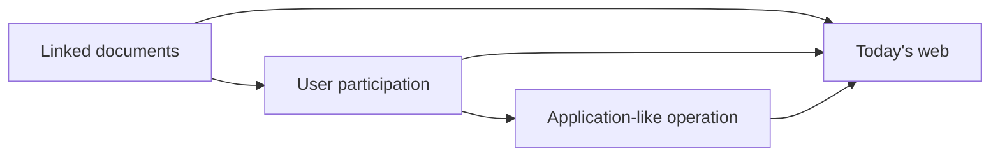

# 01.02. The evolution of the web: from document web to application-like web

The web originally served to link documents. Today, building on the same standards, it provides services that are interactive, personalized, real-time, and in many cases compete with installed applications.

It is worth not imagining this change as a simple technological race. When we read a modern organization's introductory text on an early website, the browser primarily fulfilled the role of a digital newspaper or book. When today we plan a route on a map, collaboratively edit a document, or manage our studies online, the same browser resembles an application window more. There is no sharp boundary between the two types of use, and both have their place.

## Necessary prerequisites

- Internet and World Wide Web — basic theoretical difference.
- Web document and browser — basic usage knowledge.
## The beginning: linked documents

The original goal of the World Wide Web was for researchers to easily link to each other's documents. The essence of hypertext is that a link within a document leads to another document or resource. This is also the fundamental operating principle of today's web.

The first web pages were typically simple, rarely changing text pages. The author created the content, and the visitor read it. Interaction was scarce, the user was primarily a consumer, not a creator of the content.

## Document web and "Web 1.0"

The term "Web 1.0" is a retrospective umbrella term. It generally refers to the static, document-centric web offering little interaction. A typical example is a company's introductory page, an early version of an online encyclopedia, or a personal website.

Characteristics:

- content is primarily produced by the service provider;
- less frequent content updating;
- little user contribution;
- multiple separate pages and full-page navigation;
- the browser is mainly a document viewer.

## Participatory web and "Web 2.0"

"Web 2.0" is not a new protocol or the second version of the web. Rather, it denotes a service and business approach in which users create content, communicate with each other, and services are built on data, communities, and continuous updating.

This includes, for example, social networks, blog platforms, video sharing sites, community encyclopedias, and cloud-based collaboration tools. The user is simultaneously a reader, author, evaluator, and data source.

Typical changes:

- user-generated content;
- personalized interfaces;
- services built on databases and APIs;
- fast, partial page updates;
- social and network effects.

## The application-like web

Today's web services often do not operate as a series of "pages", but as applications. An online email, map service, study system, or text editor continuously reacts to user actions, loads and saves data, can send notifications, and can synchronize between multiple devices.

This is made possible, among other things, by:

- program code running in the browser;
- asynchronous data communication via web APIs;
- browser-side data storage;
- real-time communication;
- responsive and mobile-optimized interfaces;
- technologies supporting offline operation.

It is important that evolution does not mean the disappearance of the older model. A document-centric, fast, and simple static page can still be an excellent choice today, for example, for a departmental information or event page.

The diagram shows an evolutionary direction, not eras replacing each other: all three forms are present on today's web.

## The price of evolution

More complex web applications provide more possibilities, but also raise new problems:

- the amount of data to load can be larger;
- more personal data is generated and handled;
- it is harder to ensure accessible use;
- more security risks appear;
- a stronger dependency on certain platforms can develop.

> [!tip] Choose for the task
> Therefore, the "more modern" solution is not automatically better. The technological decision must always be evaluated based on the user goal, content, risk, and available resources.

## Examples

| Service | Typical approach | Reasoning |
| --- | --- | --- |
| University regulation page | Document-centric web | Primarily serves for reading, rarely changes. |
| News portal | Content-based, partly dynamic web | Frequent updates, search, and personalization. |
| Online email | Application-like web | Continuous interaction, data management, and synchronization. |
| Social network | Participatory platform web | Users create a significant part of the content. |

## Common misunderstandings

| Statement | Clarification |
| --- | --- |
| "Web 2.0 is a new internet." | The term denotes a service and usage approach. |
| "The static web page is obsolete." | In many cases it is a faster, cheaper, and safer solution. |
| "Every modern web page is an SPA." | Many modern services use other rendering and navigation models. |

## Concepts introduced

- **Hypertext:** A document organization principle in which links lead to other documents or parts of documents. One of the foundations of web navigation.
- **Static web page:** A page whose served content can be prepared in advance and does not need to be individually generated for every request. This does not mean it cannot be interactive in the browser.
- **Dynamic web page:** A page whose content can change based on a request, user state, or other data. Generation can happen on the server side or in the browser.
- **Platform web:** A web service model that connects users, content, and often other services. Part of its value comes from the connections between participants.
- **Web application:** Interactive software usable from a browser, supporting task execution. The interface and backend system can communicate via web standards.
