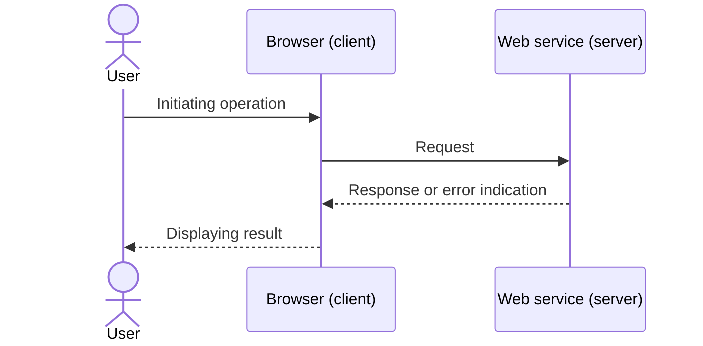
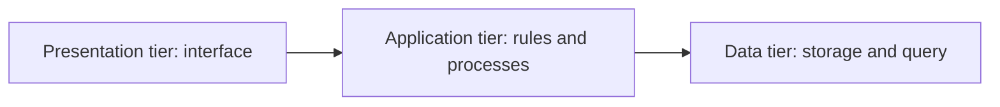

# 01.04. Client-server model and multi-tier systems

In web systems, the client requests a service, and the server responds. Larger systems break tasks down into logical tiers so that the interface, business rules, and data management can be separated.

When a student clicks the "Register for Course" button, they see a single operation on the screen. For the system, however, this is a series of questions: who initiated the operation, are they authorized, is there still a free place, are the prerequisites met, and how must the result be permanently recorded? The client-server model and tiering help to understand how this single click becomes a securely and verifiably executed process.

## Necessary prerequisites

- Browser and web server — knowledge of their basic roles.
## Client and server

The **client** is a program or device that requests a service. On the web, this is typically the browser. The **server** is a system that receives the request, processes it, and sends a response. Roles are interpreted in communication: the same computer can be a client in certain situations, and a server in others.

For example, when the browser requests a product page, it acts as a client. The webshop's host responds as a server. The webshop application might also call the API of a payment provider during this; in this connection, the webshop application is the client, and the payment provider is the server.

## Request and response

The basic communication pattern of the web is the request-response model. The client formulates what resource or operation it requests, and the server responds with a status, headers, and data if necessary.

Simplified process:

1. The user opens a URL.
2. The browser sends a request to the server.
3. The server can check authorization, retrieve data, or process an operation.
4. The server sends a response.
5. The browser interprets and displays the response.

The request does not always ask for a full web page. It can also be an image, JSON data, a search result, a login operation, or a file upload.

The timeline of messages looks like this in a simple case:

## Why do we break systems into tiers?

In a small system, all tasks can fit in a single application. As the system grows, it is advantageous to separate different responsibilities. The classic three-tier model is the following:

| Tier | Main task | Example in a study system |
| --- | --- | --- |
| Presentation tier | Connection with the user and display | Browser interface, forms, tables |
| Application or business tier | Rules, processes, permissions | Checking conditions for course registration |
| Data tier | Storing and querying data | Data of students, subjects, applications |

Tiering helps ensure that a change does not necessarily affect the entire system. For example, modifying the database storage method ideally does not require redesigning the entire user interface.

In the diagram, the arrows denote logical cooperation, not that the tiers run on separate machines:

## Logical and physical separation

> [!note] Logical tiers and physical machines
> There is an important difference between logical and physical separation. We can speak of three tiers logically even if everything runs on a single machine. In a larger system, however, these tasks can also be distributed among multiple servers or services.

| Solution | Advantage | Limitation |
| --- | --- | --- |
| Single application, on one machine | Simple operation and development | Limited expandability, one error can affect multiple functions |
| Logically tiered system | Transparent spheres of responsibility | Requires more design discipline |
| Physically separated tiers | Better scalability and defense options | More complex communication and operation |

The goal is not always to use the most tiers or the most servers. A good architecture fits the real needs of the system.

## Example: course registration

When the student registers for a course in a browser-based study system:

1. The browser sends the student's request.
2. The application tier checks if the student is logged in, has met the prerequisites, and if there is a free place.
3. The data tier queries, then modifies the appropriate data.
4. The application tier prepares the result.
5. The browser displays the response about the successful or failed operation.

In this example, it is clearly visible that the browser does not "overwrite the database" directly; rules and checks belong to the operation.

## Common misunderstandings

| Statement | Clarification |
| --- | --- |
| "The client is always a user's computer." | The client can also be another server-side application. |
| "The server is a single machine." | The server is a role that multiple machines or services can fill. |
| "The three tiers must run on three separate machines." | Tiers are primarily logical spheres of responsibility. |
| "The browser connects directly to the database." | Usually, the application tier mediates and enforces the rules. |

## Concepts introduced

- **Client:** A program requesting a service or resource in a communication link. The same system can operate as a server in another connection.
- **Server:** A program or system receiving the client's request and giving a response to it. The role is logical, not necessarily tied to a physical machine.
- **Request:** A message sent by the client, specifying a resource or operation. On the web, an HTTP request can contain a method, address, headers, and sometimes a body.
- **Response:** The server's message given to a request. It contains a result, status indication, and data as needed.
- **Presentation tier:** The logical part of the system responsible for user interaction and display. It is not the same as a presentation slide deck; on the web, it is often formed by the browser interface.
- **Business tier:** The logical part implementing the rules and processes of the system. It can check, for example, the permission and conditions of an operation.
- **Data tier:** The logical part managing the storage, querying, and modification of data. It separates the details of data storage from the other tiers of the application.
