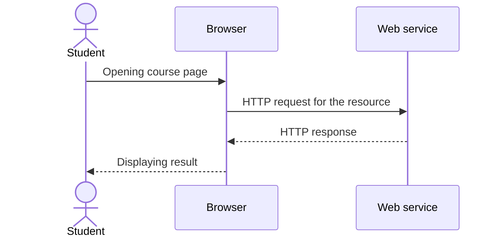
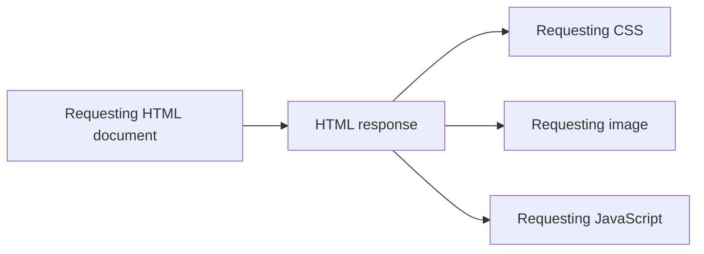

# 02.02. The HTTP request and response

HTTP is the common rule system for message exchange between the web client and server. The browser requests a resource or operation, and the server gives a response. The response can be successful content, redirection, or an error indication. Interpreting this dialogue is the basis for later browser, API, and security topics.

## Necessary prerequisites

- [Web addresses and resources](02-01-web-addresses-and-resources.md) — URL, path, and resource.
- [Client and server](../01/01-04-client-server-and-multitier.md) — the two communication roles.

## Opening a page

The student opens the `https://tananyag.example.edu/kurzusok/webprog` address. As a client, the browser sends a request to the server. The server generates a response based on the requested resource. If we receive an HTML document, the browser processes this for display. The details of establishing the network connection will be discussed in the fourth week; here we focus on the application messages.



HTTP is not only used by browsers. A mobile application, command-line client, or another server can also send an HTTP request. The roles of client and server can be interpreted in the specific message exchange.

## Parts of the request

A simple HTTP/1.1 request, shortened for educational purposes, might look like this:

```http
GET /kurzusok/webprog?felev=2026-osz HTTP/1.1
Host: tananyag.example.edu
Accept: text/html
```

The first line contains the method (`GET`), the target path and query part, as well as the HTTP version. The `Host` header tells which host the client is turning to. `Accept` indicates the desired response format. After the headers follows an empty line; the request can then also have a body, but a usual GET request does not.

> [!note] A simplified view of HTTP
> The actual form transmitted on the network depends on the HTTP version. The textual form above helps understand the concepts; it does not claim that every modern HTTP request appears exactly like this on the network.

## Parts of the response

The server's response can be broken down similarly:

```http
HTTP/1.1 200 OK
Content-Type: text/html; charset=utf-8

<h1>Web Programming I</h1>
```

The first line provides the status code and its short description. `200` means a successful HTTP response. The `Content-Type` header provides information for interpreting the body; here it is about HTML. The content after the empty line is the body of the response. In other cases, the body can also be JSON data, an image, or another resource.

`200` does not mean that the page is flawless from every business or user perspective. Just that the HTTP request received a successful response at the protocol level. The server can also send a `404` response if the requested resource is not found, or `503` if the service is temporarily unavailable. The details of the codes are sorted out in a separate chapter.

## Multiple requests can belong to one page

The user sees a single page, but the initial HTML can refer to further resources: stylesheets, images, fonts, or programs. For these, the browser can initiate new HTTP requests. Exactly how the page visible on the screen comes together is the topic of the third week. Now it is important that "opening a page" is not necessarily a single HTTP dialogue.



The separate requests can also be directed to the same or different services. In the browser's Network panel, therefore, multiple rows often appear even if the user only opened one address once.

## HTTP and HTTPS this week

In the address, `http://` or `https://` indicates the access method. HTTPS is HTTP communication transmitted over a secure connection. Because of this, its request-response basic pattern does not change: the client continues to request, the server responds. The method of protecting the connection, the role of TLS and certificates, will be examined in the fourth week. The existence of HTTPS itself does not prove that the content of the page is true or the provider is reliable.

## Common misunderstandings

| Statement | Clarification |
| --- | --- |
| "HTTP is only needed for HTML pages." | Images, data, and other resources can also be transmitted with it. |
| "Opening a page is a single request." | The document can initiate further resource requests. |
| "200 means everything is fine." | It only indicates a successful response at the HTTP level. |
| "HTTPS is another request-response model." | It uses the same HTTP model on a secure connection. |

## Concepts introduced

- **HTTP:** The rule system for application communication between a web client and server. Defines the meaning of requests and responses.
- **HTTP request:** The message sent by the client, targeting a resource or operation. Contains a method, target, headers, and sometimes a body.
- **HTTP response:** The message sent by the server about the result of the request. Contains a status code, headers, and if necessary a body.
- **Method:** The HTTP element indicating the meaning of the request's targeted operation. GET is typically used for fetching, POST for data sent for processing or initiating an operation.
- **Header:** Name-value information related to interpreting the HTTP message. For example, `Content-Type` indicates the type of transmitted content.
- **Body:** The content part of the HTTP message after the headers. Not every request or response has a body.
- **Status code:** The three-digit result indication of the response. The client can know the HTTP-level outcome of the request from this.
