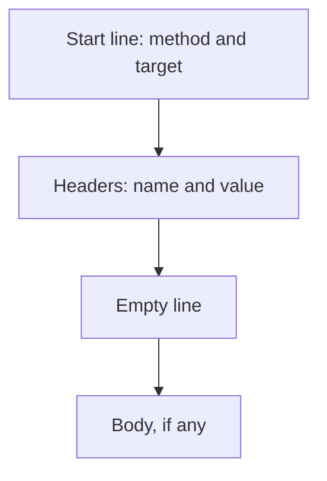

# 02.05. Headers, Body, and Content Types

An HTTP message does not consist only of an address and a status code. Headers provide supplementary information about the request or response; the body—if present—carries the data itself. Distinguishing the two helps understand why the same server response appears as a webpage, text, or processable data.

## Prerequisites

- [HTTP Request and Response](02-02-http-request-and-response.md) — the basic structure of messages.
- [HTTP Status Codes](02-04-http-status-codes.md) — the result indication of the response.

## Location of Headers in the Message

The following example shows a textual HTTP/1.1 form:

```http
GET /courses/webprog HTTP/1.1
Host: course-material.example.edu
Accept: text/html

```

After the first line, name–value formatted headers follow. `Host` specifies the target hostname, `Accept` indicates what response format the client can receive. The empty line marks the end of the header section. There is no body in this GET request. The actual network encoding depends on the HTTP version; this format serves the understanding of message parts.



## The Body: The Transmitted Content

The body in a request can be, for example, form data or a JSON document. In a response, it can be HTML, JSON, an image, or another data type. Not every message has a body: a standard GET request does not, and a `204 No Content` response cannot have a content body.

An educational example of an application request:

```http
POST /applications HTTP/1.1
Host: course-material.example.edu
Content-Type: application/json

{"course":"webprog"}
```

Here, `Content-Type` indicates the format of the sent body. In JSON, field names and values form structured data. The server still has to verify whether the request is meaningful and permitted. `Content-Type` is descriptive information, not an authorization or a guarantee of the content's correctness.

## Content-Type and Accept

`Content-Type` tells the format of the body of the given message. In a response, `text/html` can indicate a web document, `application/json` can indicate structured data. `text/plain` is plain text. The type influences how the client interprets the received bytes.

> [!note] Accept and Content-Type have different roles
> `Accept` answers a different question: with this, the client can indicate what format of response it can or wants to receive. The client's request does not guarantee that the server will give exactly such a response; the server's capabilities and rules also matter. Thus, the two headers are not interchangeable: one describes the actual content, the other describes the desired response.

| Header | Who can send it? | What does it express? |
| --- | --- | --- |
| `Content-Type` | Client or server | The format of the sent body |
| `Accept` | Client | The desired or acceptable response format |
| `Location` | Server | Address of a new or redirected resource |

## Not Every Header is About the Same Thing

Some headers affect the content type, others affect routing or caching. During redirection, `Location` indicates a new URL. For caching, `Cache-Control` can help regulate how long a response can be used without a new server connection. We will examine the full operation of caching later; here it is enough to recognize that headers can direct further behavior beyond the content.

Among headers, we will later encounter data related to authentication, cookies, and browser security. We will interpret these in detail only in the corresponding later topics. For now, what is important is that headers are not the "decorations" of the visible page: they are the machine-readable parts of web operation.

## Human-Targeted Page and Machine-Targeted Data

The same web service can return an HTML page for a browser interface and JSON data for another program. For the user, HTML can directly become a readable interface. JSON is usually data processed by a program. Both are bodies of an HTTP response, but their content type and further use differ.

The difference becomes visible in the Network panel: the response headers belonging to the request show the format, and the content of the response appears in the body. The next chapter will follow through with this observation.

## Common Misconceptions

| Statement | Clarification |
| --- | --- |
| "The header is the text visible at the top of the page." | The HTTP header is part of the message, not the visual header of the document. |
| "Content-Type creates the format." | The sender indicates the format of the body with it; the content must actually correspond to this. |
| "Every request has a body." | A standard GET request has no body. |
| "Accept and Content-Type are the same." | The former describes the desired response, the latter describes the sent body. |

## Learned Concepts

- **HTTP header:** Name–value information aiding the interpretation of the request or response. It is located after the start line, before the body.
- **Message body:** The optional content part of the HTTP message. It can carry data sent in a request or the result's content in a response.
- **Media type:** An identifier indicating the format of the transmitted content, for example `text/html` or `application/json`. The receiving party can choose a processing method based on this.
- **Content-Type:** A header indicating the media type of the sent message body. It can occur in both requests and responses.
- **Accept:** A request header indicating the response formats desired or acceptable by the client. It is not identical to the type of content actually received.
- **Cache-Control:** A header carrying instructions regarding caching. Its effect can be interpreted in the context of the response and the full operation of the cache.
