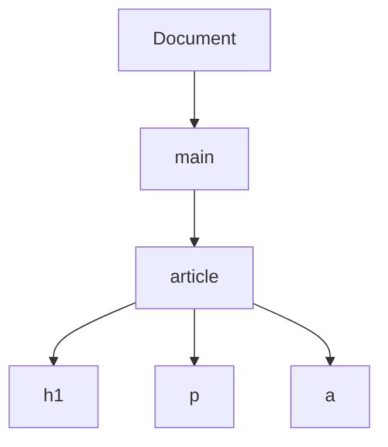

# 03.02. Document Structure, DOM, and Semantics

The browser does not receive a picture from the server, but among other things, HTML text, from which it builds a processable document model. The DOM is the current, tree-like model of the document. Proper HTML structure and semantics help make the content not only visible, but interpretable and usable for different people and devices.

## Prerequisites

- [The Role of HTML, CSS, and JavaScript](03-01-html-css-and-javascript.md) — HTML as a descriptive language and JavaScript as a browser-side program.

## The HTML Source Becomes a Document Tree

Let's assume the student opens a course news item. The server's HTML response is text markup. The browser parses it and builds a tree of nested objects. `html` is connected to the root of the document, under it `head` and `body`, and then the content elements. DOM — Document Object Model — denotes this structure that is also manageable from a program.

```html
<main>
  <article>
    <h1>Course application has opened</h1>
    <p>Applications are open until Friday.</p>
    <a href="/courses">Courses</a>
  </article>
</main>
```



The tree is not a second HTML file. It is a living model in the browser's memory: HTML processing creates it, and JavaScript can modify it later. The diagram illustrates the parent-child relationships of the main elements; the actual DOM also contains text nodes and further details.

## Source and Current DOM

The HTML source received from the server and the browser's momentary DOM are not always identical. The browser can interpret some faulty or incomplete HTML by correcting it according to the rules. JavaScript can later insert a new element, swap text, or remove an existing element. Because of this, "view source" and the developer tool's Elements or Inspector view can show different content.

For example, a text indicating application status might initially be "No course selected". After the user's choice, JavaScript can change it to the text "Web Programming I selected" in the current DOM. The source file sent earlier by the server is not rewritten by this. The current interface and the original HTML are different observation points.

## The Semantic Element Says More Than the Appearance

`h1` marks a main heading, `p` a paragraph, `a` a link. `main` is the main content region, `article` is an independent content unit. Selecting the element is thus not only a visual decision. A heading does not become a heading just because it appears in large letters; its HTML role must also express this. Screen readers, search engines, and other programs can rely on this structure.

> [!tip] Use native controls
> A clickable `div` can look like a button with CSS, but by itself, it does not get all the keyboard and semantic properties of a real `button` element. Using the appropriate native element is therefore in many cases a simpler and more accessible solution. Semantic HTML is not a full accessibility guarantee, but an important foundation of it.

## Structure and Hierarchy

Document headings help in reviewing the content. After a main heading, the parts can be structured by subheadings. The text of the link should be understandable on its own; "click here" gives little information about where it leads. Form field labels help identify what data the interface expects. These all make the content's meaning readable, not just its look.

In the DOM tree, the parent-child relationship matters for CSS and JavaScript as well. For example, a style rule can target the paragraphs under `article`. JavaScript can find an element by its identifier and then modify its text. If the structure of the HTML is disordered, these operations are also harder to follow.

## The Developer Tool's Perspective

The Elements or Inspector view shows the browser's current document tree. When an element is selected, its position in the tree, its multiple attributes, and the styles affecting it can be seen. This answers a different question than last week's Network panel. Network showed what resource arrived; Elements shows what document the browser is working with now.

If a text is not yet visible in the Network response, but is in the current DOM, it was probably modified by a program after loading or built from data that arrived later. This is a deduction, not by itself proof of the full internal workings. However, the two views together give a much more accurate picture of the page.

## Common Misconceptions

| Statement | Clarification |
| --- | --- |
| "The DOM is the exact same file that the server sent." | It is the browser's current, modifiable internal model. |
| "Text in large letters is automatically a heading." | Visual size does not replace the proper HTML element. |
| "Every clickable element is a button." | The semantics and keyboard behavior of a native button is a distinct property. |
| "The source and the Elements view are always the same." | They can differ due to processing and JavaScript modification. |

## Learned Concepts

- **DOM:** The tree-like object model of the HTML document created by the browser. It represents the current document state and can be modified programmatically.
- **Node:** An element of the DOM tree, such as an HTML element or text. It can have parent-child relationships with other nodes.
- **HTML source:** The text markup handed to the browser, from which the document model is built. Not necessarily identical to the later modified DOM.
- **Semantic HTML:** Using elements that correspond to the content's meaning. It aids the interpretation and accessibility of the document.
- **Elements/Inspector view:** The interface of the browser's developer tool to examine the current DOM and its associated features. It provides a different observation point than the Network panel.
