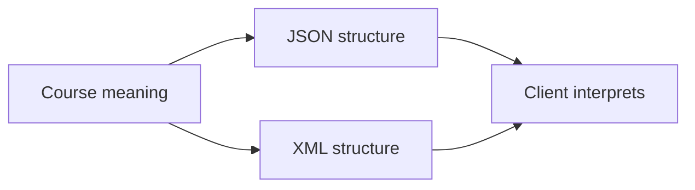

# 05.02. JSON, XML and structured data

A web API response is not useful because it contains text, but because the client can consistently interpret it. JSON and XML are formats suitable for marking structured data. They use different syntax, but they raise the same question: how do we separate the meaning of the data from its presentation, and how do the parties agree on the expected structure?

## Prerequisites

- [Web API](05-01-what-is-a-web-api.md) — the contract between the client and the service.
- [Headers and content types](../02/02-05-headers-body-and-content-types.md) — the role of `Content-Type`.

## The same course data in two forms

The course list page and the mobile application use the same course. The server can return the data as JSON:

```json
{
  "id": 42,
  "title": "Web Programming I",
  "available": true,
  "topics": ["HTTP", "browser", "API"]
}
```

The object contains key-value pairs. The `id` is a number, the `title` is text, the `available` is a boolean value, and `topics` is a list. JSON has a precise syntax: keys are in quotation marks, texts as well, and different value types cannot be swapped unnoticed. If the API contract states that `id` is a number, but it unexpectedly arrives as text, the operation of the client program may change.

The same content can also be represented in XML:

```xml
<course id="42" available="true">
  <title>Web Programming I</title>
  <topics><topic>HTTP</topic><topic>browser</topic><topic>API</topic></topics>
</course>
```

XML uses elements and attributes that can be nested within each other. Here the `available` attribute is a character value; the client must interpret its boolean meaning based on the data schema. XML is not "old JSON", but a different model and toolset. There are situations where a document-like structure, namespaces, or interoperability with already existing XML-based systems are needed.



## Data and document

A JSON response typically describes data records, lists, and relationships that the client processes further. HTML, on the other hand, is a web document: in addition to the structure of the content, it also carries the meaning and links necessary for the browser to display it. XML can be used to mark both data exchange and document-like content. The categories are not mutually exclusive, but the purpose of use helps in choosing the appropriate format.

> [!note] Format is not a data contract
> The `Content-Type: application/json` or `application/xml` header indicates how the body of the response can be interpreted. However, the client also needs to know the specific fields and meanings. The content type is not API documentation: it only indicates the format of the representation.

## Missing data and changing structure

The structure of the data format itself does not tell you if a field is required. If the course instructor has not yet been assigned, the contract must clarify whether the field is missing, has a `null` value, or receives some other signal. The client cannot infer the possible states from a single successful sample response. Similarly, the order of the list, the format of the dates, and the meaning of the identifiers must be agreed upon.

Choosing a format is therefore only the first layer. The real data exchange is based on contractual meaning: the parties interpret the same `title` field in the same way, and they know what to do with a missing or unknown field. This becomes especially important during later versioning.

## Common misconceptions

| Statement | Clarification |
| --- | --- |
| "JSON is the API itself." | JSON is a data format; the API also defines the operations and the contract. |
| "The `Content-Type` describes the meaning of every field." | It only indicates the format of the body. |
| "XML and HTML are the same." | Both are markup languages, but they follow rules and usage for different purposes. |
| "A sample response reveals all possible states." | Missing fields and errors require separate documentation. |

## Concepts learned

- **JSON:** A data exchange format describing objects, lists, and basic value types as text.
- **XML:** A hierarchical markup language built from elements and attributes, which can describe both data and document-like content.
- **Structured data:** Information with a specific structure and meaning, which the program processes according to fields and types.
- **Representation:** The appearance of a resource or data in a specific format in the HTTP response.
- **Data schema:** A set of rules describing the shape, types, and allowed relationships of data.
