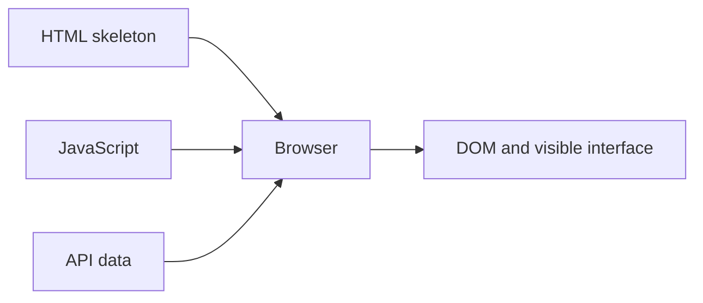

# 06.02. Client-side rendering

With client-side rendering, the JavaScript running in the browser assembles a significant part of the interface. The server can provide an HTML skeleton, program, and data; the client builds the current DOM from these. This can provide flexible interaction, but the appearance of usable content may also depend on loading and running the program.

## Prerequisites

- [HTML, CSS, JavaScript and DOM](../03/03-02-document-structure-and-dom.md) — the browser model of the document.
- [Web API and data](../05/05-01-what-is-a-web-api.md) — where the client program can get data from.

## The course list is assembled in the browser

The student opens a course search engine. The server sends an initial HTML skeleton and JavaScript. The program fetches the current courses, then creates the DOM elements needed for the list. If the user sets a filter, the same program can recalculate the visible elements. The server does not necessarily send a full new HTML page for every view switch.

The figure does not claim that the server never sends HTML during client-side rendering. The starting skeleton and other content can also be HTML; the crucial question is where the main content view is generated.

## Consequences of the load chain

The browser must first download and run the required program. If API data is needed for the content, it may also wait for its response. The time to the first usable screen is thus influenced by the JavaScript size, execution, and data fetching, alongside the HTML. On a weak device, processing can especially matter. It's not enough to look at the number of network requests; the work done in the browser is also part of the user experience.

The loading, empty, and error states of the interface must be designed separately. If the API is unreachable, the program shouldn't leave an endlessly spinning indicator or an unexplained empty area. If there are no results, it's not the same as a data fetch error. Client-side rendering is not just DOM modification, but a comprehensible interface belonging to states.

## Interaction and redrawing

The client program can react quickly to local changes, such as filtering courses or opening a panel. If server data is needed for the change, it initiates a new HTTP request. After modifying the DOM, the browser can also recalculate style and layout. The speed perceived by the user thus depends on program design, the network, and rendering together.

The application's data model and the displayed DOM are not identical. The course list data can be in memory, while only the filtered part is visible on the screen. If the data is updated, the program must synchronize the internal state and the interface. The navigation and client-side state chapter details this further.

## Connection with SPA

> [!note] SPA and CSR are different concepts
> Many SPAs rely heavily on client-side rendering, but the two concepts are not identical. In an SPA, a significant part of navigation is handled by the client; the initial page can even arrive as server-side generated HTML. A single interactive part of a multi-page site can also be rendered by JavaScript. The location of rendering and the method of navigation must be named separately.

## Common misconceptions

| Statement | Clarification |
| --- | --- |
| "With CSR there is no server." | The server can provide an HTML skeleton, program, and API data as well. |
| "After downloading JavaScript, the page is ready." | Execution, data fetching, and rendering might still remain. |
| "Client-side switching is always network-less." | Fresh data might require a new API request. |
| "CSR = SPA." | The rendering location and the navigation model are different axes. |

## Concepts learned

- **Client-side rendering (CSR):** Generating a significant part of the interface in the browser, using JavaScript.
- **HTML skeleton:** Initial document that provides a starting structure for the client-side application.
- **Loading state:** A state of the interface in which the required program or data is not yet available.
- **Client-side data model:** The data and state handled in the browser, based on which the program displays the interface.
