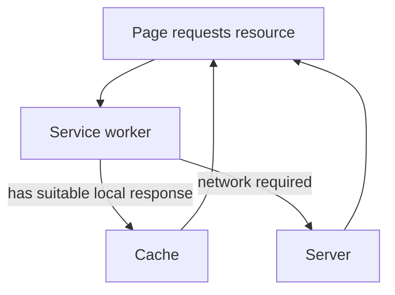

# 06.06. Service workers and offline operation

A web application can sometimes be useful even on an interrupted network. The browser can run a background component called a service worker, which can handle certain network requests for its associated pages and serve appropriately prepared resources from a local cache. This can enable offline reading or certain operations, but it does not automatically make every web service work without a network.

## Required prerequisites

- [Loading web resources](../03/03-04-loading-web-resources.md) — separate requests for HTML, CSS, images, and program files.
- [Browser capabilities and IndexedDB](../03/03-06-browser-capabilities.md) — the role of local storage.
- [Client-side state](06-05-navigation-and-client-state.md) — the difference between local and server-side data.

## Course material on the go

A student might open a previously viewed course description on a train, but the connection drops. If the application has previously stored the necessary HTML, styles, and other resources, the service worker can respond to certain requests from these. The student can thus read the material that was made available earlier. However, the current number of available places or a new application cannot be reliably considered final without the network and a server-side decision.

The diagram shows the possible operation for controlled pages. The service worker does not intercept every request of every page, and the actual path is determined by the application's caching strategy.

## What is a service worker?

A service worker is a background program running separately from the web page's main JavaScript. Within its scope, it can receive events related to network requests and respond from the cache or the network. It has no direct access to the DOM; the visible interface is still managed by the page. The browser can start or stop the service worker as needed, so it shouldn't be thought of as a continuously running process.

Using a service worker typically requires a secure environment, usually HTTPS; `localhost` can be a special case for local development. Its installation, activation, and updating are a separate lifecycle. This is essential because a new application version and old cached content can easily cause errors together if there is no consistent update plan.

## Cache, local data, and offline operations

The Cache API can store responses associated with web requests. IndexedDB, on the other hand, can manage structured application data, for example, a half-finished note. The two storages are for different purposes. For a course material to be read offline, caching the document and its resources might be important; for a draft of an assignment edited locally, structured storage might also be necessary. Forwarding modifications made offline to the server is a separate synchronization problem.

> [!warning] Define exactly what works offline
> Not all data can be cached without consideration. For personal or rapidly changing application state, there are freshness, authorization, and privacy considerations. A service worker with a bad strategy might show old data even when there is a network. Therefore, when claiming "works offline," it must be specified exactly which content can be read and which operations can be performed.

## Not identical to SPA

A service worker can be attached to both multi-page and single-page websites. An SPA is a model for navigation and interface; a service worker is one of the browser's tools for requests and background tasks. An SPA does not automatically work offline, and an MPA can also offer pages readable offline. The two concepts are on separate axes.

## Common misconceptions

| Statement | Clarification |
| --- | --- |
| "The service worker draws the interface." | It has no direct DOM access; it helps in handling requests and background operations. |
| "Every piece of data in an offline app is fresh." | The local copy might reflect the last known state. |
| "An SPA works offline by default." | A separate storage and request management plan is needed. |
| "The Cache API and IndexedDB are the same." | The former manages responses, the latter manages structured data in a different way. |

## Concepts learned

- **Service worker:** A separate browser background program that, among other things, can handle events related to network requests within its scope.
- **Cache API:** A browser interface for local storage of request-response pairs.
- **Offline strategy:** The planned rule of which resource and operation can be used without a network, and how subsequent updating occurs.
- **Scope:** The range of pages and resources that a service worker's control can extend to.
