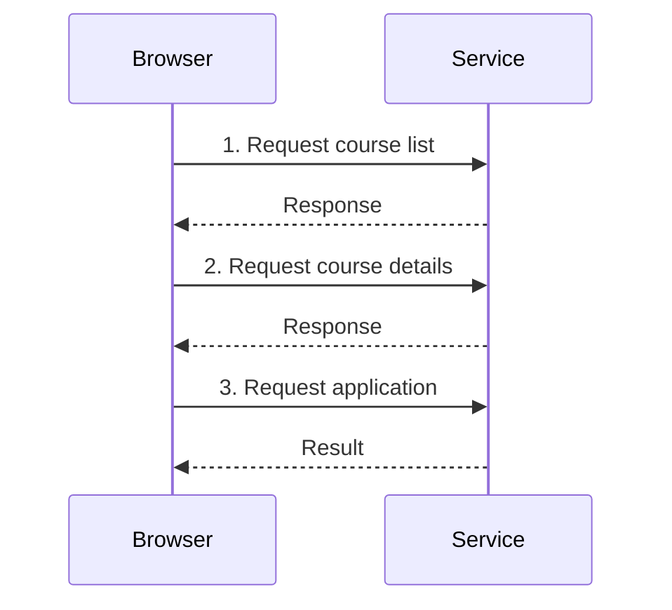

# 07.01. Stateless HTTP and application state

An HTTP request is an independent message: the protocol does not automatically preserve who sent the previous request and what operation they performed. Yet, the web application often needs continuity. On the course registration interface, the same student must see their choices across several pages. This state is linked to the separate requests by application solutions.

## Required prerequisites

- [HTTP request and response](../02/02-02-http-request-and-response.md) — independent message exchanges.
- [Client-side and server-side state](../06/06-05-navigation-and-client-state.md) — the separate data of the interface and the service.

## Multiple requests of one student

The student opens the course list, selects a subject, then goes to the application page. The server sees three separate HTTP requests. The method, URL, headers, and possible body arrive separately for each. HTTP by itself does not link them to a single person or application process. The service must use some identifier and stored state to retrieve the appropriate student's previous choices.

The diagram shows a chronological order, not a shared, automatic HTTP memory. A separate state management mechanism is required to link the three requests.

## What does statelessness mean?

The statelessness of the protocol means that the interpretation of individual requests does not come with an automatic conversation state inherited from previous requests. This does not mean that the server cannot store a database, or that it is impossible to log in on the web. A web service can create continuity through identifiers carried in messages and its own data storage.

In the previous week's REST chapter, the stateless request was also included as an architectural principle: the request carries the context necessary for its interpretation, rather than relying on a hidden step of a previous conversation. Here we are examining the application's user state. The two are related but not identical to the statement that "there is no state anywhere."

## Where can the state live?

The browser can have a momentary interface state: search filter, open panel, entered form data. Part of it can also be expressed in the URL, thus becoming shareable and retrievable. The browser's local storage can also preserve data for a later visit. The server, on the other hand, manages the actual result of the application and the permissions belonging to the student. Not all states need to be put in the same place.

| State | Natural location | Why? |
| --- | --- | --- |
| Course list filter | URL or client | Shareable or momentary interface data |
| Opened panel | Client memory | Short-lived view state |
| Half-finished local draft | Browser storage, if justified | Later continuation |
| Accepted application | Server | Official data affecting multiple users |

## Continuity and identifier

A service can find the state stored on the server based on the session identifier in successive requests. The identifier can come with a cookie, for example. Other APIs accept an access token. The identifier itself is not identical to the user's name, and it is not advisable to write all personal data into it. The next chapter details the relationship between cookies and sessions.

The state shown by the interface and the official state of the server may differ. If two students try to take the last place at the same time, the server must decide who is successful when processing the application. The number of available places seen earlier by the browser is only momentary information.

## Common misconceptions

| Statement | Clarification |
| --- | --- |
| "There can be no login alongside stateless HTTP." | Cookie, token, and server-side session can link requests. |
| "The server doesn't store data if HTTP is stateless." | The protocol's message and the application's data storage are separate concepts. |
| "The place seen by the client is the final truth." | The server decides on the current state at the moment of the operation. |

## Concepts learned

- **Stateless HTTP:** The property of HTTP that requests do not automatically come with an application conversation state inherited from previous requests.
- **Application state:** Time-varying data necessary for the operation of the service, such as a selection or an accepted application.
- **Session:** An application-level connection of linked user operations and requests.
