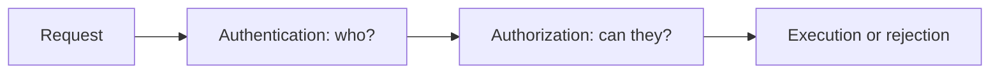

# 07.04. Authentication and authorization

Recognizing a logged-in user and authorizing an operation are two separate questions. Authentication answers whose identity the service accepts. Authorization management is about what this actor can do with a given resource. The two are linked, but the "logged in" state by itself does not grant permission to modify any course.

## Required prerequisites

- [Cookie, session, and token](07-03-browser-storage-and-tokens.md) — linking requests and access values.
- [Web API contract](../05/05-01-what-is-a-web-api.md) — operations and errors.

## Student and teacher in the same system

The student can look at courses and apply. The teacher can modify their own course description. Both users can successfully authenticate themselves, but are authorized for different operations. In addition, the teacher cannot necessarily modify every course: the specific resource and the relationship also matter.

The diagram separates two logical checks. The order can be more complex in the system's internal implementation, but the decision questions are different. The server must not infer from a button hidden in the browser that an operation is forbidden: it must also check the API call.

## Authentication: whose request do we believe it is?

The user can prove themselves in multiple ways. Password login is one example, but an external identity provider or another solution is also possible. After successful authentication, the service can establish a session so that the full proof does not have to be provided again every time for subsequent requests. The session identifier or appropriate token can help tie the subsequent request to the previously recognized identity.

Authentication does not mean that the service infallibly knows everything about the person. It means that according to the chosen method, it accepts a claim regarding an identity. Details of multi-factor methods and password security are discussed in the next, security session.

## Authorization: what can the given actor do?

The service can decide based on role, such as student or teacher, but often a condition tied to a resource is also needed. A teacher can edit their own course, not another teacher's. A student can see their own applications, not another student's personal data. Thus, in authorization, the actor, the operation, the resource, and the environment can all count together.

| Actor | Operation | Possible decision |
| --- | --- | --- |
| Student | Reading course list | Allowed |
| Student | Reading another student's application | Rejected |
| Teacher | Modifying own course description | Allowed conditionally |
| Teacher | Modifying another teacher's course | Rejected |

The table is an educational example, not the real authorization policy of the course. The point is that even after successful login, access must be checked for every relevant operation.

## Error and interface feedback

If the request doesn't have an accepted identity, the service can indicate an authentication problem. If the user is known but doesn't have the right for the operation, an authorization denial occurs. In HTTP responses, these often appear with different status codes, for example `401` or `403`. The specific response depends on the system's contract, and it is not advisable to explain the rejection with the same detail for every resource.

> [!warning] Hiding a button is not authorization
> The interface can hide an irrelevant button for ease of use, but this is not a security check. The client's code can be modified, and the API can also be called directly. The decision must be enforced at the server-side protected operation.

## Common misconceptions

| Statement | Clarification |
| --- | --- |
| "Anyone logged in can do anything." | Authorization can vary by operation and resource. |
| "Hiding a button forbids the API call." | The server must check authorization separately. |
| "Authentication and authorization are the same." | The former answers to identity, the latter to operation permission. |

## Concepts learned

- **Authentication:** Verifying and accepting a claim regarding an actor's identity.
- **Authorization:** Deciding and enforcing whether an actor can perform an operation on a resource.
- **Role:** A category assigned to a user that can be used in multiple authorization decisions.
- **Resource-level permission:** An access decision for specific data or object, such as a teacher modifying their own course.
