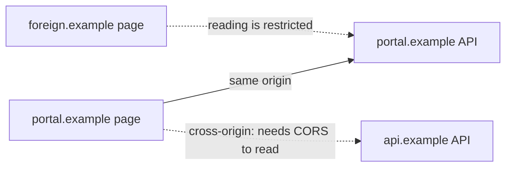
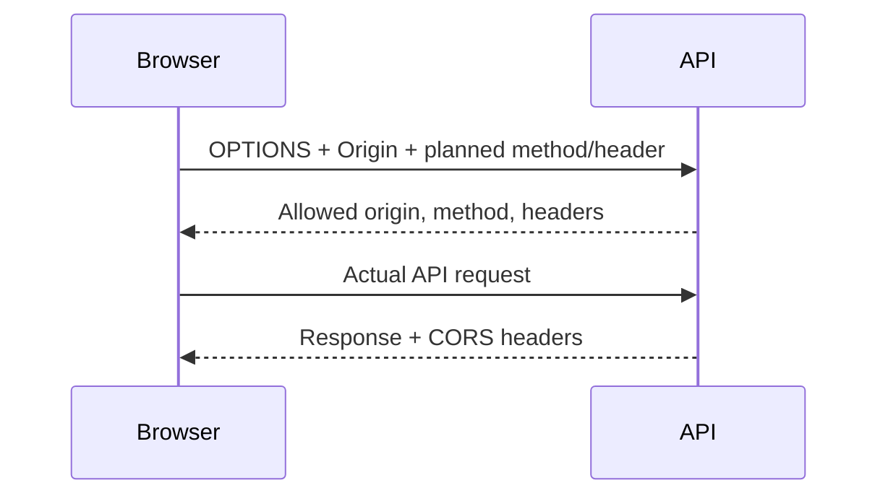

# 08.02. Same-origin policy and CORS

The browser draws a boundary between websites of different origins. The same-origin policy primarily limits what responses or resources of a different origin a script running on a page can read or access. CORS is a rule system indicated by a server and enforced in the browser for allowed cross-origin reading; it is not general API authorization.

## Required prior knowledge

- [Web addresses and resources](../02/02-01-web-addresses-and-resources.md) — scheme, hostname, and port.
- [HTTP request and response](../02/02-02-http-request-and-response.md) — messages and headers.
- [Web API](../05/05-01-what-is-a-web-api.md) — relationship between client and API.

## What does origin mean?

An origin is the combination of **scheme, hostname, and port**. `https://portal.example:443` and `https://api.example:443` are different origins because the hostname is different. `http://portal.example` and `https://portal.example` are also different because the scheme differs. The path is not part of the origin: `/courses` and `/profile` on the same host with the same scheme and port are of the same origin.

If the student opens the course system and a foreign website at the same time, the foreign site's JavaScript cannot simply read the course system's personal API response. This is one of the foundations of the browser's separation between pages.

## Sending a request and reading a response

The same-origin policy does not say that a request can never be initiated from a browser towards another origin. Images, navigations, forms, and certain requests initiated from scripts can be cross-origin. The important difference is often whether the sending page's JavaScript **can access the content of the response**. Despite this, the server can still receive the request, and a side effect can even occur. Therefore, CORS should not be interpreted as CSRF protection or server-side authorization check.

## What does CORS do?

If the page of `portal.example` wants to read the `api.example` API, the browser indicates the starting origin in the `Origin` header. The server can indicate in the `Access-Control-Allow-Origin` response header which origin can read the response. For certain methods and headers, the browser sends a preliminary `OPTIONS` request, a preflight, and only continues the actual request based on the permissions. A preflight does not appear for every cross-origin request.

If the cross-origin request also handles cookies or other authentication data, the browser and server enforce additional conditions. The `*` value, which allows all origins, cannot be used for a CORS response that also contains authentication data. The cookies' own `SameSite` rules form a separate layer from this.

## What is CORS not for?

> [!warning] CORS does not replace API authorization
> CORS is a browser reading limit. It does not provide general access protection for a directly run HTTP client, and it does not replace the API's authentication or authorization check. The API must independently decide whether the requester can read or modify the given data. During debugging, it is therefore a separate question whether the browser blocks reading the response, or whether the server correctly authorized the operation.

## Common misunderstandings

| Claim | Clarification |
| --- | --- |
| "CORS protects the API from unwanted clients." | It regulates reading the response in the browser; server-side access protection is still required. |
| "Another path is already another origin." | The path is not part of the origin. |
| "A CORS error means no request was sent." | In certain cases, the request might have gone out, only the response is not readable from the script. |
| "There is an OPTIONS before every CORS request." | Preflight is only required for specific cross-origin requests. |

## Learned concepts

- **Origin:** The trio of scheme, hostname, and port.
- **Same-origin policy:** The browser's basic principle restricting access between origins.
- **CORS:** A cross-origin read permission system indicated by the server via HTTP headers and enforced in the browser.
- **Preflight:** An `OPTIONS` check request preceding certain cross-origin requests.
