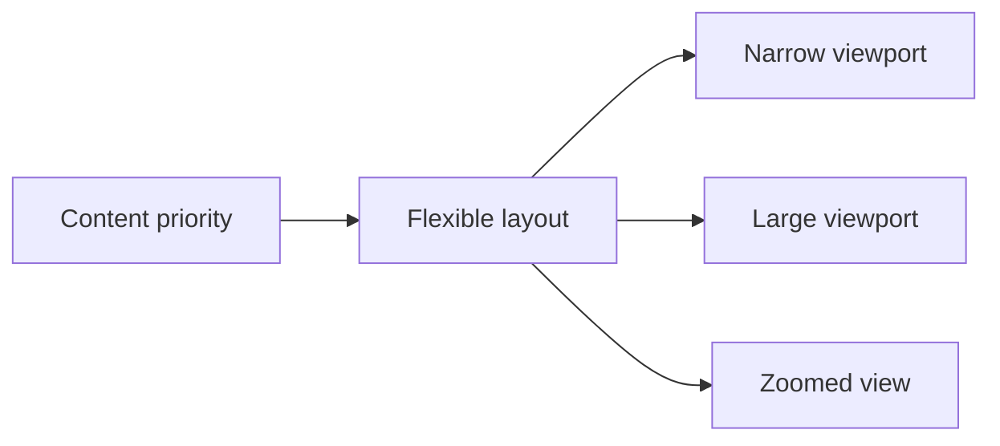

# 09.03. Responsive and device-independent design

A web page must be usable on a small phone, a large monitor, in zoomed view, and with different input methods. Responsive design is about a layout that adapts to the content, not a mechanical copying of a few device sizes.

## Required prior knowledge

- [HTML, CSS and JavaScript](../03/03-01-html-css-and-javascript.md) — the relationship between structure and appearance.
- [Accessibility and inclusive design](09-01-accessibility-and-inclusive-design.md) — different usage situations.

## Why is there no single standard screen?

Today, a website can be used on a 27-inch monitor, a narrow phone, a zoomed-in browser window, a landscape tablet, a TV, or with a screen reader. The user might rotate their phone, open the tab in split-screen mode, or set a 200% zoom. Even for the exact same phone model, the available space can differ due to the browser interface, split view, or font size settings.

Therefore, device independence does not mean the visuals are pixel-perfect everywhere. It means the core information and tasks are accessible in all relevant situations. For a restaurant's website, the address, opening hours, and reservations might be primary on mobile; while on a wide screen, more photos and a detailed story can comfortably fit. The goal is not to "dumb down" the smaller screen, but to consciously manage the priority of importance.

## The viewport and flexible space

The viewport is the area of the browser where the web page is displayed. Responsive pages do not assume this is always a pre-fixed width. A flexible layout can use percentages, `fr`, `minmax()`, or other relative units to adapt to the available space. CSS Flexbox and Grid are tools where the distribution of boxes is not based on rigid, manually calculated coordinates.

In a rigid approach, all three columns of a three-column page have a fixed width. On a narrow screen, this results in horizontal scrolling, squished text, or cut-off content. In a flexible approach, columns have a desired and a minimum size, and then where there is no longer enough space, they stack below each other. The decision is justified not by the phone model itself, but by the readability of the content.

## Breakpoints: the content breaks, not the device

A media query allows a different layout to take effect at a certain available width or user setting. We call these boundaries breakpoints. The wrong question is: "what is the width of an iPhone?". The better question is: "at what width are these three columns no longer comfortably readable, or when does the navigation fit?"

This difference provides a more durable solution. New devices arrive all the time, but the fact that a card needs a certain minimum width does not change. A breakpoint can be where the navigation would break into multiple lines, a table would become incomprehensible, or the main action would disappear below the fold.

## Mobile-first and content-first thinking

In the mobile-first approach, the base style is built for the smaller, simpler situation, and then expanded for larger spaces. This does not mean the phone user is more important, but that we first force ourselves to select the essentials. If a feature only fits on a giant display, the question must be asked: is it truly indispensable, or does it need to be reorganized?

Content-first is an even deeper principle. We first plan the content and the order of tasks, and only then the boxes. For a job offer, for instance, the position name, location, application deadline, and the application button itself should be quickly accessible. It is not worth taking up the first screen with a huge decorative image if the user really wants to know if the application is still open.

## Images, typography, and touch targets

A responsive image is not simply a shrunk-down image. A high-resolution photo can unnecessarily slow down loading on a phone, while mobile networks are constrained. The browser should receive resources of appropriate size and format where possible. It is important that the aspect ratio of the image is maintained, important details are not cropped in the wrong place, and the content meaning remains accessible in the alternative text.

Typography adapts as well. Lines that are too long are tiring on a wide monitor; fonts that are too small are unreadable on a phone. Good readability is not just a question of font size: line spacing, contrast, paragraph spacing, and line length also matter. The user's own zoom must be respected; the page should not break just because someone requests a larger font.

On a touch screen, there is no mouse pointer, and an imprecise finger requires a larger target area. Using a row of tiny icons crowded next to each other is frustrating. Important controls should be sufficiently large, separated from each other, and clearly labeled. At the same time, do not assume that a mobile device is only touch-based: a keyboard or an assistive input device can also be connected to a phone.

## Device-independent interaction

> [!warning] Do not make hover the only access path
> The mouse-operated "hover" state can be useful visual feedback, but it cannot be the only way to access content or functionality. There is no persistent hover on a touch screen, and focus is its proper pair on a keyboard. A "drag and drop" task should also have an alternative, for example, reordering with buttons. Gestures can be fast, but they should not be exclusively relied upon.

The same applies to orientation. It is rarely justified for a service to only be usable in landscape or portrait mode. If a complex data visualization really requires more space, provide clear guidance, but the rest of the content must still remain accessible.

## Performance as an inclusive issue

Responsiveness is not just layout. On fast office Wi-Fi and a new laptop, it is barely noticeable if a page loads dozens of large images, external fonts, and tracking codes. On a slow mobile network or a cheaper device, this can feel like minutes. A slow page is effectively an inaccessible page for those with limited data plans, weak connections, or lower-performance devices.

Therefore, content priority is also a performance decision. The main information and the main action should load first. Decorative, below-the-fold, or rarely needed elements can arrive later. According to the principle of progressive enhancement, the base experience works with simple, standard features, and more advanced capabilities enhance it, but are not strictly required for usage.

## A walkthrough example: rearranging a university event page

Let's imagine an event page in desktop view: the program is on the left, a large speaker photo in the middle, and the registration box on the right. In a narrow space, the three columns cannot remain. Based on content priority, the title, time, location, and the "Register" button appear first. Then follows the short description and the program; the speaker photo and related news come later. The button is visible in full width and in a good, touchable size, but is also accessible by keyboard. The navigation might shrink, but every menu item remains accessible, not only appearing on hover.

On a large screen, the three-column layout can return, because it aids overview there. We didn't create two separate websites, but rather designed the meaningful display of the exact same information across multiple spaces.

## Common misconceptions

**"Responsive = mobile-friendly."** Mobile is an important case, but the task is broader: varying size, zoom, input, and network.

**"Two breakpoints are enough: phone and desktop."** Content can break or become crowded at intermediate widths as well. Breakpoints should be chosen based on the specific layout.

**"We just hide the heavy parts on mobile."** If the hidden part is needed to complete the task, it should rather be accessible in a different form. Less should not mean loss of information.

**"The hover menu is modern, so it's good."** Not everyone can access it exclusively with hover; keyboard and touch operation is also required.

## Learned concepts

**Responsive web design:** design and implementation that adapts the layout and interaction to the available conditions.

**Viewport:** the display area available for the page in the browser.

**Breakpoint:** the condition or size at which the layout consciously changes.

**Mobile-first:** a base solution built for a smaller screen that expands in a larger space.

**Content priority:** the conscious management of the order of importance for content and actions.

**Progressive enhancement:** gradual capability expansion built upon a stable base experience.
