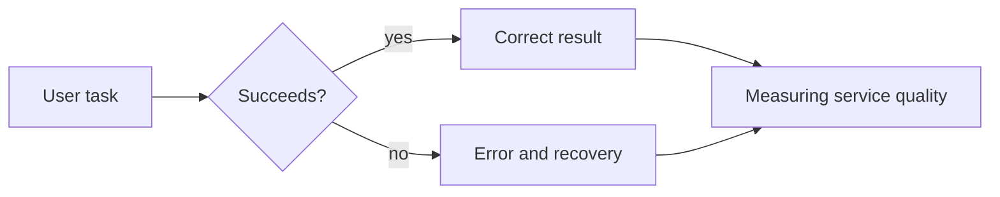

# 10.01. Service quality and availability

It is not enough for a web service to just respond: it must reliably support the right task at the right moment. Availability, correct operation, and recovery are distinct but interconnected properties.

## Required prior knowledge

- [The quality web](../09/09-01-accessibility-and-inclusive-design.md) — user usability.
- [The complete path of a request](../04/04-05-complete-web-request.md) — the layers of a service.

## What does "quality" mean on the web?

When someone says "the website was bad", they often compress multiple, distinct problems into a single sentence. It could be that the page didn't open. It could be that it opened, but stopped at checkout. It might also be that the main page appeared quickly, but a visitor using a screen reader couldn't proceed. The quality of a web service is therefore not a single metric, but a set of interrelated properties.

This includes functional correctness: does the system do what it promises? In a movie ticket booking app, a reservation must be created for the selected show and the selected seat. This includes performance: how long does it take for the system to respond, and after how much time can the visitor actually take action? Usability, accessibility, security, and privacy are also important. Finally, reliability expresses how predictably the system behaves over time, not just during a single successful attempt.

This mindset helps avoid the mistake of talking exclusively about the server's state. A "green" server does not guarantee a good user experience. The server might be available while an external payment provider is down; the page might return a 200 HTTP response while a JavaScript error prevents the cart button from working; or the system might be fast from Budapest, but unusable on a slow mobile network.

## Availability: is the service accessible?

Availability describes the proportion of time a service can be used as intended during the examined period. Two words are especially important in this formulation: "usable" and "as intended". It is not enough for a machine to respond on the network. An online academic system is available if the student can log in, view their courses, and execute the necessary actions.

Availability is often given as a percentage. 99.9% seems almost perfect at first glance, but in a thirty-day month, it allows for about 43 minutes of downtime. 99.99% only allows for roughly 4 minutes. More "nines" is therefore not just marketing: it means an increasingly strict expectation. At the same time, the availability percentage alone does not tell when the outage occurred. A five-minute error at 3 AM has different consequences than the same error exactly when exam registration opens.

The question of what counts as an outage also arises. If the public homepage works, but after logging in, no user can save, then the service is partially down. If only the recommendation system is broken but purchases can be made, it's still an error, but of a different weight. Good quality goals therefore start from critical user journeys: login, search, payment, registration, upload, or administration.

## Reliability, resilience, recovery

Availability is related to, but not the same as, reliability. A reliable system is expected to function correctly over a longer period. A resilient system tries to maintain or reasonably limit the important service even in the event of an error. Recoverability expresses how quickly and safely the system returns to the proper state.

Imagine a bookstore. If the recommendation module is faulty, a resilient system can still show books and allow purchases, honestly indicating in place of the recommendations that this feature is temporarily unavailable. If, however, the recommendation error causes the entire homepage to remain empty, the system has tied less important and vital features too closely together. The goal is not that nothing can ever break; the goal is that the impact of an error shouldn't be larger than absolutely necessary.

Errors are not exceptional events. Networks slow down, external services delay, configurations can be faulty, and people make mistakes too. Quality thinking therefore does not build on the promise of "eternal flawlessness", but on the system recognizing, handling, and understandably communicating the error. This perspective will also return later when discussing performance, security, and user experience.

## SLI, SLO, and SLA: three similar acronyms, three different roles

An **SLI** (Service Level Indicator) is an observable metric: it measures how the service behaves from a given aspect. An example could be the ratio of successful logins, the 95th percentile response time of searches, or the rate at which primary content appears when a page loads. The SLI is therefore a measurement, not a promise.

An **SLO** (Service Level Objective) is an internal target value for the same metric. For example: "the ratio of successful payment initiations should be at least 99.95% monthly", or "95% of search requests receive a response within two seconds". A good SLO is specific: it dictates what we measure, with what threshold, and in what time window. It is not necessary to create an SLO for every possible thing; it is worth doing for paths important to the user.

An **SLA** (Service Level Agreement) is an external, contractual commitment. It can be an agreement between a provider and its client regarding the level of availability the provider guarantees, and the consequence if it fails to meet it. This could be a fee credit or other contractual settlement. An SLA is generally a less detailed and more cautious commitment than an internal SLO, because it carries legal and business significance.

A useful sentence to remember the difference: the SLI tells **what happened**; the SLO tells **what we want to achieve**; and the SLA tells **what we commit to towards others**. It is not a good practice if the external contractual minimum is identical to the internal quality goal: then even the smallest deviation is a breach of contract, and there is no room to detect a deteriorating trend.

## Example: a university course registration system

Let's assume course registration opens at 10 AM on Monday. The system operator only checks if the landing page responds. This is not enough: the student has to log in, find the course, and finally save the registration. If the first two steps work, but saving yields an error due to a timeout, then from the user's perspective, the critical service is unavailable.

A good SLI could be the "ratio of successfully completed course registrations". For this, an SLO could state, for example, that in the two hours following opening, at least 99.5% of initiated course registrations should close successfully. This does not imply that every error is acceptable: investigating the remaining percentage is still necessary. The metric only helps ensure that judging quality doesn't rely exclusively on anecdotes or a single server signal.

## Common misconceptions

**"100% availability is a realistic baseline."** It might happen in certain narrow time windows, but over the long term, a zero-minute downtime is extremely expensive and often a pointless goal. The right question is, for which features does how much downtime cause what kind of harm.

**"If the server sends 200 OK, everything is fine."** The HTTP status is just a communication signal. The business operation behind the response could be faulty, incomplete, or unusable for the user.

**"High availability equals a good user experience."** A slow, confusing, or inaccessible service can be technically available, yet fail in its goal.

**"The SLA is a technical metric."** An SLA is a contractual commitment; it might contain a metric, but it is not identical to either the measurement or the internal goal.

## Learned concepts

- **Availability:** the proportion of time the service is usable as intended.
- **Reliability:** the predictability of correct operation over time.
- **Resilient system:** it strives to maintain important features or provide them in a limited capacity even in the event of an error.
- **SLI (Service Level Indicator):** a measured service metric.
- **SLO (Service Level Objective):** an internal target value for an SLI.
- **SLA (Service Level Agreement):** a contractual service commitment made towards an external party.
- **Critical user journey:** the crucially important sequence of steps necessary for the user's goal.
