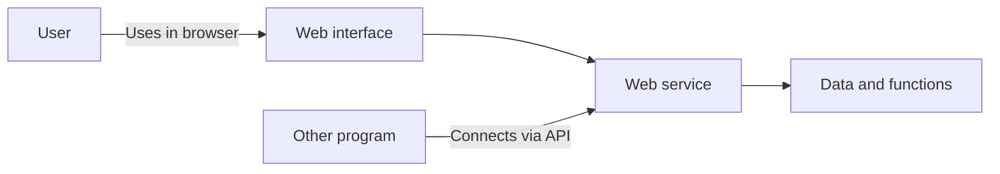

# The web as a general platform

The web is not just an application development area. A significant part of IT systems can be accessed through a browser, communicates via web APIs, or is built on web standards. Therefore, every IT professional must understand the basic operation of the web – even if they do not work as a web developer later.

> [!note] Internet and web
> The internet is the infrastructure of interconnected networks; the web is the system operating on it, based on addressable resources and common communication rules. The difference is an important starting point, but not the subject of an independent chapter: moving on from here, we examine why the web became the common platform for so many different IT tasks.

An IT professional today often encounters the consequences of web decisions even when they do not write a single HTML element. A data analyst gets data from an API, an operator monitors the response time of a web service, a security expert examines a login process, and a mobile developer communicates with server-side endpoints. Basic web knowledge is therefore a common professional language: it helps to understand how different specializations connect.

## The web is a general platform

Today, the web is one of the most important interfaces through which people use digital services. University systems, banks, webshops, public institutions, corporate internal systems, social platforms, and business software are also often accessible from a browser.

This is no coincidence. The browser is available on almost every modern device, the web is built on open standards, and a well-designed web service can be used on many operating systems without separate installation. The web is therefore not a single application or technology, but a general access and integration platform.

In an IT system, the web can fulfill several roles:

- **user interface:** here the client, the instructor, or the employee uses the functions of the system;
- **communication tier:** different systems exchange data via web APIs;
- **publication interface:** documents, news, public data, and services appear here;
- **integration medium:** systems made with different technologies can connect to each other on standard web interfaces.

The diagram below shows that the same web platform can provide an interface for people and a connection point for programs:

## Not only the web developer uses web technologies

Not every student will become a frontend or backend developer. Yet knowledge of how the web works helps in many other IT tasks.

| Specialization | Why are web basics important? |
| --- | --- |
| Software development | Many applications connect with a web API, administration interface, or online service. |
| Databases and data analysis | Data often comes from web services or is displayed on a browser interface. |
| Cybersecurity | A significant part of the most common attack surfaces is web-based: login, data submission, browser, and API. |
| Networks and operations | Understanding web traffic, DNS, TLS, and availability is a daily task. |
| Mobile development | Mobile applications typically communicate with backend systems via web APIs. |
| Artificial intelligence | Models and AI services are often accessible through a web interface or API. |
| Embedded systems and IoT | Devices often use a web control interface or cloud-based web service. |

The basic principle is simple: if a system communicates with people or other systems over the internet, we will very likely encounter web concepts.

## Web basic literacy does not equal web developer specialization

In this subject, the goal is not for students to learn to create an application in a specific framework. Concrete tools change quickly: a JavaScript framework popular today might be less dominant in a few years. The underlying principles, however, are much more enduring.

Therefore, the course prioritizes questions such as:

- What happens when a browser requests a web page?
- How does a client communicate with a server?
- Why is there a need for HTTPS, cookies, or authentication?
- How do web services connect via APIs?
- What makes a web service secure, fast, accessible, and lawful?

This knowledge remains useful even if the student later works in Java, Python, mobile, data analysis, or security fields.

## Web decisions have real consequences

The quality of a web service directly affects users. A poorly designed login process can pose a security risk. A slow page can cause business loss or frustration. An interface that ignores accessibility aspects can exclude people from using the service. Opaque data management can raise legal and ethical problems.

Therefore, studying web programming is not exclusively a technical competence. The subject also provides an aspect system for responsible digital service design.

## Example: a university study system

A university study system well demonstrates why many IT fields connect to the web:

- the student uses the interface in a browser;
- the system communicates via HTTPS;
- upon login, it manages the student's identity and permissions;
- the data comes from a database;
- it can connect with other systems, such as payment or email services, via APIs;
- it must remain operational even under heavy load;
- it handles personal data, therefore it must meet data protection requirements;
- it must be accessible to use.

To understand such a system, there is no need for every student to write its code. But seeing through the operation, connections, and risks is valuable for every IT professional.

## Common misunderstandings

| Statement | Clarification |
| --- | --- |
| "Web programming only needs to be learned by web developers." | Web systems connect many IT specializations. |
| "The subject is only about HTML and the look of web pages." | The web is broader than this: a system of communication, security, data, browsers, and services. |
| "Technologies change quickly anyway, so the subject will soon become obsolete." | Concrete tools change, but protocols, standards, and basic principles are also important in the long run. |
| "Web questions are only the developer's tasks." | Security, privacy, operations, and product decisions are also connected to them. |

## Concepts introduced

- **Web platform:** A technological environment built on open web standards on which documents, services, and applications operate. The browsers of different devices can access it on a common interface.
- **Web API:** An interface between programs, accessible via web technologies. It defines what requests can be made and what responses can be expected.
- **Interoperability:** The ability of different systems to cooperate based on common formats and rules. On the web, for example, this means that the same service can be used from multiple browsers.
- **Accessibility:** Designing digital content and services that provides access for people with different abilities and usage situations. This includes, for example, keyboard operability and an interpretable document structure.
- **Data protection (Privacy):** The totality of legal, organizational, and technical principles concerning the handling of personal data. Its goal is that data management is justified, transparent, and secure.
